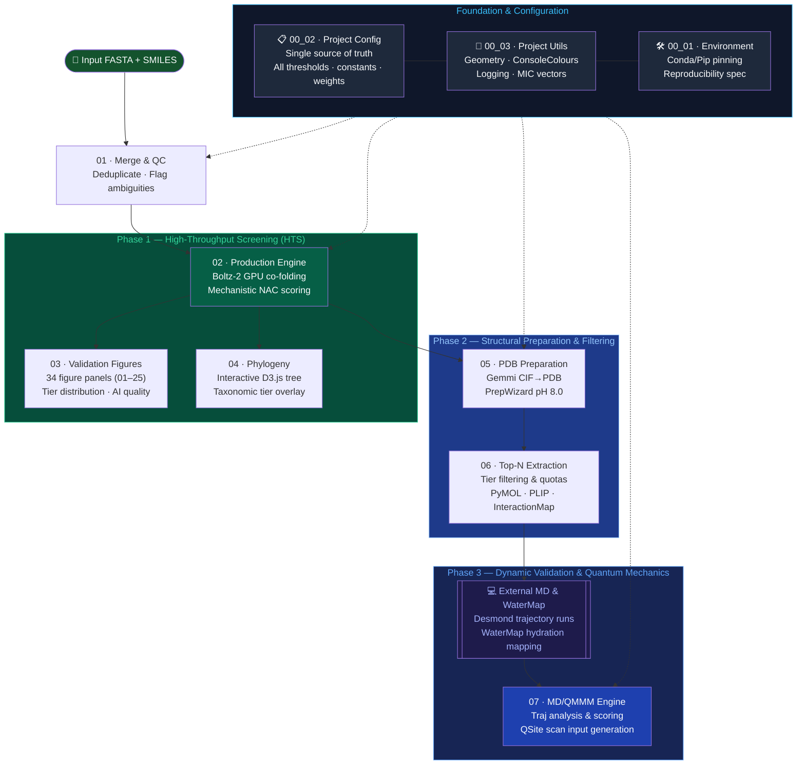

<div align="center">

# Defluorination of 27 PFAS Compounds by Fluoroacetate Dehalogenase (FAcD)

**Structure-based mechanistic validation of Fluoroacetate Dehalogenases against 27 PFAS compounds**  
*AI structure prediction · thermodynamic MD · QM/MM frame extraction — fully automated*

<p align="center">
  
  
  
</p>

</div>

---

## Table of contents

<table>
<tr>
<td valign="top">

**Science & Structure**

1. [FAcD Scientific Mandate](#-facd-scientific-mandate)
2. [PFAS Ligand Panel](#pfas-ligand-panel-27-compounds)
3. [Pipeline Architecture](#-pipeline-architecture)
4. [Repository Structure](#-repository-structure)

</td>
<td valign="top">

**Setup & Operations**

5. [Installation](#-installation)
6. [Quick Start](#-quick-start)
7. [Script Catalog](#-script-catalog)
8. [Reproducibility](#-reproducibility)

</td>
<td valign="top">

**Technical Reference**

9. [Hardware & Deployment](#-hardware--deployment)
10. [Troubleshooting](#-troubleshooting)
11. [References & Citations](#-references--citations)
12. [License](#-license)
13. [Authors](#-authors)

</td>
</tr>
</table>

---

## 🌿 FAcD scientific mandate

### The PFAS problem

Per- and polyfluoroalkyl substances (PFAS) — the so-called 'forever chemicals' — are a family of >12,000 synthetic compounds characterised by extraordinarily stable carbon–fluorine bonds (C–F bond dissociation energy ~544 kJ mol⁻¹). Ubiquitous environmental contamination, bioaccumulation, and links to endocrine disruption and carcinogenicity make PFAS remediation one of the defining environmental challenges of the 21st century.

Enzymatic defluorination represents the most thermodynamically elegant route to PFAS degradation. **Fluoroacetate Dehalogenases (FAcDs)** catalyse an **SN2 Walden-inversion** mechanism, directly cleaving the C–F bond via nucleophilic substitution at the α-carbon. The question this pipeline addresses:

> *Among thousands of phylogenetically diverse fluoroacetate dehalogenase (FAcD) candidate proteins, which ones possess the precise three-dimensional active-site geometry capable of catalysing defluorination of long-chain perfluorinated PFAS?*

<details id="pfas-ligand-panel-27-compounds">
<summary><b>🧪 27 PFAS Ligand (Click to expand)</b></summary>

The screening panel spans the full regulatory PFAS priority list, from short-chain to ultra-long-chain perfluorinated acids and sulfonates, plus next-generation PFAS replacements. Compounds are grouped by chemical function; index numbers match `D_INP_PFAS-27_Ligands.smi` entries and are fixed throughout the pipeline.

**Positive controls — known FAcD substrates**

| # | Compound | Abbreviation | C–F count | Notes |
|---|----------|--------------|-----------|-------|
| 26 | Fluoroacetate | **FA** | 1 | Natural FAcD substrate; geometry benchmark |
| 27 | Difluoroacetate | **DFA** | 2 | Short-chain analogue |
| 25 | Trifluoroacetate | **TFA** | 3 | Short-chain; alpha-CF3 substrate |

**Regulatory priority — perfluorocarboxylic acids (PFCA)**

| # | Compound | Abbreviation | C–F count |
|---|----------|--------------|-----------|
| 7 | Perfluorobutanoic acid | **PFBA** | 7 |
| 8 | Perfluoropentanoic acid | **PFPeA** | 9 |
| 6 | Perfluorohexanoic acid | **PFHxA** | 11 |
| 13 | Perfluoroheptanoic acid | **PFHpA** | 13 |
| 1 | Perfluorooctanoic acid | **PFOA** | 15 |
| 4 | Perfluorononanoic acid | **PFNA** | 17 |
| 10 | Perfluorodecanoic acid | **PFDA** | 19 |
| 12 | Perfluoroundecanoic acid | **PFUnDA** | 21 |
| 11 | Perfluorododecanoic acid | **PFDoDA** | 23 |
| 14 | Perfluorotridecanoic acid | **PFTrDA** | 25 |
| 17 | Perfluorotetradecanoic acid | **PFTeDA** | 27 |
| 18 | Perfluorohexadecanoic acid | **PFHxDA** | 31 |
| 19 | Perfluorooctadecanoic acid | **PFODA** | 35 |

**Regulatory priority — perfluorosulfonic acids (PFSA)**

| # | Compound | Abbreviation | C–F count |
|---|----------|--------------|-----------|
| 5 | Perfluorobutanesulfonic acid | **PFBS** | 9 |
| 9 | Perfluoropentanesulfonic acid | **PFPeS** | 11 |
| 3 | Perfluorohexanesulfonic acid | **PFHxS** | 13 |
| 15 | Perfluoroheptanesulfonic acid | **PFHpS** | 15 |
| 2 | Perfluorooctanesulfonic acid | **PFOS** | 17 |
| 16 | Perfluorodecanesulfonic acid | **PFDS** | 21 |

**Novel and emerging PFAS replacements**

| # | Compound | Abbreviation | Class | C–F count |
|---|----------|--------------|-------|-----------|
| 20 | Hexafluoropropylene oxide dimer acid | **GenX** | Ether-PFCA | — |
| 21 | ADONA | **ADONA** | Ether-PFCA | — |
| 22 | 6:2 Fluorotelomer alcohol | **6:2-FTOH** | FTOH | 13 |
| 23 | 8:2 Fluorotelomer alcohol | **8:2-FTOH** | FTOH | 17 |
| 24 | Cyclic perfluoroether | **C6O4** | Cyclic PFAS | — |

> †  **C–F count for GenX, ADONA and C6O4:** these are perfluoroether / cyclic next-generation replacements whose fluorine inventory is structure-dependent and branched. The count is listed as '—' pending a verified per-atom structural assignment rather than asserting an unconfirmed value; defluorination scoring uses the modelled 3D structure, not this tabulated count.

> **Positive controls (25–27):** All 27 compounds are genuine screen targets, each modelled against the full ~2,150-protein panel. Entries 25–27 (TFA, FA, DFA) *additionally* serve as positive controls: alongside the 3R3U crystal structure and the experimentally validated DEHA4 enzyme they constitute **6 control cases** that anchor the NAC geometry thresholds. Every run benchmarks them—if a control tier drops below `Best_A`, investigate the thresholds or structure-prediction quality before trusting the wider screen.

</details>

### Scientific approach

This pipeline adopts a **structure-first, geometry-validated** screening strategy:

1. **Structure prediction** — Boltz-2 (diffusion-based co-folding model) predicts protein–ligand complex structures at scale, guided by ColabFold MSA for evolutionary context.
2. **Catalytic geometry scoring** — Mechanistic fingerprinting using Near Attack Conformation (NAC) criteria derived from transition-state theory: nucleophile–carbon distance, SN2 attack angle, catalytic triad integrity, and fluoride cradle contacts.
3. **Phylogenetic context** — Interactive evolutionary tree maps tier-classified candidates across taxonomic diversity, revealing convergently evolved defluorination capability.
4. **Molecular dynamics validation** — Schrödinger Desmond MD trajectories assess thermodynamic stability and dynamic NAC persistence of top candidates.
5. **QM/MM extraction** — Representative frames satisfying strict NAC criteria are extracted for high-level quantum mechanical/molecular mechanical calculation with Schrödinger QSite (M06-2X/6-31+G(d,p)).

### Crystal reference: PDB 3R3U

All mechanistic geometry is benchmarked against the **3R3U crystal structure** (*Rhodopseudomonas palustris* FAcD, wild-type, 1.60 Å resolution, no substrate bound — carries Ni²⁺/Cl⁻ ions; Chan *et al.* 2011 *JACS*, DOI: 10.1021/ja200277d). The catalytic triad — **Asp110 (nucleophile) · Asp134 (acid catalyst) · His277 (base)** — defines canonical geometry for an active FAcD, cross-validated against DEHA4 (*Delftia acidovorans* D4B; Farajollahi *et al.* 2024 *ACS Omega*).

**Active-site residue quick reference (3R3U / DEHA4 numbering):**

| Role | Key | Residue | Seq ID | Function |
|---|---|---|---|---|
| Nucleophile | Nuc | Asp | 110 | Backside attack on Cα; forms covalent ester |
| Carboxylate clamp 1 | Carb1 | Arg | 111 | Anchors substrate –COO⁻ |
| Carboxylate clamp 2 | Carb2 | Arg | 114 | Anchors substrate –COO⁻ |
| Acid catalyst | Acid | Asp | 134 | Protonates departing F⁻; part of Asp–His–Asp triad |
| Fluoride stabiliser | Stab_H | His | 155 | H-bond to F⁻ |
| Fluoride cradle | Stab_W | Trp | 156 | Aromatic + electrostatic stabilisation of F⁻ |
| Fluoride cradle | Stab_Y | Tyr | 217 | Aromatic + electrostatic stabilisation of F⁻ |
| Base catalyst | Base | His | 277 | Proton shuttle; activates Asp110 nucleophile |

---

### The mechanistic filter: beyond structural confidence

Boltz-2 confidence metrics (ipTM, pLDDT, cross-PAE) assess structural plausibility — they do not assess catalytic competence. A protein can score perfectly on every confidence metric whilst being entirely unable to perform SN2 defluorination. This pipeline adds five independent mechanistic gates that must all pass:

| Gate | Criterion | Basis |
|------|-----------|-------|
| **SN2 attack angle** | ≥ 145° relaxed · ≥ 175° (Perfect_A) | Backside attack geometry; 180° = ideal Walden inversion |
| **Nucleophile–C distance** | ≤ 3.8 Å relaxed · ≤ 3.2 Å strict | Near Attack Conformation (NAC) requirement |
| **Catalytic triad integrity** | Asp110 · Asp134 · His277 within distance thresholds | Charge-relay geometry for nucleophile activation |
| **Fluoride cradle occupancy** | His155 / Trp156 / Tyr217 within 5.5 Å of departing F | Electrostatic + aromatic stabilisation of F⁻ departure |
| **Walden geometry** | Improper dihedral ≤ 15° → near-planar sp² transition state | Confirms the carbon undergoes genuine SN2 inversion, not non-productive binding |

A candidate that binds PFOA with high affinity but presents the wrong face to Asp110, or lacks the His155/Trp156/Tyr217 aromatic basket to stabilise the departing fluoride, is **classified as non-degrader regardless of its Boltz-2 confidence score**. High-affinity PFAS binders are not FAcDs.

**On the hard–soft acid–base (HSAB) transition:** Fluoroacetate's α-carbon is a borderline electrophile, whilst the departing fluoride is the hardest halide — high charge density, low polarisability. The incoming Asp110-OD is a hard nucleophile. The pipeline explicitly models this: the fluoride cradle (His155/Trp156/Tyr217) provides the specific hard-base electrostatic environment required for F⁻ departure, whilst the SN2 angle enforces the linear trajectory that minimises orbital overlap with the adjacent C–F σ* in the transition state.

---

## 🔄 Pipeline architecture



**Diagram key:** solid arrows = data flow; dashed arrows (`-.->`) = foundation dependencies.

**Three-phase design:**

| Phase | Steps | Goal | Input | Output |
|---|---|---|---|---|
| **Foundation** | 00_01–00_03 | Environment installation, shared configuration, and utility functions | — | Conda environment, `CFG` & `ProjectUtils` |
| **Phase 1 — HTS** | 01–04 | Database merging, co-folding, & database-wide validation | Raw sequence databases | Master CSV, D3 tree, publication figure panel |
| **Phase 2 — Filter & Prep** | 05–06 | Protonation, minimisation, & top candidates extraction | CIF structures from Step 02 | Prepared structures, 3D interaction diagrams |
| **Phase 3 — Dynamics & QM** | External MD + 07 | MD trajectory simulation, hydration profiling, & QM/MM setup | Prepared structures from Step 06 | Desmond trajectories, WaterMaps, QSite `.inp` |

Phase 1 is deliberately fast and permissive; Phase 2 prepares and extracts the elite hits; Phase 3 evaluates candidate dynamics under thermodynamic fluctuations to confirm Near Attack Conformation (NAC) persistence.

> [!NOTE]
> In Phase 1, Step 02 (Boltz-2 production) co-folds every candidate against the PFAS panel. A fresh prediction takes approximately 15 to 30 seconds per complex (GPU co-folding plus CPU file/CSV write operations). The timing of `4h23m` for `02 Production (Boltz-2 scoring)` shown in the timing summary below is for resume mode checking 58,056 pre-existing jobs.

---

## 📁 Repository structure

```
FAcDs_PFAS-27_Defluorination/
│
├── 00_00_run_pipeline_FAcDs.sh              ← One-command full pipeline runner
├── 00_01_Environment_Installation_FAcDs.py  ← Environment check, conda/pip export
├── 00_02_Project_Config_FAcDs.py            ← ★ Central configuration (all parameters)
├── 00_03_Project_Utils_FAcDs.py             ← Shared utilities (logging, geometry, colours)
│
├── 01_Merge_FAcDs.py                        ← FASTA merge, deduplication, QC
├── 02_Production_FAcDs.py                   ← Boltz-2 prediction + scoring (MAIN ENGINE)
├── 03_Validation_Figures_FAcDs.py           ← Publication-quality validation figures
├── 04_Phylogeny_FAcDs.py                    ← Interactive D3 phylogenetic tree
├── 05_CIF-PDB_Preparation_FAcDs.py          ← CIF→PDB + Schrödinger PrepWizard
├── 06_Top-N_Extraction_FAcDs.py             ← Top-N extraction + PyMOL/PLIP figure generation
├── 07_SID_Post_Processing_FAcDs.py          ← Step 07 Desmond SID post-processing → *_SID-out.eaf
├── 08_MD_Thermodynamics_QMMM_Engine_FAcDs.py ← Step 08 MD + NAC analysis + QM/MM engine
│
├── PFAS.yml                                 ← Conda environment (full reproducible spec)
├── requirements.txt                         ← pip requirements (auto-exported)
│
├── A_Labelled_15-Seq.fasta                  ← Curated seed sequences (~15 proteins)
├── B_Downloaded-Blast_Uniprot_NCBI.fasta    ← BLAST/UniProt/NCBI expanded set
├── C_INP_Merged_for_Boltz-2.fasta         ← Merged, deduplicated input (auto-generated)
├── C_INP_Merged_for_Boltz-2.log           ← Merge QC report (auto-generated)
├── C_INP_Merged_for_Boltz-2.png           ← Length/identity distribution figure (auto-generated)
├── D_INP_PFAS-27_Ligands.smi                  ← 27 PFAS ligands (SMILES format, tab-separated)
│
├── Boltz-2_Run_YYYYMMDDTHHMMSSZ/        ← Output directory generated for each pipeline execution run
│   ├── 1_Boltz2_Production/             ← Prediction engine outputs (generated by 02_Production_FAcDs.py)
│   │   ├── 0_Reference_Crystal_3R3U/    ← 3R3U reference structure
│   │   ├── 1_Input_FASTA_and_SMILES/    ← Copied input files
│   │   ├── 2_Boltz2_YAML_Configs/       ← Per-job Boltz-2 YAML inputs
│   │   ├── 3_Sequence_Reference_Data/   ← BLOSUM62 alignments, identity tables
│   │   ├── 4_Prediction_Jobs/           ← Boltz-2 run outputs + confidence JSON
│   │   ├── 5_Boltz2_Log_*.log           ← Production engine log file
│   │   ├── 6_Boltz2_FAcDs_Master_*.csv  ← Master results CSV (all jobs)
│   │   └── 7_Boltz2_FAcDs_Ranked_*.csv  ← Tier-ranked results CSV
│   │
│   ├── 2_Best_Complexes_CIFs/           ← Top-ranked CIF per protein × ligand (generated by 02_Production_FAcDs.py)
│   │
│   ├── 3_Validation_Figures/            ← 34 figure panels (01–25), validated master CSV (generated by 03_Validation_Figures_FAcDs.py)
│   │
│   ├── 4_Phylogeny/                     ← Interactive phylogenetic D3 tree apps (generated by 04_Phylogeny_FAcDs.py)
│   │
│   ├── 5_PDB_Generation_Preparation/    ← Raw & prepared PDBs (generated by 05_CIF-PDB_Preparation_FAcDs.py)
│   │   ├── 1_Converted_Raw_PDB/         ← Gemmi-converted PDB files
│   │   ├── 2_Prepared_PDBs/             ← Prepared PDB files (via PrepWizard)
│   │   └── 3_PDB_prep_master.log
│   │
│   ├── 6_Top_N_Extracted/               ← Tier-filtered top candidates & interaction figures (generated by 06_Top-N_Extraction_FAcDs.py)
│   │   ├── 1_Perfect_A_*_Raw_Complexes/
│   │   ├── 2_Perfect_A_*_Prepared_Complexes/
│   │   ├── 3_Perfect_A_*_Comparative_Ramachandran_Plots/
│   │   ├── 4_Controls/
│   │   ├── 5_Perfect_A_*_Molecular_Handover_Files/
│   │   ├── 6_Top-N_Extraction_Report.log
│   │   └── 7_Perfect_A_*_Combined_Scientific_Data.csv
│   │
│   └── 7_Physics_Validation/            ← MD + QM/MM validation outputs (generated by 08_MD_Thermodynamics_QMMM_Engine_FAcDs.py)
│       ├── MolecularDynamics/           ← Desmond topology, trajectory, NAC analysis
│       ├── WaterMaps/                   ← WaterMap hydration-site results
│       ├── SystemBuilder/               ← Schrödinger system build files
│       └── MD_Thermodynamics_Results/   ← NAC tables, frame scoring, QSite inputs
│
├── PFAS_Geneious.geneious           ← Geneious alignment project (auxiliary)
└── LICENSE                          ← CC BY-NC 4.0
```

### Key file descriptions

| File | Role | Inputs | Outputs |
|------|------|--------|---------|
| [`00_00_run_pipeline_FAcDs.sh`](./00_00_run_pipeline_FAcDs.sh) | Orchestrates all HTS, prep, and analysis steps with timing | — | Logs, all outputs |
| [`00_01_Environment_Installation_FAcDs.py`](./00_01_Environment_Installation_FAcDs.py) | Environment check, conda/pip export | — | `PFAS.yml`, `requirements.txt` |
| [`00_02_Project_Config_FAcDs.py`](./00_02_Project_Config_FAcDs.py) | **Single source of truth** — all thresholds, weights, paths | — | `CFG` dataclass instance |
| [`00_03_Project_Utils_FAcDs.py`](./00_03_Project_Utils_FAcDs.py) | Shared utilities: console colours, geometry functions, logging | — | `ConsoleColours`, `calculate_angle()`, `print_elapsed()`, etc. |
| [`01_Merge_FAcDs.py`](./01_Merge_FAcDs.py) | Sequence deduplication + QC | `A_*.fasta`, `B_*.fasta` | `C_INP_Merged_for_Boltz-2.fasta` |
| [`02_Production_FAcDs.py`](./02_Production_FAcDs.py) | **Core engine** — MSA, prediction, scoring, tier classification | merged FASTA + SMI | master CSV, CIF files, YAML jobs |
| [`03_Validation_Figures_FAcDs.py`](./03_Validation_Figures_FAcDs.py) | 34 figure panels (01–25) — tier/AI quality/mechanistic/PFAS network | ranked CSV | PNG figures + validated master CSV |
| [`04_Phylogeny_FAcDs.py`](./04_Phylogeny_FAcDs.py) | Interactive phylogenetic D3 tree | merged FASTA + validated master CSV | `03_Global_Master_Interactive_App.html` (+ per-tier apps) |
| [`05_CIF-PDB_Preparation_FAcDs.py`](./05_CIF-PDB_Preparation_FAcDs.py) | Gemmi CIF→PDB + PrepWizard | ranked CSV + CIF files | prepared `.pdb` files |
| [`06_Top-N_Extraction_FAcDs.py`](./06_Top-N_Extraction_FAcDs.py) | Filter and export top candidates; PyMOL/PLIP figure generation | ranked CSV + prepared PDBs | tier CSV, PDB copies, interaction figures |
| [`07_SID_Post_Processing_FAcDs.py`](./07_SID_Post_Processing_FAcDs.py) | **Step 07** Desmond SID post-processing — generates `*_SID-out.eaf` files for Step 08 | Desmond `*-out.cms` + trajectory | `*_SID-in.eaf`, `*_SID-out.eaf`, logs |
| [`08_MD_Thermodynamics_QMMM_Engine_FAcDs.py`](./08_MD_Thermodynamics_QMMM_Engine_FAcDs.py) | **Step 08** MD + NAC analysis + QM/MM extraction (consumes `*_SID-out.eaf`) | Desmond trajectories + WaterMaps + ranked CSV | final conformation frame, QSite inputs |
| [`D_INP_PFAS-27_Ligands.smi`](./D_INP_PFAS-27_Ligands.smi) | 27 PFAS ligand SMILES panel | — | — |


## 🛠 Installation

### Prerequisites

| Requirement | Version | Notes |
|-------------|---------|-------|
| Linux (Ubuntu 22.04+) | — | Tested on Ubuntu 24.04 |
| CUDA-capable GPU | ≥12 GB VRAM | Required for Boltz-2 |
| CUDA Toolkit | 13.x | Installed via conda |
| Miniconda / Conda | ≥24.x | Environment management |
| Schrödinger Suite | 2024+ | PrepWizard (step 05) · Desmond MD · WaterMap · QSite (step 08) |

### Step 1 — Clone the repository

```bash
git clone https://github.com/KU-MGB/FAcDs_PFAS-27_Defluorination.git
cd FAcDs_PFAS-27_Defluorination
```

### Step 2 — Create and verify the conda environment

Use the automated installer (recommended):

```bash
python 00_01_Environment_Installation_FAcDs.py --install
conda activate PFAS
python 00_01_Environment_Installation_FAcDs.py
```

<details>
<summary>Manual alternative — conda directly</summary>

```bash
conda env create -f PFAS.yml
conda activate PFAS
```

</details>

> Full restoration takes approximately 10–15 minutes depending on network speed.

### Step 3 — Verify the environment

```bash
python 00_01_Environment_Installation_FAcDs.py
```

Expected output:

```
  ✔ Python           : 3.10.19
  ✔ boltz            : 2.2.1
  ✔ colabfold        : 1.6.1
  ✔ MDAnalysis       : 2.9.0
  ✔ rdkit            : 2026.3.3
  ✔ gemmi            : 0.6.5
  ✔ torch (CUDA)     : 2.11.0 — CUDA available
  ✔ PyMOL            : 3.1.0
  ✔ PLIP             : 3.0.0
```

### Step 4 — Optional: Schrödinger Suite

PrepWizard (step 05) and QSite (step 08) require a Schrödinger licence. Set the environment variable before running:

```bash
export SCHRODINGER=/opt/schrodinger   # adjust to your installation path
```

If Schrödinger is unavailable, step 05 will skip PrepWizard and use raw Gemmi-converted PDB files.

---

## ⚡ Quick start

### Full pipeline — one command

```bash
conda activate PFAS
bash 00_00_run_pipeline_FAcDs.sh
```

The script activates the environment, runs all steps in sequence, writes a timestamped log to `<Run>/0_FAcDs_Pipeline_Logs/`, and prints a timing summary on completion:

```
  ══════════════════════════════════════════════════════════════════════════
  TIMING SUMMARY
  ══════════════════════════════════════════════════════════════════════════
  STEP                                     ELAPSED  STATUS
  ----                                     -------  ------
  00  Environment check                        12s  PASS
  01  Merge sequences                          45s  PASS
  02  Production (Boltz-2 scoring)           4h23m  PASS
  03  Validation figures                      8m12s  PASS
  04  Phylogeny                               3m47s  PASS
  05  CIF/PDB preparation                    52m18s  PASS
  06  Top-N extraction + figures             19m47s  PASS
  07  MD thermodynamics + QM/MM engine        6h41m  PASS
  ──────────────────────────────────  ──────────
  TOTAL WALL TIME                           12h10m
```

> [!NOTE]
> The timing of `4h23m` for Step 02 shown above represents a run in **resume mode** checking 58,056 pre-existing jobs. In a **fresh run**, prediction throughput is approximately 15 to 30 seconds per complex (GPU co-folding plus CPU file/CSV write operations).

### Quick validation (smoke test)

Before committing to a full 12-hour run, verify that Boltz-2, Schrödinger, and all path dependencies are correctly configured:

1. Create a minimal FASTA containing only the 3R3U reference sequence (available in `CFG.DEHA4_CONTROL_SEQ` in `00_02_Project_Config_FAcDs.py`):

```bash
python -c "
import importlib.util, sys
spec = importlib.util.spec_from_file_location('cfg', '00_02_Project_Config_FAcDs.py')
mod  = importlib.util.module_from_spec(spec); spec.loader.exec_module(mod)
with open('smoke_test.fasta', 'w') as f:
    f.write('>3R3U_FAcD_reference\n' + mod.CFG().DEHA4_CONTROL_SEQ + '\n')
print('Written smoke_test.fasta')
"
```

2. Run step 02 against only the three control ligands (entries 25–27):

```bash
python 02_Production_FAcDs.py --fasta smoke_test.fasta
```

Expected behaviour: the 3R3U × Fluoroacetate complex classifies as **Best_A** or higher within ~10–15 minutes on a single GPU. If tier assignment returns "Decoy" for all ligands, check that Boltz-2 and Schrödinger paths are set correctly.

> **Interpretation:** A Best_A tier for 3R3U × FA confirms the geometry scoring is working. Perfect_A is not expected for the 3R3U APO structure (no ligand in crystal) — the Boltz-2 prediction introduces small positional uncertainty at the ground state.

### Resume from an existing run

Step 02 supports full crash recovery. Pass the existing run directory name to resume from the last completed job:

```bash
python 02_Production_FAcDs.py --resume Boltz-2_Run_20260309T085406Z
```

Completed jobs are detected from the master CSV and skipped automatically — zero repeated work.

### Run individual steps

Each script after step 02 accepts the run directory as its sole argument:

```bash
python 03_Validation_Figures_FAcDs.py  Boltz-2_Run_20260309T085406Z
python 04_Phylogeny_FAcDs.py           Boltz-2_Run_20260309T085406Z
python 05_CIF-PDB_Preparation_FAcDs.py Boltz-2_Run_20260309T085406Z
python 06_Top-N_Extraction_FAcDs.py    Boltz-2_Run_20260309T085406Z
python 08_MD_Thermodynamics_QMMM_Engine_FAcDs.py Boltz-2_Run_20260309T085406Z
```

---

## 💻 Technical reference

### 📖 Script catalog

<details>
<summary><b>00_00_run_pipeline_FAcDs.sh — Pipeline Runner</b></summary>

**Purpose:** Orchestrates the complete FAcDs workflow from environment checks through production, validation figures, phylogeny, structure preparation, top-candidate extraction, and MD/QM/MM analysis.

**Usage:**
```bash
bash 00_00_run_pipeline_FAcDs.sh
```

**Outputs:** Timestamped run directory, per-step logs, and the timing summary printed at completion.
</details>

<details>
<summary><b>00_01_Environment_Installation_FAcDs.py — Environment Setup</b></summary>

**Purpose:** Verifies all pipeline dependencies are installed and optionally exports the current environment for archiving or sharing.

**Usage:**
```bash
# Check environment only
python 00_01_Environment_Installation_FAcDs.py

# Export current environment to PFAS.yml and requirements.txt
python 00_01_Environment_Installation_FAcDs.py --export
```

**Arguments:**

| Flag | Description |
|------|-------------|
| `--export` | Export conda environment to `PFAS.yml` and `requirements.txt` |

**Outputs (with `--export`):**
- `PFAS.yml` — full pinned conda environment spec
- `requirements.txt` — pip requirements (auto-exported from conda)
</details>

<details>
<summary><b>00_02_Project_Config_FAcDs.py — Central Configuration</b></summary>

**Purpose:** Single-source-of-truth `@dataclass` holding every numerical parameter, threshold, weight, and constant used across the entire pipeline. Editing this file propagates changes to all downstream scripts — no code modification required elsewhere.

**Sections:**

| Section | Parameters |
|---------|-----------|
| §1 — Project Identity | `PROJECT_NAME`, `PIPELINE_ROLE` |
| §2 — Boltz-2 Engine | Executable, sampling, retry, ColabFold MSA timeouts, confidence weights |
| §3 — Reference Data | DEHA4 sequence, PDB 3R3U, control ligands, active-site map, catalytic triad |
| §4 — Interaction Geometry | H-bond, salt bridge, hydrophobic, π–π, π–cation, halogen-bond cutoffs |
| §5 — NAC Geometry | Strict + relaxed NAC distance/angle thresholds; fluoride cradle radius |
| §6 — Catalytic Triad | Triad distance cutoffs and integrity scoring |
| §7 — SN2 / Walden Geometry | SN2 backside attack angle range, improper dihedral (TS flatness) |
| §8 — Smart-Lock Detection | 3D geometry-biased residue auto-identification parameters |
| §9 — Tier Classification | 7-tier distance/angle/score thresholds, colours (Okabe–Ito palette) |
| §10 — MD Trajectory | Solvent names, WaterMap parameters, frame scoring weights, viability thresholds |
| §11 — QM/MM Extraction | QSite level of theory, basis sets, QM/MM region definitions |
| §12 — Residue Mapping | 3R3U / DEHA4 canonical residue mapping (`DREAM_TEAM_REFS`) |
| §13 — Processing | Batch size, header check lines |
| §14 — Visualisation | Figure dimensions, timeouts, geometric radii, layout constants |
| §15 — Alignment & Scoring | BLOSUM62 gap penalties, likelihood scoring thresholds, GPU watchdog |
| §16 — PDB Preparation | PrepWizard pH, RMSD restraint, chain assignment, residue classification |
| §17 — Data Registry & Aesthetics | Master CSV column name constants (`COL_*`), tier marker sizes/alphas, alignment grade definitions |

**Backward-compatibility aliases (§4 — π–π stacking):** `THRESHOLD_PI_FACE` ↔ `PI_STACK_FACE_DIST_MAX` and `THRESHOLD_PI_EDGE` ↔ `PI_STACK_EDGE_DIST_MAX` hold identical values. Both names are intentionally retained so that older analysis and figure code importing the `PI_STACK_*` names continues to resolve against the single source of truth; edit only the `THRESHOLD_PI_*` definitions and the aliases follow.

**Usage:**
```python
from importlib.util import spec_from_file_location, module_from_spec
spec = spec_from_file_location("cfg", "00_02_Project_Config_FAcDs.py")
mod  = module_from_spec(spec); spec.loader.exec_module(mod)
cfg  = mod.CFG()
print(cfg.NAC_DIST_STRICT)    # 3.2 Å
print(cfg.TIER_THRESHOLDS)    # dict of tier definitions
```

**Frequently Tuned Parameters:**
To change any parameter, edit only `00_02_Project_Config_FAcDs.py`. Examples of frequently tuned attributes:
```python
# ── Tier thresholds (§9) — relax or tighten the scoring tiers (dicts keyed by tier)
TIER_NUC_DIST  = {"Perfect_A": 3.0, ...}   # Å, Nuc–C upper bound per tier
TIER_ANGLE_MIN = {"Perfect_A": 175.0, ...} # ° SN2 attack-angle lower bound per tier

# ── Boltz-2 sampling (§2) — increase for higher structural diversity
BOLTZ_DIFFUSION_SAMPLES: int = 5     # predicted structures per complex

# ── MD frame-scoring weights (§10) — QM/MM frame selection only
SCORE_DIST_WEIGHT:  float = 100.0    # per Å below the relaxed NAC distance
SCORE_ANGLE_WEIGHT: float =   5.0    # per degree above the relaxed NAC angle

# ── PrepWizard (§16)
PREPWIZARD_PROPKA_PH: float = 8.0    # protein protonation pH

# ── Visualisation (§14)
VIS_IMG_WIDTH: int  = 2400   # output image width in pixels
VIS_RAY_TRACE: bool = True   # PyMOL ray tracing (high quality, slower)
```

**Environment Variables:**
| Variable | Default | Purpose |
|----------|---------|---------|
| `SCHRODINGER` | `/opt/schrodinger` | Schrödinger Suite installation path |

**Scientific references:**
| Parameter / Cutoff | Scientific Reference |
|---|---|
| Boltz-2 structure prediction | Passaro et al. (2025) *bioRxiv* 2025.06.14.659707. [DOI](https://doi.org/10.1101/2025.06.14.659707) |
| ColabFold MSA server | Mirdita et al. (2022) *Nature Methods* 19:679–682. [DOI](https://doi.org/10.1038/s41592-022-01488-1) |
| FAcD reference structure (PDB 3R3U) | Chan et al. (2011) *JACS* 133:7461–7468. [DOI](https://doi.org/10.1021/ja200277d) |
| DEHA4 control sequence source | Farajollahi et al. (2024) *ACS Omega* 9(26):28546–28555. [DOI](https://doi.org/10.1021/acsomega.4c02517) |
| H-bond geometry (D···A ≤ 3.5 Å) | Jeffrey, G.A. (1997) *An Introduction to Hydrogen Bonding*. Oxford UP |
| H-bond geometry (H···A) | Baker & Hubbard (1984) *Prog Biophys Mol Biol* 44:97–179. [DOI](https://doi.org/10.1016/0079-6107(84)90007-5) |
| Salt bridge | Barlow & Thornton (1983) *J Mol Biol* 168:867–885 |
| Hydrophobic contact | Salentin et al. (2015) *Nucleic Acids Res* 43:W443–W447. [DOI](https://doi.org/10.1093/nar/gkv315) |
| π–π stacking | McGaughey et al. (1998) *J Biol Chem* 273:15458–15463. [DOI](https://doi.org/10.1074/jbc.273.25.15458) |
| π–cation | Gallivan & Dougherty (1999) *PNAS* 96:9459–9464. [DOI](https://doi.org/10.1073/pnas.96.17.9459) |
| Halogen bond | Wilcken et al. (2013) *J Med Chem* 56:1363–1388. [DOI](https://doi.org/10.1021/jm3012068) |
| NAC dist/angle criteria | Lightstone & Bruice (1996) *JACS* 118:2595. [DOI](https://doi.org/10.1021/ja952589l); Bruice (2002) *Acc Chem Res* 35:139. [DOI](https://doi.org/10.1021/ar0001665) |
| Catalytic triad distances | Holmquist (2000) *Curr Protein Pept Sci* 1:209. [DOI](https://doi.org/10.2174/1389203003381405) |
| Bürgi–Dunitz angle (auxiliary carbonyl metric) | Bürgi et al. (1973) *JACS* 95:5065. [DOI](https://doi.org/10.1021/ja00796a058); Bürgi et al. (1974) *Tetrahedron* 30:1563. [DOI](https://doi.org/10.1016/S0040-4020(01)90678-7) |
| WaterMap thermodynamics | Abel et al. (2008) *JACS* 130:2817. [DOI](https://doi.org/10.1021/ja0771033) |
| QSite DFT functional (M06-2X) | Zhao & Truhlar (2008) *Theor Chem Acc* 120:215. [DOI](https://doi.org/10.1007/s00214-007-0310-x) |
| QM/MM free-energy method (general) | Rosta et al. (2006) *J Phys Chem B* 110:2934. [DOI](https://doi.org/10.1021/jp057109j) |
| QSite implementation | Murphy et al. (2000) *J Comput Chem* 21:1442. [DOI](https://doi.org/10.1002/1096-987X(200012)21:16<1442::AID-JCC3>3.0.CO;2-O) |
| FAcD Burkholderia reference | Jitsumori et al. (2009) *J Bacteriol* 191:2630–2637. [DOI](https://doi.org/10.1128/JB.01654-08) |
| Metal coordination | Harding (2006) *Acta Crystallogr* D62:678–682. [DOI](https://doi.org/10.1107/S0907444906014594) |
| Sequence alignment | Henikoff & Henikoff (1992) *PNAS* 89:10915–10919. [DOI](https://doi.org/10.1073/pnas.89.22.10915) |
| OPLS4 force field (Desmond MD) | Lu et al. (2021) *J Chem Theory Comput* 17:4291–4300. [DOI](https://doi.org/10.1021/acs.jctc.1c00302) |

</details>


<details>
<summary><b>00_03_Project_Utils_FAcDs.py — Shared Utilities</b></summary>

**Purpose:** Central utility module for console formatting, logging helpers, geometry calculations, and reusable plotting helpers imported by downstream pipeline scripts.

**Usage:** Loaded by numbered pipeline scripts through `importlib.util.spec_from_file_location`, because the filename begins with digits.

**Typical downstream consumers:** `01_Merge_FAcDs.py`, `02_Production_FAcDs.py`, `03_Validation_Figures_FAcDs.py`, `04_Phylogeny_FAcDs.py`, `05_CIF-PDB_Preparation_FAcDs.py`, `06_Top-N_Extraction_FAcDs.py`, and `08_MD_Thermodynamics_QMMM_Engine_FAcDs.py`.
</details>

<details>
<summary><b>01_Merge_FAcDs.py — Sequence Deduplication & QC</b></summary>

**Purpose:** Merges a curated seed FASTA (`A_*.fasta`) with a broader BLAST/UniProt/NCBI database set (`B_*.fasta`), removes duplicates, flags ambiguous residues, and generates a length/identity QC figure.

**Usage:**
```bash
python 01_Merge_FAcDs.py \
    --master    A_Labelled_15-Seq.fasta \
    --secondary B_Downloaded-Blast_Uniprot_NCBI.fasta \
    --output    C_INP_Merged_for_Boltz-2.fasta
```

**Arguments:**

| Flag | Description |
|------|-------------|
| `--master` | Primary curated sequence file (retained with priority on duplicates) |
| `--secondary` | Supplementary sequences from database searches |
| `--output` | Output merged FASTA path |

**Outputs:**
- `C_INP_Merged_for_Boltz-2.fasta` — merged, deduplicated sequences
- `C_INP_Merged_for_Boltz-2.log` — QC report (lengths, duplicates removed)
- `C_INP_Merged_for_Boltz-2.png` — length distribution figure
</details>

<details>
<summary><b>02_Production_FAcDs.py — Core Production Engine</b></summary>

**Purpose:** The central pipeline engine. For every protein in the merged FASTA × every PFAS ligand in the SMI panel:
1. Generates ColabFold MSA via cloud API (or uses cached A3M files)
2. Constructs a Boltz-2 YAML input file per complex
3. Submits GPU-accelerated structure co-folding prediction
4. Scores the best-ranked prediction using a composite confidence metric (ipTM, cross-PAE, pLDDT, PTM, interaction density)
5. Runs mechanistic geometry analysis: active-site BLOSUM62 alignment, NAC scoring, tier classification
6. Writes results to a master CSV with full crash-recovery support

**Usage:**
```bash
# New run — auto-creates a timestamped run directory
python 02_Production_FAcDs.py --fasta C_INP_Merged_for_Boltz-2.fasta --smi D_INP_PFAS-27_Ligands.smi

# Resume from checkpoint after interruption
python 02_Production_FAcDs.py --resume Boltz-2_Run_20260309T085406Z
```

**Arguments:**

| Flag | Description |
|------|-------------|
| `--fasta <file>` | Input merged FASTA (Step 01 output). Starts a new `Boltz-2_Run_YYYYMMDDTHHMMSSZ/` |
| `--smi <file>` | Input PFAS SMILES panel (tab-separated `SMILES<TAB>Name`) |
| `--resume <run_dir>` | Resume from an existing run directory; skips completed jobs |
| `--cpus <int>` | Override CPU thread cap (default: total cores − 2) |
| `--diffusion-samples <int>` | Boltz-2 structures sampled per complex (default: `CFG.BOLTZ_DIFFUSION_SAMPLES`) |

**Key computed metrics:**

| Column (master CSV) | Description |
|--------|-------------|
| `confidence_score` / `Boltz_Model_Confidence` | Boltz-2 global confidence of the selected model |
| `binding_likelihood_computed` | Sigmoid composite of ipTM, pLDDT, interaction density, cross-PAE, confidence |
| `identity_pct` | Sequence identity of candidate to DEHA4 reference (BLOSUM62 alignment) |
| `dist_Nuc` (`NAC_dist_Nuc`) | Nucleophile–substrate carbon distance (Å); ≤ 3.2 Å strict / ≤ 3.8 Å relaxed |
| `sn2_attack_angle` | SN2 attack angle (°); target ≥ 175° (Perfect_A) |
| `dist_nuc_base_internal` / `dist_base_acid_internal` | Internal catalytic-triad distances (Å) |
| `Mechanistic_Fingerprint_Score` | 0–1 active-site fingerprint vs DEHA4 control (`analyse_candidate_structure`) |
| `mechanistic_score` | 0–1 in-pose mechanistic gate used by the tier cascade |
| `Likelihood_Degrader_Score` | Final degradation-likelihood score (0–100) |
| `degrader_tier` | Categorical: Perfect_A → Perfect_B → Best_A → Best_B → Good → Poor → Decoy |
| `Active_Site_RMSD` | Active-site Cα RMSD of prediction vs DEHA4 control (Å) |

**Tier classification criteria:**

| Tier | SN2 Attack Angle | Nuc–C Distance | Mech. Fingerprint |
|------|-----------------|----------------|-------------------|
| Perfect_A | ≥ 175° | ≤ 3.0 Å | ≥ 0.9 |
| Perfect_B | ≥ 165° | ≤ 3.2 Å | ≥ 0.7 |
| Best_A | ≥ 155° | ≤ 3.2 Å | ≥ 0.5 |
| Best_B | ≥ 145° | ≤ 3.8 Å | — |
| Good | — | ≤ 4.2 Å | — |
| Poor | — | ≤ 8.0 Å | — |
| Decoy | — | > 8.0 Å | — |

> Perfect/Best_A tiers additionally require the internal catalytic-triad distances
> (Nuc–Base ≤ `TIER_NB_MAX`, Base–Acid ≤ `TIER_BA_MAX`). All threshold values are
> defined once in [`00_02_Project_Config_FAcDs.py`](./00_02_Project_Config_FAcDs.py) §9
> (`TIER_NUC_DIST`, `TIER_ANGLE_MIN`, `TIER_NB_MAX`, `TIER_BA_MAX`, `TIER_MECH_MIN`).
</details>

<details>
<summary><b>03_Validation_Figures_FAcDs.py — Publication-Quality QC Figures</b></summary>

**Purpose:** Generates a comprehensive figure suite for manuscript-quality validation of the prediction run.

**Usage:**
```bash
python 03_Validation_Figures_FAcDs.py Boltz-2_Run_20260309T085406Z
```

**Generated figures (~34 panels, Figure_01–Figure_25 with a/b/c sub-panels):**
- **Part 1 — Dataset overview (01–03):** tier distribution, alignment grades, tier × grade cross-tabulation
- **Part 2 — AI quality (04a/04b/05):** Boltz-2 confidence boxes, Perfect_A AI-quality space, pTM vs ipTM scatter
- **Part 3 — Structural validation (06–08):** active-site RMSD, Spearman correlation heatmap, Cleveland dot plot
- **Part 4 — Mechanistic analysis (09/10/11/12a/12b):** halide-stabilisation cross-tab, fingerprint scores, SN2 angle ECDF, geometry scatter, Perfect_A mechanistic space
- **Part 5 — Ligand interactions (13a/13b/14):** bond-type profile, Perfect_A interaction space, fluorine engagement ratio
- **Part 6 — Binding energetics (15–16):** binding probability violin, product-inhibition penalty
- **Part 7 — Chemical space (17a/17b):** UMAP manifold + Perfect_A landscape
- **Part 8 — Multi-metric synthesis (18a/18b/19a/19b/20/21/22):** radar fingerprints, tier success rates, confidence × SN2 landscape, conflict composition, hidden gems, Euler overlap
- **Part 9 — Publication assembly (23/23b/24/25a/25b/25c):** top-25 multitarget proteins + PFAS radial ligand network, Sankey (nuc-dist → SN2 angle → tier), PFAS chain-length hexbin/composition/confidence panels

**Configuration (CFG §14):** figure DPI, fonts, axis proportions, maximum display ranks.
</details>

<details>
<summary><b>04_Phylogeny_FAcDs.py — Interactive Sequence-Similarity Dendrogram</b></summary>

**Purpose:** Constructs an alignment-free **K-mer (k=3) cosine UPGMA dendrogram** from the merged FASTA and overlays tier-classification colours on each leaf, giving a similarity map of where FAcD-competent candidates cluster.

> **Scientific scope:** this is a *sequence-similarity dendrogram* for clustering and visualisation — **not** a substitution-model phylogeny. K-mer cosine + UPGMA assumes a constant evolutionary rate and applies no substitution model, indel handling, or branch support. Do not infer evolutionary rates or ancestry from branch lengths. For publication-grade phylogenetics, build an MSA (MAFFT/Clustal-Ω) + maximum-likelihood/Bayesian tree (IQ-TREE/RAxML/MrBayes) with bootstrap/posterior support, then overlay the tiers from this step.

**Usage:**
```bash
python 04_Phylogeny_FAcDs.py Boltz-2_Run_20260309T085406Z
```

**Output:** `03_<Tier>_Interactive_App.html` (one self-contained app per tree) — fully interactive D3.js tree viewable in any browser, featuring:
- Expandable/collapsible clades
- Tier colour coding (Okabe–Ito palette)
- Per-node metadata table (species, accession, best ligand, tier)
- Zoom/pan and full-text search

> **Sharing:** Each `*_Interactive_App.html` is a fully self-contained file with no external dependencies. To share results publicly, copy it to a GitHub Pages branch (`gh-pages`) or open it instantly with the VS Code Live Server extension. No server required — a direct browser open (`file://`) also works.
</details>

<details>
<summary><b>05_CIF-PDB_Preparation_FAcDs.py — Structure Preparation</b></summary>

**Purpose:** Converts Boltz-2 mmCIF outputs to PDB files and applies Schrödinger PrepWizard for complete protein preparation, targeting only the viable complexes listed in the ranked CSV.

**Usage:**
```bash
python 05_CIF-PDB_Preparation_FAcDs.py Boltz-2_Run_20260309T085406Z
```

**Pipeline:**
1. **Gemmi CIF→PDB conversion** — moves non-standard residues (ligands) to Chain L; retains metals (Zn, Mg, Ca, Fe) and modified amino acids (MSE, SEP, TPO) in the protein chain
2. **PrepWizard preparation** (requires Schrödinger):
   - Fills truncated side chains common in AI predictions
   - PropKa protonation at pH 8.0 (physiological FAcD context)
   - Epik PFAS ligand protonation at pH 8.0
   - RMSD-restrained minimisation (0.3 Å cutoff) for clash resolution
   - Disulfide bond detection and bonding
3. Parallel processing: `os.cpu_count() - CFG.PREP_CPU_RESERVE` workers

**Configuration (CFG §16):** pH values, RMSD threshold, CPU reservation, chain names.

**Scientific references:**
| Method | Reference |
|---|---|
| PrepWizard protein preparation | Sastry et al. (2013) *J Comput Aided Mol Des* 27:221–234. [DOI](https://doi.org/10.1007/s10822-013-9644-8) |
| Gemmi CIF→PDB conversion | Wojdyr (2022) *J Open Source Softw* 7:4200. [DOI](https://doi.org/10.21105/joss.04200) |
| PropKa protonation at pH 8.0 | Olsson et al. (2011) *J Chem Theory Comput* 7:525–537. [DOI](https://doi.org/10.1021/ct100578z) |

</details>

<details>
<summary><b>06_Top-N_Extraction_FAcDs.py — Candidate Filtering & 3D Figure Generation</b></summary>

**Purpose:** Extracts the top-N candidates from the ranked CSV based on tier ranking, score thresholds, and per-tier quotas. Copies prepared PDB files to a structured output directory and generates detailed 3D molecular interaction figures for each candidate.

**Usage:**
```bash
python 06_Top-N_Extraction_FAcDs.py Boltz-2_Run_20260309T085406Z
```

Interactive mode prompts tier selection if multiple tiers contain viable candidates; auto-selects the highest available tier after a 30-second timeout.

**Output:** per-tier subdirectory within `6_Top_N_Extracted/` containing raw complexes, prepared PDBs, Ramachandran figures, a scientific data CSV, sequence FASTA, ligand SDF/SMI files, and interaction figure sets from all supported visualisation engines.

> **Ramachandran disclaimer:** the favoured / allowed regions drawn on the Ramachandran plots are approximate visualisation boundaries for qualitative backbone inspection. They are not MolProbity-certified validation polygons and must not be cited as formal stereochemical-quality statistics.

**Supported visualisation engines (auto-detected):**

| Tool | Output | Notes |
|------|--------|-------|
| PyMOL | Ray-traced PNG (opaque + transparent, `CFG.VIS_IMG_WIDTH`² = 2400×2400 px) + `.pse` session | Pocket surface, H-bonds + salt bridges; auto-installed via conda if absent |
| PLIP | Interaction XML → matplotlib 2D diagram | Protein–Ligand Interaction Profiler; binary or `python -m plip` |
| InteractionMap | Pure-Python 2D interaction diagram (matplotlib) | No external tool required; always available as fallback |

**Configuration (CFG §14):** image resolution, ray tracing, contact radii, timeouts.

**Scientific references:**
| Method | Reference |
|---|---|
| PLIP protein–ligand interaction profiler | Salentin et al. (2015) *Nucleic Acids Res* 43:W443–W447. [DOI](https://doi.org/10.1093/nar/gkv315) |
| π–π stacking interactions | McGaughey et al. (1998) *J Biol Chem* 273:15458–15463. [DOI](https://doi.org/10.1074/jbc.273.25.15458) |
| Cation–π interactions | Gallivan & Dougherty (1999) *PNAS* 96:9459–9464. [DOI](https://doi.org/10.1073/pnas.96.17.9459) |
| Halogen bonding | Wilcken et al. (2013) *J Med Chem* 56:1363–1388. [DOI](https://doi.org/10.1021/jm3012068) |
| FAcD structure reference | Chan et al. (2011) *JACS* 133:7461. [DOI](https://doi.org/10.1021/ja200277d) |

</details>

<details>
<summary><b>08_MD_Thermodynamics_QMMM_Engine_FAcDs.py — MD Trajectory & QM/MM Analyzer</b></summary>

**Purpose:** The final-stage analysis engine for thermodynamic validation and QM/MM input preparation of top FAcD candidates.

**Usage:**
```bash
python 08_MD_Thermodynamics_QMMM_Engine_FAcDs.py Boltz-2_Run_20260309T085406Z
```

**Pipeline stages:**

*   **External Simulation Steps (Performed by User):**
    1.  **System Solvation & Setup:** prepared structures from Step 06 are built, solvated, and neutralised under the OPLS4 force field.
    2.  **Desmond MD Production Run:** solvated complexes undergo explicit-solvent molecular dynamics simulations (trajectories are saved under `7_Physics_Validation/MolecularDynamics/`).
    3.  **Desmond SID Post-Processing:** run the helper script [07_SID_Post_Processing_FAcDs.py](./07_SID_Post_Processing_FAcDs.py) from the repository root to sequentially generate the Simulation Interaction Diagram (SID) `.eaf` files for all computed ranks:
        **Step 07: Desmond SID Post-Processing (Automated by `07_SID_Post_Processing_FAcDs.py`)**

        When called from the pipeline runner (`00_00_run_pipeline_FAcDs.sh`), this script runs automatically after Step 06 with the `--pipeline-mode` flag. Standalone usage:
        ```bash
        python 07_SID_Post_Processing_FAcDs.py [optional_run_directory_name]
        ```
        This script automatically masks `systemd-oomd` at startup, checks for existing complete EAF files (frame count verified against the actual trajectory length via the Schrödinger traj API), and skips running/completed jobs.
    4.  **WaterMap Hydration Mapping:** Desmond trajectories are analysed via Schrödinger WaterMap to generate hydration thermodynamics (exported CSVs are placed under `7_Physics_Validation/WaterMaps/`).

*   **Step 08 Analysis & QM/MM Automation (Performed by Script):**
    1.  **Smart-Lock residue identification** — 3D geometry-biased automatic detection of catalytic triad residues from structure (no manual input required)
    2.  **NAC trajectory analysis** — parses the Desmond trajectory to compute geometry metrics (Nuc–C distance, SN2 angle, triad distances, Walden improper dihedral, and cradle occupancy) across all frames.
    3.  **WaterMap thermodynamic integration** — reads the hydration-site CSV reports to calculate dG-weighted water blockade scores on the SN2 reaction runway.
    4.  **Conformation frame scoring** — ranks all frames using a multi-parameter scoring function to locate the ideal conformation.
    5.  **QSite input extraction** — Schrödinger QSite-format `.inp` generation for M06-2X/6-31+G(d,p) QM/MM coordinate scan. QM region includes the **full catalytic triad + fluoride stabiliser** (Nuc Asp110, Base His277, Acid Asp134, StabH His155 sidechains + ligand) to ensure the general acid/base proton-transfer relay is treated quantum-mechanically.

**Key geometry criteria (from CFG §5 / §6):**

| Parameter | Strict NAC | Relaxed NAC |
|-----------|-----------|-------------|
| Nuc–C distance | ≤ 3.2 Å | ≤ 3.8 Å |
| SN2 attack angle (O–C–F) | ≥ 155° | ≥ 145° |
| Catalytic triad NB (MD) | ≤ 6.5 Å | ≤ 6.5 Å |
| Catalytic triad BA (MD) | ≤ 9.0 Å | ≤ 9.0 Å |
| Walden improper dihedral | ≤ 15° | — |

**Memory Requirements & OOM Prevention:**
As the most memory-intensive step in the pipeline, the following behaviours are built in to prevent OOM (out-of-memory) kills:

*   **Default trajectory stride:** The trajectory analysis loop defaults to **stride 1** (full-density analysis). However, the engine includes a dynamic memory check (`_auto_select_stride`) that evaluates available RAM before execution. If the estimated memory footprint for all processed ranks exceeds 80% of the system's available memory, the engine automatically falls back to **stride 5** or **stride 10** to prevent out-of-memory errors.
*   **Automatic `systemd-oomd` masking:** Before initiating Schrödinger SID (System Interaction Diagram) analysis — the sub-step most likely to spike memory consumption — the script automatically applies `sudo systemctl mask systemd-oomd` to prevent the Linux out-of-memory daemon from terminating the Schrödinger process mid-run. The mask is removed automatically on clean exit. If the job is interrupted, restore the service manually using `sudo systemctl unmask systemd-oomd`.
*   **Concurrent per-rank processing:** Candidates are processed **concurrently** using a thread pool (`ThreadPoolExecutor`), scaling dynamically with the available CPU cores (reserving 2 cores for system stability). To prevent cumulative memory accumulation from multiple resident Desmond trajectories, the auto-stride memory estimator automatically scales up the sampling stride if the estimated concurrent memory exceeds available physical memory.
*   **Manual stride override:** To run full-frame density analysis (stride 1) — required for precise NAC frame counts in publication-quality results — pass `--stride 1` explicitly:
    ```bash
    python 08_MD_Thermodynamics_QMMM_Engine_FAcDs.py Boltz-2_Run_20260309T085406Z --stride 1
    ```
    *Note: A 1000 ns Desmond trajectory for a ~300-residue FAcD + PFAS ligand in explicit solvent (~40,000 atoms) generates 100,000 frames and approximately 50–100 GB of trajectory data. Ensure at least 128 GB RAM is available before using `--stride 1`. On workstations with ≤ 64 GB RAM, stride 10 (the default) is strongly recommended.*

**Configuration (CFG §8, §10, §11):** Smart-Lock biases, WaterMap radii, frame scoring weights, QSite region definitions, Desmond MD parameters.

**Scientific references:**
| Method | Reference |
|---|---|
| Boltz-2 structure prediction | Passaro et al. (2025) *bioRxiv* 2025.06.14.659707. [DOI](https://doi.org/10.1101/2025.06.14.659707) |
| ColabFold MSA server | Mirdita et al. (2022) *Nature Methods* 19:679–682. [DOI](https://doi.org/10.1038/s41592-022-01488-1) |
| FAcD mechanism & PDB 3R3U | Chan et al. (2011) *JACS* 133:7461. [DOI](https://doi.org/10.1021/ja200277d) |
| DEHA4 defluorination validation (D4B) | Farajollahi et al. (2024) *ACS Omega* 9(26):28546. [DOI](https://doi.org/10.1021/acsomega.4c02517) |
| Dream Team triad distances | Holmquist (2000) *Curr Protein Pept Sci* 1:209. [DOI](https://doi.org/10.2174/1389203003381405) |
| Haloalkane dehalogenase mechanism | Verschueren et al. (1993) *Nature* 363:693. [DOI](https://doi.org/10.1038/363693a0) |
| NAC criteria | Lightstone & Bruice (1996) *JACS* 118:2595. [DOI](https://doi.org/10.1021/ja952589l); Bruice (2002) *Acc Chem Res* 35:139. [DOI](https://doi.org/10.1021/ar0001665); Hur & Bruice (2003) *PNAS* 100:12015. [DOI](https://doi.org/10.1073/pnas.1534873100) |
| Bürgi–Dunitz angle (auxiliary carbonyl metric) | Bürgi et al. (1973) *JACS* 95:5065. [DOI](https://doi.org/10.1021/ja00796a058); Bürgi et al. (1974) *Tetrahedron* 30:1563. [DOI](https://doi.org/10.1016/S0040-4020(01)90678-7) |
| WaterMap hydration scoring | Abel et al. (2008) *JACS* 130:2817. [DOI](https://doi.org/10.1021/ja0771033) |
| Desmond MD engine | Bowers et al. (2006) *SC06*. [DOI](https://doi.org/10.1109/SC.2006.54) |
| QSite DFT functional (M06-2X) | Zhao & Truhlar (2008) *Theor Chem Acc* 120:215. [DOI](https://doi.org/10.1007/s00214-007-0310-x) |
| QSite QM/MM methodology | Rosta et al. (2006) *J Phys Chem B* 110:2934. [DOI](https://doi.org/10.1021/jp057109j); Murphy et al. (2000) *J Comput Chem* 21:1442. [DOI](https://doi.org/10.1002/1096-987X(200012)21:16<1442::AID-JCC3>3.0.CO;2-O) |
| FAcD SN2 defluorination QM/MM energetics | Yue et al. (2021) *Environ Sci Technol* 55(14):9817–9825. [DOI](https://doi.org/10.1021/acs.est.0c08811) |
| MD triad threshold calibration | Holmquist (2000); ±2 Å buffer for 300 K thermal fluctuations in solution MD |
| MDAnalysis trajectory parsing | Michaud-Agrawal et al. (2011) *J Comput Chem* 32:2319–2327. [DOI](https://doi.org/10.1002/jcc.21787); Gowers et al. (2016) *Proc 15th Python Sci Conf*. [DOI](https://doi.org/10.25080/Majora-629e541a-00e) |

</details>

---

### 🔬 Reproducibility

#### Environment pinning

```bash
# Exact reproduction (recommended)
conda env create -f PFAS.yml

# Export current environment for archiving
python 00_01_Environment_Installation_FAcDs.py --export
# ↳ writes PFAS.yml + requirements.txt with current exact versions
```

#### Determinism

- Boltz-2 predictions are **stochastic** (diffusion model). For deterministic comparisons, fix the random seed via Boltz-2's `--seed` flag.
- MD simulations use Schrödinger Desmond; fix the random seed in the Desmond `.msj` configuration for reproducible trajectories.

#### Data archiving

All intermediate outputs are preserved:
- Master CSV captures every computed metric with job-name timestamps
- CIF/PDB files are retained alongside confidence JSON
- BLOSUM62 alignment files record sequence identity at the time of analysis

---

### 🖥 Hardware & deployment

#### Hardware requirements

| Stage | Minimum | Recommended |
|-------|---------|-------------|
| Steps 01, 03–06 | 8-core CPU, 16 GB RAM | 32-core, 64 GB RAM |
| Step 02 (Boltz-2) | 1× NVIDIA A100 40 GB | 2–4× A100/H100 80 GB |
| Step 08 (MD) | 1× A100 + 32-core CPU | GPU-accelerated Desmond MD |

#### Runtime estimates (1000 proteins × 27 ligands)

| Step | Wall time | Bottleneck |
|------|-----------|-----------|
| 01 | < 2 min | I/O |
| 02 | 4–24 h | GPU (Boltz-2 inference) |
| 03 | 5–15 min | matplotlib rendering |
| 04 | 2–5 min | tree construction |
| 05 | 30–90 min | PrepWizard (parallel) |
| 06 | 15–45 min | PyMOL ray tracing |
| 07 | 6–48 h | Desmond MD |

#### GPU memory

Boltz-2 v2.2.1 requires ~12–24 GB VRAM per prediction batch depending on protein length and diffusion samples. The pipeline auto-batches proteins to respect `BOLTZ_MAX_PROTEINS_PER_BATCH` (default 20).

#### Parallelism

- **Step 02**: ColabFold MSA uses cloud API concurrently; Boltz-2 uses GPU parallelism internally
- **Step 05**: PrepWizard runs `os.cpu_count() - CFG.PREP_CPU_RESERVE` parallel workers via `ThreadPoolExecutor`
- **Step 08**: Desmond exploits GPU offloading for PME and non-bonded calculations; NAC trajectory analysis is sequential per rank to prevent OOM (see [Memory Requirements](#-running-step-08-mdqm-mm--memory-requirements))

#### Storage

A full run over ~1000 proteins × 27 ligands generates approximately **200–500 GB** of raw data (CIF files, Desmond trajectories). Budget accordingly.

#### HPC deployment (Slurm)

The pipeline runs on any Linux system with CUDA. For institutional clusters (Slurm/PBS), the two GPU bottlenecks are step 02 (Boltz-2 inference) and step 08 (Desmond MD). Below is a Slurm template for step 02:

```bash
#!/bin/bash
#SBATCH --job-name=pfas27_boltz
#SBATCH --partition=gpu
#SBATCH --nodes=1
#SBATCH --ntasks=1
#SBATCH --cpus-per-task=32
#SBATCH --gres=gpu:a100:1
#SBATCH --mem=128G
#SBATCH --time=24:00:00
#SBATCH --output=logs/pfas27_%j.out
#SBATCH --error=logs/pfas27_%j.err

module load cuda/12.x anaconda3
conda activate PFAS

export SCHRODINGER=/opt/schrodinger   # adjust to cluster path

# New run
python 02_Production_FAcDs.py

# Or resume after pre-emption
# python 02_Production_FAcDs.py --resume Boltz-2_Run_20260309T085406Z
```

For step 08 (Desmond MD), GPU offloading handles the PME and non-bonded calculations. Request the same GPU partition; 32 CPUs are recommended for the CPU-side NAC trajectory analysis loop.

```bash
#!/bin/bash
#SBATCH --job-name=pfas27_md
#SBATCH --partition=gpu
#SBATCH --nodes=1
#SBATCH --ntasks=1
#SBATCH --cpus-per-task=32
#SBATCH --gres=gpu:a100:1
#SBATCH --mem=64G
#SBATCH --time=48:00:00
#SBATCH --output=logs/pfas27_md_%j.out

module load cuda/12.x anaconda3
conda activate PFAS
export SCHRODINGER=/opt/schrodinger

python 08_MD_Thermodynamics_QMMM_Engine_FAcDs.py Boltz-2_Run_20260309T085406Z
```

> Steps 01, 03–06 are CPU-only and can run on a standard login or compute node without GPU allocation. Step 05 (PrepWizard) benefits from high CPU count due to its `ThreadPoolExecutor` parallelism.

---

### 🔧 Troubleshooting

<details>
<summary><b>CUDA / GPU errors</b></summary>

```
RuntimeError: CUDA out of memory
```

Reduce `BOLTZ_MAX_PROTEINS_PER_BATCH` in [`00_02_Project_Config_FAcDs.py`](./00_02_Project_Config_FAcDs.py):
```python
BOLTZ_MAX_PROTEINS_PER_BATCH: int = 10  # reduce from 20 to 10
```

Or reduce diffusion samples:
```python
BOLTZ_DIFFUSION_SAMPLES: int = 2  # reduce from 5 to 2
```
</details>

<details>
<summary><b>ColabFold MSA rate limiting</b></summary>

```
[MSA-direct] Submission received status RATELIMIT
```

This is expected. The pipeline retries automatically with exponential backoff. If it persists:
- Check `COLABFOLD_SUBMIT_RETRIES` (default 8) in CFG §2
- Consider running during off-peak hours
- Increase `COLABFOLD_MSA_POLL_TIMEOUT` (default 900 s)
</details>

<details>
<summary><b>PrepWizard not found</b></summary>

```
PrepWizard binary not found at /opt/schrodinger/utilities/prepwizard
```

Set the `SCHRODINGER` environment variable:
```bash
export SCHRODINGER=/path/to/your/schrodinger
```

Step 05 will fall back to raw Gemmi-converted PDB files without PrepWizard preparation.
</details>

<details>
<summary><b>Config module not found</b></summary>

```
FileNotFoundError: Required module not found: .../00_02_Project_Config_FAcDs.py
```

All scripts must be run from the repository root directory. Do not move scripts to subdirectories.
</details>

<details>
<summary><b>ColabFold API unreachable</b></summary>

Pre-generate A3M MSA files locally using `colabfold_search` and place them in the MSA cache directory. The pipeline detects and uses cached A3M files automatically.
</details>

<details>
<summary><b>Master CSV corruption / recovery</b></summary>

```bash
# Back up before recovery
cp Boltz-2_Run_*/1_Boltz2_Production/6_Boltz2_FAcDs_Master_*.csv backup.csv
# Resume — the pipeline re-scores only the missing jobs
python 02_Production_FAcDs.py --resume Boltz-2_Run_20260309T085406Z
```
</details>

---

## 📚 References & citations

If this pipeline is used in your research, please cite:

### Primary citation

```bibtex
@software{ahmad2026pfas27,
  author       = {Ahmad, Shaban and Nielsen, Tue Kjærgaard},
  title        = {{FAcDs PFAS-27: Fluoroacetate Dehalogenase Defluorination Pipeline}},
  year         = {2026},
  publisher    = {GitHub},
  howpublished = {\url{https://github.com/KU-MGB/FAcDs_PFAS-27_Defluorination}}
}
```

<details>
<summary><b>Key Publications & Software Tools (BibTeX)</b></summary>

For external databases, crystallographic references, and software dependencies, please use the following BibTeX entries:

```bibtex
@article{farajollahi2024deha4,
  author  = {Farajollahi, Sanaz and others},
  title   = {Defluorination of Organofluorine Compounds Using Dehalogenase Enzymes from Delftia acidovorans (D4B)},
  journal = {ACS Omega},
  year    = {2024},
  volume  = {9},
  number  = {26},
  pages   = {28546--28555},
  doi     = {10.1021/acsomega.4c02517}
}

@article{chan2011facd,
  author  = {Chan, P.W.Y. and Yakunin, A.F. and Edwards, E.A. and Pai, E.F.},
  title   = {Mapping the reaction coordinates of enzymatic defluorination},
  journal = {Journal of the American Chemical Society},
  year    = {2011},
  volume  = {133},
  pages   = {7461--7468},
  doi     = {10.1021/ja200277d}
}

@article{jitsumori2009facd,
  author  = {Jitsumori, K and others},
  title   = {X-ray crystallographic and mutational studies of fluoroacetate dehalogenase from Burkholderia sp. strain FA1},
  journal = {Journal of Bacteriology},
  year    = {2009},
  volume  = {191},
  pages   = {2630--2637},
  doi     = {10.1128/JB.01654-08}
}

@software{boltz1,
  author = {Wohlwend, J. and others},
  title = {Boltz-1: An open-source model for co-folding proteins, RNA, DNA, and small molecules},
  year = {2024},
  publisher = {bioRxiv},
  doi = {10.1101/2024.11.19.624167}
}

@software{boltz2,
  author = {Passaro, S. and others},
  title = {Boltz-2: High-accuracy structure prediction and binding affinity estimation},
  year = {2025},
  publisher = {bioRxiv},
  doi = {10.1101/2025.06.14.659707}
}

@article{mirdita2022colabfold,
  author = {Mirdita, M. and others},
  title = {ColabFold: making protein folding accessible to all},
  journal = {Nature Methods},
  volume = {19},
  pages = {679--682},
  year = {2022},
  doi = {10.1038/s41592-022-01488-1}
}

@article{michaud2011mdanalysis,
  author = {Michaud-Agrawal, N. and others},
  title = {MDAnalysis: A toolkit for the analysis of molecular dynamics trajectories},
  journal = {Journal of Computational Chemistry},
  volume = {32},
  pages = {2319--2327},
  year = {2011},
  doi = {10.1002/jcc.21787}
}

@article{burgi1974tetrahedron,
  title = {Stereochemistry of reaction paths at carbonyl centres},
  volume = {30},
  ISSN = {0040-4020},
  url = {http://dx.doi.org/10.1016/S0040-4020(01)90678-7},
  DOI = {10.1016/s0040-4020(01)90678-7},
  number = {12},
  journal = {Tetrahedron},
  publisher = {Elsevier BV},
  author = {B{\"u}rgi, H. B. and Dunitz, J. D. and Lehn, J. M. and Wipff, G.},
  year = {1974},
  month = {Jan},
  pages = {1563–1572}
}

@article{auffinger2004pnas,
  title = {Halogen bonds in biological molecules},
  volume = {101},
  ISSN = {1091-6490},
  url = {http://dx.doi.org/10.1073/pnas.0407607101},
  DOI = {10.1073/pnas.0407607101},
  number = {48},
  journal = {Proceedings of the National Academy of Sciences},
  publisher = {Proceedings of the National Academy of Sciences},
  author = {Auffinger, Pascal and Hays, Franklin A. and Westhof, Eric and Ho, P. Shing},
  year = {2004},
  month = {Nov},
  pages = {16789–16794}
}

@article{hur2003pnas,
  title = {The near attack conformation approach to the study of the chorismate to prephenate reaction},
  volume = {100},
  ISSN = {1091-6490},
  url = {http://dx.doi.org/10.1073/pnas.1534873100},
  DOI = {10.1073/pnas.1534873100},
  number = {21},
  journal = {Proceedings of the National Academy of Sciences},
  publisher = {Proceedings of the National Academy of Sciences},
  author = {Hur, Sun and Bruice, Thomas C.},
  year = {2003},
  month = {Oct},
  pages = {12015–12020}
}

@article{hagmann2008jmedchem,
  title = {The Many Roles for Fluorine in Medicinal Chemistry},
  volume = {51},
  ISSN = {1520-4804},
  url = {http://dx.doi.org/10.1021/jm800219f},
  DOI = {10.1021/jm800219f},
  number = {15},
  journal = {Journal of Medicinal Chemistry},
  publisher = {American Chemical Society (ACS)},
  author = {Hagmann, William K.},
  year = {2008},
  month = {June},
  pages = {4359–4369}
}

@article{yue2021est,
  title = {Comprehensive Understanding of Fluoroacetate Dehalogenase-Catalyzed Degradation of Fluorocarboxylic Acids: A QM/MM Approach},
  volume = {55},
  ISSN = {1520-5851},
  url = {http://dx.doi.org/10.1021/acs.est.0c08811},
  DOI = {10.1021/acs.est.0c08811},
  number = {14},
  journal = {Environmental Science \& Technology},
  publisher = {American Chemical Society (ACS)},
  author = {Yue, Yue and Fan, Jiaqian and Xin, Guoqing and Huang, Qun and Wang, Jian-bo and Li, Yanwei and Zhang, Qingzhu and Wang, Wenxing},
  year = {2021},
  month = {June},
  pages = {9817–9825}
}

@article{jesani2024angew,
  title = {Selective Defluorination of Trifluoromethyl Substituents by Conformationally Induced Remote Substitution},
  volume = {63},
  ISSN = {1521-3773},
  url = {http://dx.doi.org/10.1002/anie.202403477},
  DOI = {10.1002/anie.202403477},
  number = {24},
  journal = {Angewandte Chemie International Edition},
  publisher = {Wiley},
  author = {Jesani, Mehul H. and Schwarz, Maria and Kim, Shiwhu and Evans, Finlay L. and White, Alexander and Browning, Alex and Abrams, Roman and Clayden, Jonathan},
  year = {2024},
  month = {May}
}

@article{jansen2026angew,
  title = {Engineering Fluoroacetate Dehalogenase by Growth‐Based Selections on Non‐Natural Organofluorides},
  volume = {65},
  ISSN = {1521-3773},
  url = {http://dx.doi.org/10.1002/anie.202524234},
  DOI = {10.1002/anie.202524234},
  number = {10},
  journal = {Angewandte Chemie International Edition},
  publisher = {Wiley},
  author = {Jansen, Suzanne C. and van Beers, Pauline and Mayer, Clemens},
  year = {2026},
  month = {Jan}
}

@article{wojdyr2022joss,
  title = {GEMMI: A library for structural biology},
  volume = {7},
  ISSN = {2475-9066},
  url = {http://dx.doi.org/10.21105/joss.04200},
  DOI = {10.21105/joss.04200},
  number = {73},
  journal = {Journal of Open Source Software},
  publisher = {The Open Journal},
  author = {Wojdyr, Marcin},
  year = {2022},
  month = {May},
  pages = {4200}
}

@article{virtanen2020scipy,
  title = {SciPy 1.0: fundamental algorithms for scientific computing in Python},
  volume = {17},
  ISSN = {1548-7105},
  url = {http://dx.doi.org/10.1038/s41592-019-0686-2},
  DOI = {10.1038/s41592-019-0686-2},
  number = {3},
  journal = {Nature Methods},
  publisher = {Springer Science and Business Media LLC},
  author = {Virtanen, Pauli and Gommers, Ralf and Oliphant, Travis E. and Haberland, Matt and Reddy, Tyler and Cournapeau, David and Burovski, Evgeni and Peterson, Pearu and Weckesser, Warren and Bright, Jonathan and van der Walt, Stéfan J. and Brett, Matthew and Wilson, Joshua and Millman, K. Jarrod and Mayorov, Nikolay and Nelson, Andrew R. J. and Jones, Eric and Kern, Robert and Larson, Eric and Carey, C J and Polat, İlhan and Feng, Yu and Moore, Eric W. and VanderPlas, Jake and Laxalde, Denis and Perktold, Josef and Cimrman, Robert and Henriksen, Ian and Quintero, E. A. and Harris, Charles R. and Archibald, Anne M. and Ribeiro, Antônio H. and Pedregosa, Fabian and van Mulbregt, Paul and Vijaykumar, Aditya and Bardelli, Alessandro Pietro and Rothberg, Alex and Hilboll, Andreas and Kloeckner, Andreas and Scopatz, Anthony and Lee, Antony and Rokem, Ariel and Woods, C. Nathan and Fulton, Chad and Masson, Charles and Häggström, Christian and Fitzgerald, Clark and Nicholson, David A. and Hagen, David R. and Pasechnik, Dmitrii V. and Olivetti, Emanuele and Martin, Eric and Wieser, Eric and Silva, Fabrice and Lenders, Felix and Wilhelm, Florian and Young, G. and Price, Gavin A. and Ingold, Gert-Ludwig and Allen, Gregory E. and Lee, Gregory R. and Audren, Hervé and Probst, Irvin and Dietrich, Jörg P. and Silterra, Jacob and Webber, James T and Slavič, Janko and Nothman, Joel and Buchner, Johannes and Kulick, Johannes and Schönberger, Johannes L. and de Miranda Cardoso, José Vinícius and Reimer, Joscha and Harrington, Joseph and Rodríguez, Juan Luis Cano and Nunez-Iglesias, Juan and Kuczynski, Justin and Tritz, Kevin and Thoma, Martin and Newville, Matthew and Kümmerer, Matthias and Bolingbroke, Maximilian and Tartre, Michael and Pak, Mikhail and Smith, Nathaniel J. and Nowaczyk, Nikolai and Shebanov, Nikolay and Pavlyk, Oleksandr and Brodtkorb, Per A. and Lee, Perry and McGibbon, Robert T. and Feldbauer, Roman and Lewis, Sam and Tygier, Sam and Sievert, Scott and Vigna, Sebastiano and Peterson, Stefan and More, Surhud and Pudlik, Tadeusz and Oshima, Takuya and Pingel, Thomas J. and Robitaille, Thomas P. and Spura, Thomas and Jones, Thouis R. and Cera, Tim and Leslie, Tim and Zito, Tiziano and Krauss, Tom and Upadhyay, Utkarsh and Halchenko, Yaroslav O. and Vázquez-Baeza, Yoshiki},
  year = {2020},
  month = {Feb},
  pages = {261–272}
}

@article{holmquist2000cpps,
  title = {Alpha Beta-Hydrolase Fold Enzymes Structures, Functions and Mechanisms},
  volume = {1},
  ISSN = {0000-0000},
  url = {http://dx.doi.org/10.2174/1389203003381405},
  DOI = {10.2174/1389203003381405},
  number = {2},
  journal = {Current Protein and Peptide Science},
  publisher = {Bentham Science Publishers Ltd.},
  author = {Holmquist, M.},
  year = {2000},
  month = {Sept},
  pages = {209–235}
}

@article{verschueren1993nature,
  title = {Crystallographic analysis of the catalytic mechanism of haloalkane dehalogenase},
  volume = {363},
  ISSN = {1476-4687},
  url = {http://dx.doi.org/10.1038/363693a0},
  DOI = {10.1038/363693a0},
  number = {6431},
  journal = {Nature},
  publisher = {Springer Science and Business Media LLC},
  author = {Verschueren, Koen H. G. and Seljée, Frank and Rozeboom, Henriëtte J. and Kalk, Kor H. and Dijkstra, Bauke W.},
  year = {1993},
  month = {June},
  pages = {693–698}
}

@article{lightstone1996jacs,
  title = {Ground State Conformations and Entropic and Enthalpic Factors in the Efficiency of Intramolecular and Enzymatic Reactions. 1. Cyclic Anhydride Formation by Substituted Glutarates, Succinate, and 3,6-Endoxo-Δ<sup>4</sup>-tetrahydrophthalate Monophenyl Esters},
  volume = {118},
  ISSN = {1520-5126},
  url = {http://dx.doi.org/10.1021/ja952589l},
  DOI = {10.1021/ja952589l},
  number = {11},
  journal = {Journal of the American Chemical Society},
  publisher = {American Chemical Society (ACS)},
  author = {Lightstone, Felice C. and Bruice, Thomas C.},
  year = {1996},
  month = {Jan},
  pages = {2595–2605}
}

@article{bruice2002acr,
  title = {A View at the Millennium:  the Efficiency of Enzymatic Catalysis},
  volume = {35},
  ISSN = {1520-4898},
  url = {http://dx.doi.org/10.1021/ar0001665},
  DOI = {10.1021/ar0001665},
  number = {3},
  journal = {Accounts of Chemical Research},
  publisher = {American Chemical Society (ACS)},
  author = {Bruice, Thomas C.},
  year = {2002},
  month = {Jan},
  pages = {139–148}
}

@article{burgi1973jacs,
  title = {Geometrical reaction coordinates.  II.  Nucleophilic addition to a carbonyl group},
  volume = {95},
  ISSN = {1520-5126},
  url = {http://dx.doi.org/10.1021/ja00796a058},
  DOI = {10.1021/ja00796a058},
  number = {15},
  journal = {Journal of the American Chemical Society},
  publisher = {American Chemical Society (ACS)},
  author = {Burgi, H. B. and Dunitz, J. D. and Shefter, Eli.},
  year = {1973},
  month = {July},
  pages = {5065–5067}
}

@article{abel2008jacs,
  title = {Role of the Active-Site Solvent in the Thermodynamics of Factor Xa Ligand Binding},
  volume = {130},
  ISSN = {1520-5126},
  url = {http://dx.doi.org/10.1021/ja0771033},
  DOI = {10.1021/ja0771033},
  number = {9},
  journal = {Journal of the American Chemical Society},
  publisher = {American Chemical Society (ACS)},
  author = {Abel, Robert and Young, Tom and Farid, Ramy and Berne, Bruce J. and Friesner, Richard A.},
  year = {2008},
  month = {Feb},
  pages = {2817–2831}
}

@inproceedings{bowers2006sc,
  title = {Scalable Algorithms for Molecular Dynamics Simulations on Commodity Clusters},
  url = {http://dx.doi.org/10.1109/SC.2006.54},
  DOI = {10.1109/sc.2006.54},
  booktitle = {ACM/IEEE SC 2006 Conference (SC′06)},
  publisher = {IEEE},
  author = {Bowers, Kevin J. and Chow, David E. and Xu, Huafeng and Dror, Ron O. and Eastwood, Michael P. and Gregersen, Brent A. and Klepeis, John L. and Kolossvary, Istvan and Moraes, Mark A. and Sacerdoti, Federico D. and Salmon, John K. and Shan, Yibing and Shaw, David E.},
  year = {2006},
  month = {Nov},
  pages = {43–43}
}

@article{zhao2008tca,
  title = {The M06 suite of density functionals for main group thermochemistry, thermochemical kinetics, noncovalent interactions, excited states, and transition elements: two new functionals and systematic testing of four M06-class functionals and 12 other functionals},
  volume = {120},
  ISSN = {1432-2234},
  url = {http://dx.doi.org/10.1007/s00214-007-0310-x},
  DOI = {10.1007/s00214-007-0310-x},
  number = {1-3},
  journal = {Theoretical Chemistry Accounts},
  publisher = {Springer Science and Business Media LLC},
  author = {Zhao, Yan and Truhlar, Donald G.},
  year = {2007},
  month = {July},
  pages = {215–241}
}

@article{rosta2006jpcb,
  title = {Towards Accurate Ab Initio QM/MM Calculations of Free-Energy Profiles of Enzymatic Reactions},
  volume = {110},
  ISSN = {1520-5207},
  url = {http://dx.doi.org/10.1021/jp057109j},
  DOI = {10.1021/jp057109j},
  number = {6},
  journal = {The Journal of Physical Chemistry B},
  publisher = {American Chemical Society (ACS)},
  author = {Rosta, Edina and Klähn, Marco and Warshel, Arieh},
  year = {2006},
  month = {Jan},
  pages = {2934–2941}
}

@article{murphy2000jcc,
  title = {A mixed quantum mechanics/molecular mechanics (QM/MM) method for large-scale modeling of chemistry in protein environments},
  volume = {21},
  ISSN = {1096-987X},
  url = {http://dx.doi.org/10.1002/1096-987X(200012)21:16<1442::AID-JCC3>3.0.CO;2-O},
  DOI = {10.1002/1096-987x(200012)21:16<1442::aid-jcc3>3.0.co;2-o},
  number = {16},
  journal = {Journal of Computational Chemistry},
  publisher = {Wiley},
  author = {Murphy, R. B. and Philipp, D. M. and Friesner, R. A.},
  year = {2000},
  pages = {1442–1457}
}

@article{henikoff1992pnas,
  title = {Amino acid substitution matrices from protein blocks.},
  volume = {89},
  ISSN = {1091-6490},
  url = {http://dx.doi.org/10.1073/pnas.89.22.10915},
  DOI = {10.1073/pnas.89.22.10915},
  number = {22},
  journal = {Proceedings of the National Academy of Sciences},
  publisher = {Proceedings of the National Academy of Sciences},
  author = {Henikoff, S and Henikoff, J G},
  year = {1992},
  month = {Nov},
  pages = {10915–10919}
}

@article{sastry2013jcamd,
  title = {Protein and ligand preparation: parameters, protocols, and influence on virtual screening enrichments},
  volume = {27},
  ISSN = {1573-4951},
  url = {http://dx.doi.org/10.1007/s10822-013-9644-8},
  DOI = {10.1007/s10822-013-9644-8},
  number = {3},
  journal = {Journal of Computer-Aided Molecular Design},
  publisher = {Springer Science and Business Media LLC},
  author = {Madhavi Sastry, G. and Adzhigirey, Matvey and Day, Tyler and Annabhimoju, Ramakrishna and Sherman, Woody},
  year = {2013},
  month = {Mar},
  pages = {221–234}
}

@article{harding2006acta,
  title = {Small revisions to predicted distances around metal sites in proteins},
  volume = {62},
  ISSN = {0907-4449},
  url = {http://dx.doi.org/10.1107/S0907444906014594},
  DOI = {10.1107/s0907444906014594},
  number = {6},
  journal = {Acta Crystallographica Section D Biological Crystallography},
  publisher = {International Union of Crystallography (IUCr)},
  author = {Harding, Marjorie M.},
  year = {2006},
  month = {May},
  pages = {678–682}
}

@article{olsson2011jctc,
  title = {PROPKA3: Consistent Treatment of Internal and Surface Residues in Empirical p<i>K</i><sub>a</sub>Predictions},
  volume = {7},
  ISSN = {1549-9626},
  url = {http://dx.doi.org/10.1021/ct100578z},
  DOI = {10.1021/ct100578z},
  number = {2},
  journal = {Journal of Chemical Theory and Computation},
  publisher = {American Chemical Society (ACS)},
  author = {Olsson, Mats H. M. and Søndergaard, Chresten R. and Rostkowski, Michal and Jensen, Jan H.},
  year = {2011},
  month = {Jan},
  pages = {525–537}
}

@article{salentin2015nar,
  title = {PLIP: fully automated protein–ligand interaction profiler},
  volume = {43},
  ISSN = {1362-4962},
  url = {http://dx.doi.org/10.1093/nar/gkv315},
  DOI = {10.1093/nar/gkv315},
  number = {W1},
  journal = {Nucleic Acids Research},
  publisher = {Oxford University Press (OUP)},
  author = {Salentin, Sebastian and Schreiber, Sven and Haupt, V. Joachim and Adasme, Melissa F. and Schroeder, Michael},
  year = {2015},
  month = {Apr},
  pages = {W443–W447}
}
```
</details>

---

## 📜 License

Released under a **non-commercial academic research licence** based on [Creative Commons Attribution–NonCommercial 4.0 International (CC BY-NC 4.0)](https://creativecommons.org/licenses/by-nc/4.0/). See [`LICENSE`](./LICENSE) for the full text.

```
© 2026 Shaban Ahmad & Tue Kjærgaard Nielsen — CC BY-NC 4.0
```

**Permitted:** research, education, non-commercial use, modification, and redistribution with attribution.  
**Prohibited:** commercial, industrial, enterprise, or profit-oriented use without explicit prior written permission from the copyright holders.

For commercial licensing enquiries, contact: shaban.ucph@gmail.com · tkn@plen.ku.dk

---

## 👥 Authors

<table>
<tr>
<td align="center" width="50%">

**Developer & Project Lead**

<a href="https://shabanahmad.github.io/"></a><br>

**Shaban Ahmad**  
Postdoctoral Researcher  
Department of Plant and Environmental Sciences  
University of Copenhagen, Denmark

*Bioinformatics · AI in Drug Discovery · PFAS Biodegradation · Molecular Simulation*

<p>
  <a href="https://shabanahmad.github.io/"></a>
  <a href="mailto:shaban.ucph@gmail.com"></a>
  <a href="https://orcid.org/0000-0001-9832-2830"></a>
</p>

</td>
<td align="center" width="50%">

**Scientific Supervisor**

<a href="https://researchprofiles.ku.dk/en/persons/tue-kj%C3%A6rgaard-nielsen/"></a><br>

**Tue K. Nielsen**  
Tenure Track Assistant Professor · Principal Supervisor  
Department of Plant and Environmental Sciences  
University of Copenhagen, Denmark

*Microbial Biochemistry · Enzyme Characterisation · PFAS Biodegradation · Fluoroacetate Dehalogenases*

<p>
  <a href="https://researchprofiles.ku.dk/en/persons/tue-kj%C3%A6rgaard-nielsen/"></a>
  <a href="mailto:tkn@plen.ku.dk"></a>
  <a href="https://orcid.org/0000-0001-6610-8450"></a>
</p>

</td>
</tr>
</table>

---

<div align="center">


*"The strength of an enzyme lies not in its sequence, but in the geometry it can sustain."*

<br>


© 2026 **Shaban Ahmad & Tue Kjærgaard Nielsen** · University of Copenhagen

<sub>Last updated: 10 June 2026</sub>

</div>
