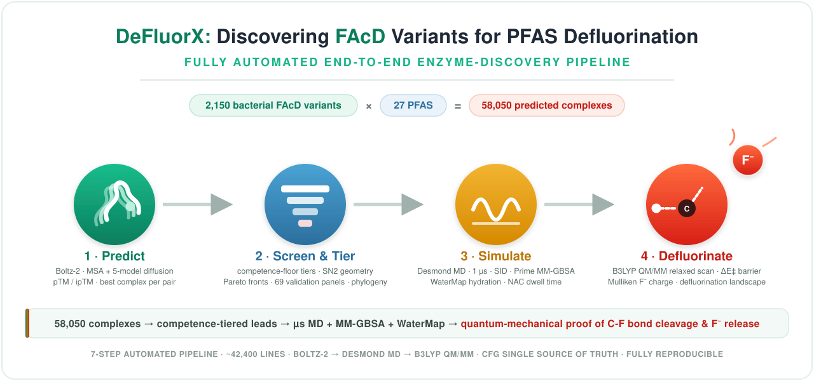
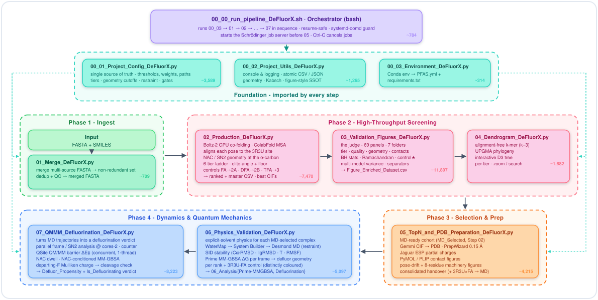
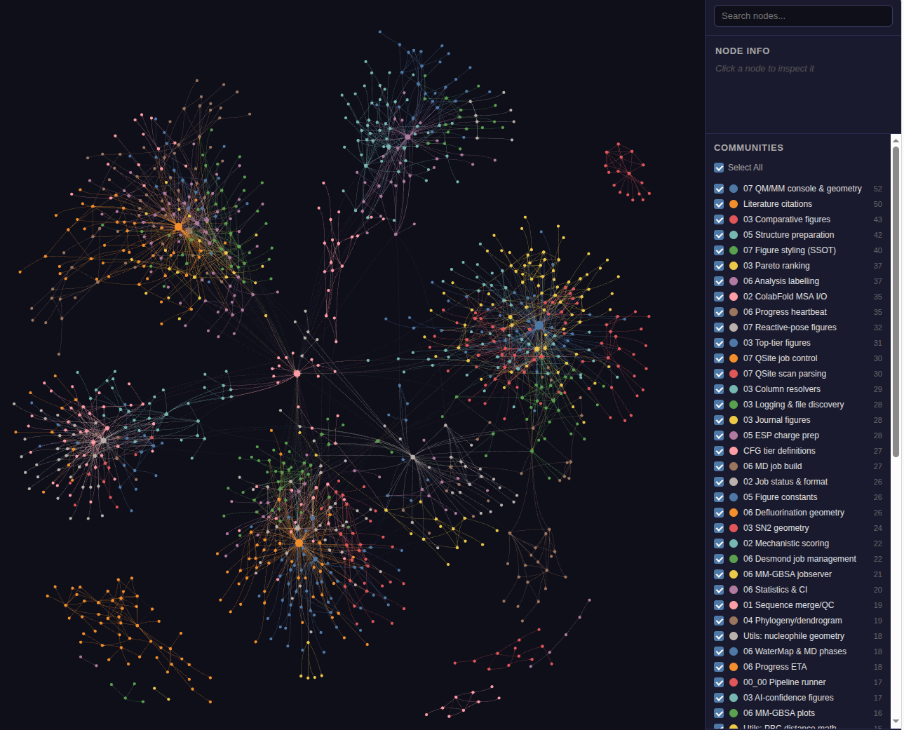

<div align="center">

# DeFluorX: Discovering FAcD Variants for PFAS Defluorination

**AI-guided Structure-based Discovery & Physics-based Mechanistic Validation of FAcD Variants for PFAS Defluorination**



</div>

---

## Table of contents

<table>
<tr>
<td valign="top">

**Science & Structure**

1. [Scientific Mandate](#-facd-scientific-mandate)
2. [PFAS Ligand Panel](#pfas-ligand-panel-27-compounds)
3. [Pipeline Architecture](#-pipeline-architecture-42428-lines)
4. [Repository Structure](#-repository-structure)

</td>
<td valign="top">

**Getting Started & Reference**

5. [Getting Started](#-getting-started)
6. [Technical Reference](#-technical-reference)
7. [Script Catalogue](#-script-catalogue)
8. [Deployment, Reproducibility & Scope](#-deployment-reproducibility--scope)

</td>
<td valign="top">

**More**

9. [References & Citations](#-references--citations)
10. [License](#-license)
11. [Authors](#-authors)

</td>
</tr>
</table>

---

## 🌿 FAcD scientific mandate

### The PFAS problem

Per- and polyfluoroalkyl substances (PFAS) are a family of >12,000 synthetic compounds, persistent in the environment and resistant to biotic and abiotic degradation, characterised by extraordinarily stable carbon–fluorine bonds (C–F bond dissociation energy ~544 kJ mol⁻¹). Ubiquitous environmental contamination, bioaccumulation, and links to endocrine disruption and carcinogenicity make PFAS remediation one of the defining environmental challenges of the 21st century.

Enzymatic defluorination represents a thermodynamically favourable route to PFAS degradation. **Fluoroacetate Dehalogenases (FAcDs)** catalyse an **SN2 Walden-inversion** mechanism, directly cleaving the C–F bond via nucleophilic substitution at the α-carbon. This pipeline addresses the following question:

> *Among thousands of phylogenetically diverse fluoroacetate dehalogenase (FAcD) candidate proteins, which ones possess the precise three-dimensional active-site geometry capable of catalysing defluorination of long-chain perfluorinated PFAS?*

<details id="pfas-ligand-panel-27-compounds">
<summary><b>🧪 27 PFAS Ligand (Click to expand)</b></summary>

The screening panel spans the full regulatory PFAS priority list, from short-chain to ultra-long-chain perfluorinated acids and sulfonates, plus next-generation PFAS replacements. Compounds are grouped by chemical function; index numbers match `D_INP_PFAS-27_Ligands.smi` entries and are fixed throughout the pipeline.

**Positive controls - known FAcD substrates**

| # | Compound | Abbreviation | C–F count | Notes |
|---|----------|--------------|-----------|-------|
| 26 | Fluoroacetate | **FA** | 1 | Natural FAcD substrate; geometry benchmark |
| 27 | Difluoroacetate | **DFA** | 2 | Short-chain analogue |
| 25 | Trifluoroacetate | **TFA** | 3 | Short-chain; alpha-CF3 substrate |

**Regulatory priority - perfluorocarboxylic acids (PFCA)**

| # | Compound | Abbreviation | C–F count |
|---|----------|--------------|-----------|
| 7 | Perfluorobutanoic acid | **PFBA** | 7 |
| 8 | Perfluoropentanoic acid | **PFPeA** | 9 |
| 6 | Perfluorohexanoic acid | **PFHxA** | 11 |
| 13 | Perfluoroheptanoic acid | **PFHpA** | 13 |
| 1 | Perfluorooctanoic acid | **PFOA** | 15 |
| 4 | Perfluorononanoic acid | **PFNA** | 17 |
| 10 | Perfluorodecanoic acid | **PFDA** | 19 |
| 12 | Perfluoroundecanoic acid | **PFUnDA** | 21 |
| 11 | Perfluorododecanoic acid | **PFDoDA** | 23 |
| 14 | Perfluorotridecanoic acid | **PFTrDA** | 25 |
| 17 | Perfluorotetradecanoic acid | **PFTeDA** | 27 |
| 18 | Perfluorohexadecanoic acid | **PFHxDA** | 31 |
| 19 | Perfluorooctadecanoic acid | **PFODA** | 35 |

**Regulatory priority - perfluorosulfonic acids (PFSA)**

| # | Compound | Abbreviation | C–F count |
|---|----------|--------------|-----------|
| 5 | Perfluorobutanesulfonic acid | **PFBS** | 9 |
| 9 | Perfluoropentanesulfonic acid | **PFPeS** | 11 |
| 3 | Perfluorohexanesulfonic acid | **PFHxS** | 13 |
| 15 | Perfluoroheptanesulfonic acid | **PFHpS** | 15 |
| 2 | Perfluorooctanesulfonic acid | **PFOS** | 17 |
| 16 | Perfluorodecanesulfonic acid | **PFDS** | 21 |

**Novel and emerging PFAS replacements**

| # | Compound | Abbreviation | Class | C–F count |
|---|----------|--------------|-------|-----------|
| 20 | Hexafluoropropylene oxide dimer acid | **GenX** | Ether-PFCA | - |
| 21 | ADONA | **ADONA** | Ether-PFCA | - |
| 22 | 6:2 Fluorotelomer alcohol | **6:2-FTOH** | FTOH | 13 |
| 23 | 8:2 Fluorotelomer alcohol | **8:2-FTOH** | FTOH | 17 |
| 24 | Cyclic perfluoroether | **C6O4** | Cyclic PFAS | - |

> †  **C–F count for GenX, ADONA and C6O4:** these are perfluoroether / cyclic next-generation replacements whose fluorine inventory is structure-dependent and branched. The count is listed as '-' pending a verified per-atom structural assignment rather than asserting an unconfirmed value; defluorination scoring uses the modelled 3D structure, not this tabulated count.

> **Controls (25–27):** All 27 compounds are genuine screen targets, each modelled against the full ~2,150-protein panel. Entries 25–27 *additionally* serve as controls with known answers: **FA and DFA are positive controls** (real FAcD substrates - must register as degraders), while **TFA is the negative/decoy control** (α-CF₃, which wild-type FAcD does not defluorinate - must fail). Against the 3R3U crystal these give the reference ordering **FA → Tier_2A, DFA → Tier_2B, TFA → Tier_3**; alongside the DEHA4 enzyme they constitute **6 control cases** that anchor the NAC geometry thresholds. Every run benchmarks them-if a positive control drops out of the degrader band, or the decoy climbs into it, investigate the thresholds or structure-prediction quality before trusting the wider screen.

</details>

### Scientific approach

This pipeline adopts a **structure-first, geometry-validated** screening strategy:

1. **Structure prediction** - Boltz-2 (diffusion-based co-folding model) predicts protein–ligand complex structures at scale, guided by ColabFold MSA for evolutionary context.
2. **Catalytic geometry scoring** - Mechanistic scoring using Near Attack Conformation (NAC) criteria derived from transition-state theory: nucleophile–carbon distance, SN2 attack angle, catalytic triad integrity, and fluoride cradle contacts.
3. **Phylogenetic context** - Interactive evolutionary tree maps tier-classified candidates across taxonomic diversity, revealing convergently evolved defluorination capability.
4. **Molecular dynamics validation** - Schrödinger Desmond MD trajectories assess thermodynamic stability and dynamic NAC persistence of top candidates.
5. **QM/MM extraction & execution** - Representative frames satisfying strict NAC criteria are extracted (with periodic-boundary correction), a valid Schrödinger QSite QM/MM relaxed-scan input (B3LYP/6-31+G(d,p)) is generated, and QSite is launched automatically into a per-candidate folder.

### Crystal reference: PDB 3R3U

All mechanistic geometry is benchmarked against the **3R3U crystal structure** (*Rhodopseudomonas palustris* FAcD, wild-type, 1.60 Å resolution, no substrate bound - carries Ni²⁺/Cl⁻ ions; Chan *et al.* 2011 *JACS*, DOI: 10.1021/ja200277d). The catalytic triad - **Asp110 (nucleophile) · Asp134 (acid catalyst) · His280 (base)** - defines canonical geometry for an active FAcD, cross-validated against DEHA4 (*Delftia acidovorans* D4B; Farajollahi *et al.* 2024 *ACS Omega*).

**Active-site residue quick reference (3R3U / DEHA4 numbering):**

| Role | Key | Residue | Seq ID | Function |
|---|---|---|---|---|
| Nucleophile | Nuc | Asp | 110 | Backside attack on Cα; forms covalent ester |
| Carboxylate clamp 1 | Carb1 | Arg | 111 | Anchors substrate –COO⁻ |
| Carboxylate clamp 2 | Carb2 | Arg | 114 | Anchors substrate –COO⁻ |
| Acid catalyst | Acid | Asp | 134 | Orients/polarises the His base (Asp–His catalytic dyad); the departing F⁻ leaves as a stabilised anion, it is **not** protonated |
| Fluoride stabiliser | Stab_H | His | 155 | H-bond to F⁻ |
| Fluoride cradle | Stab_W | Trp | 156 | H-bond donor (indole N–H) + aromatic stabilisation of F⁻ |
| Fluoride cradle | Stab_Y | Tyr | 219 | H-bond donor (phenolic O–H) + aromatic stabilisation of F⁻ |
| Base catalyst | Base | His | 280 | General base - activates the hydrolytic water that cleaves the Asp110 glycolyl-ester intermediate (Asp110 attacks Cα directly by SN2, without base activation) |

> [!NOTE]
> **Residue numbering in predicted versus crystal structures:**
> For the *R. palustris* 3R3U reference sequence, the sequence extracted from the PDB begins with `GLY -1` and `HIS 0`. Consequently, in Boltz-2 predictions (which use standard 1-based indexing starting from the first amino acid in the FASTA sequence), all residue positions are shifted by **+2** relative to the original crystal structure numbering (for example, crystal Asp110 corresponds to predicted Asp112, Asp134 to Asp136, His155 to His157, Trp156 to Trp158, Tyr219 to Tyr221, and His280 to His282). The alignment engine handles the mapping between the DEHA4 query sequence numbering (where the base is His277 and tyrosine is Tyr217) and the crystal structure numbering (where they are His280 and Tyr219, representing offsets of +3 and +2 respectively) automatically.

---

### The mechanistic filter: beyond structural confidence

Boltz-2 confidence metrics (ipTM, pLDDT, cross-PAE) assess structural plausibility - they do not assess catalytic competence. A protein can score perfectly on every confidence metric whilst being entirely unable to perform SN2 defluorination. This pipeline adds independent mechanistic gates that must all pass. Critically, every ligand-side gate is keyed on the **reactive centre** - the α-carbon bonded to the substrate carboxylate, the position FAcD defluorinates - not on the nearest ligand atom, so a large PFAS cannot satisfy the gates with non-reactive peripheral fluorines:

The tier ladder gates on a **feasibility-weighted mechanistic score** - `mechanistic_score_effective` = raw geometry mechanistic score **−** a graded chemistry penalty (scissile C–F BDE + backside occlusion) **−** a graded pocket-containment penalty. Both penalties are **graded, per-pose, and engage only past a chemistry/steric threshold**, so proven small substrates are untouched and the demotion is proportional to how recalcitrant or oversized a ligand is - never a hard substrate-class veto. A novel variant that reorganises its pocket, or presents a favourable pose, can still surface. The **functional band adds two orthogonal tier-gate axes** so the enzyme–substrate references separate cleanly: the **raw SN2 attack angle** is hard-gated at the elite tiers (Tier_1A ≥ 170°, Tier_1B ≥ 165°) **and** at Tier_2A (≥ 155°) - a statically-bent pose such as difluoroacetate (~108°) drops to Tier_2B, which carries no raw-angle gate and so keeps the bent-but-feasible substrate; and a **substrate-feasibility floor** (`competence_score` ≥ 0.50 / 0.40 at Tier_2A / 2B, the feasibility-weighted axis that folds the graded C–F BDE) drops a high-BDE decoy such as trifluoroacetate (whose whole family caps at competence ≈ 0.35) to Tier_3. Under this one formula, applied to every complex, the three 3R3U references land **FA → Tier_2A, DFA → Tier_2B, TFA → Tier_3**. Within-tier ranking keeps the **raw** geometry score. Every ligand-side gate keys on the α-carbon reactive centre.

<details>
<summary><b>The full gate table + graded-penalty logic (click to expand)</b></summary>

| Gate | Criterion | Basis |
|------|-----------|-------|
| **Productive α-attack** | The SN2 attack carbon (used for the distance/angle gates) must be the **α-carbon adjacent to the ligand carboxylate**; required for every degrader tier. A mid-chain CF₂ or a non-carboxylate head (sulfonate, ether) does not qualify. | FAcD attacks Cα of a 2-haloalkanoate; the carboxylate is the obligatory anchoring handle (Chan 2011; Kurihara & Esaki 2008) |
| **SN2 attack angle** | ≥ 145° relaxed · ≥ 170° (Tier_1A), measured Asp110-Oδ → α-carbon → leaving F | Backside attack geometry; 180° = ideal Walden inversion (170° is the near-attack gate for the native substrates, within ~10° of the 180° Walden TS given Boltz ground-state noise) |
| **Nucleophile–C distance** | ≤ 3.8 Å relaxed · ≤ 3.0 Å (Tier_1A), measured **attacking** Asp110-Oδ → **α-carbon**. The oxygen is the one that produced the reported SN2 angle, not the nearer of the two: measuring the distance to one Oδ and the angle to the other describes a chimeric nucleophile. The minimum over both oxygens is retained as `dist_Nuc_nearest_O` (diagnostic) | Near Attack Conformation (NAC) requirement - one atom must satisfy both halves of it |
| **Mechanistic-score gate (ladder + coupled elite gate)** | Gates on `mechanistic_score_effective` = raw holistic 0–1 geometry score (anchor reach + triad relays + clamp + halide stabilisation + Šidák-corrected angle) **minus** the graded chemistry and pocket-containment penalties. Ladder floor ≥ 0.85 / 0.85 / 0.70 for Tier_1A / 1B / 2A. Tier_1A additionally requires the **coupled elite gate**: effective-mech ≥ 0.90 **OR** (≥ 0.85 **AND** Criterion-B constellation ≥ 0.74). | Feasibility-weighted tier-gate key |
| **Raw-angle gate (elite + Tier_2A)** | The raw `angle_effective` is hard-gated ≥ 170° / 165° / 155° at Tier_1A / 1B / 2A; Tier_2B has **no** raw-angle gate, so a bent-but-feasible substrate (difluoroacetate, ~108°) is retained at 2B rather than cliffed below a straight-posed decoy | Keeps the elite tier near-ideal while letting a feasible bent substrate rank above a rigid decoy |
| **Substrate-feasibility floor (Tier_2A/2B)** | `competence_score` ≥ 0.50 / 0.40 at Tier_2A / 2B. The trifluoroacetate family caps at competence ≈ 0.35, so a high-BDE decoy fails both floors and lands Tier_3, below the genuine substrates | Puts the feasibility-weighted chemistry axis (folds the graded C–F BDE) into the functional-band gate - the decoy separator |
| **Representative-pose selection** | Across the Boltz-2 diffusion samples, the reported pose is the highest degrader tier reached, then the **highest SN2 attack angle** within that tier (the near-attack/Walden conformer), then competence, then confidence | Surfaces each candidate's genuine near-attack geometry rather than an arbitrary sample |
| **Pocket containment - two protein-aware measurements** | `pocket_containment_cavity` (**gates**) = fraction of ligand heavy atoms the **protein cavity** encloses, by ray-cast buriedness: 42 rays per ligand heavy atom, an atom counts as contained at buriedness ≥ `BURIAL_MIN` (0.70, corpus-calibrated). Measured against protein coordinates, so the same ligand scores differently in a narrow and a wide pocket and a genuine wide-pocket homolog is not punished for the ligand's intrinsic length. `pocket_containment_site8` (**reported**) = fraction of ligand heavy atoms within `SITE8_SHELL_A` (5 Å) of the **eight mapped catalytic residues** - catalytic engagement, not cavity fit. Measured: FA/DFA/TFA ≈ 0.92–1.00 · PFBA/PFHxA/PFOA ≈ 0.91–0.99 · PFTeDA (C14) 0.36 · PFODA (C18) 0.35. Perfluoro recalcitrance is carried by the **β-fluorine chemistry penalty**, not by containment | FAcD is a small-substrate haloacetate hydrolase; long PFAS defluorinate (rarely) by radical decarboxylation, not hydrolytic SN2 (Wackett 2022; Chan 2011). Containment must express the **pocket**, not the ligand - a metric computed on ligand coordinates alone cannot tell a narrow pocket from a wide one |
| **Bidentate carboxylate clamp** | Tier_1A requires the ligand –COO⁻ oxygens to salt-bridge **both** distinct cationic clamp residues (Arg111/Arg114, or an engineered Lys), donor N within 4.0 Å, **and the two arms must be assignable to distinct carboxylate oxygens** - both arginines converging on the same oxygen is a monodentate collapse and earns no bidentate credit | The two-arm clamp positions the substrate for α-attack; one contact, one oxygen, or a non-carboxylate head, is insufficient (Maestro salt-bridge geometry; Donald 2011) |
| **Elite bond-strength ceiling** | A scissile C–F above `TIER_ELITE_BDE_MAX` (128 kcal/mol) **cannot hold Tier_1A at any attack angle** - it is capped at Tier_1B and remains a discovery lead for Step-07 QM/MM. The angle fade applies to the **backside-occlusion** term only (a steric obstruction a near-linear approach genuinely clears); the C–F dissociation energy is a property of the bond, not of the angle of approach, and does not fade | Geometry cannot repeal thermochemistry: a bond above the ceiling stays unbroken however linear the approach. The α-F-count BDE tops out at 127.5 (α-CF3), just under the 128 ceiling, so an **α-CF3 carbon stays eligible for Tier_1A on a pose that earns it** - not capped by the ceiling, but held to the tier floor by the *graded* C–F penalty above `SCISSILE_CF_BDE_MAX` (123 kcal/mol); an α-CF2 (119.5) and α-CH2F (109.9) sit comfortably inside |
| **Criterion A - active-site integrity** | Fraction of the **eight** catalytic residues (Asp110 nucleophile · His280 base · Asp134 acid · two clamp arginines · His155/Trp156/Tyr219 cradle) present and correctly typed | Identity/presence of the catalytic machinery (Chan 2011); replaces global sequence identity as the conservation signal |
| **Criterion B - catalytic constellation** | `1/(1+RMSD)` of the eight catalytic-residue Cα superposed on the 3R3U crystal; a per-tier floor (0.55 / 0.45 / 0.35 / 0.25) **caps** the tier - a pose below its floor is demoted (downgrade-only, never a promoter; B<0.25 → Tier_4, unmeasurable → Decoy) | Residues present (A) ≠ residues geometrically assembled (B); B enforces a crystal-grade constellation for the elite tiers |
| **Fluoride cradle occupancy** | His155 / Trp156 / Tyr219 **H-bond-donor atom** within 5.5 Å of the departing F | Electrostatic + aromatic stabilisation of F⁻ departure; donor-atom test avoids a ring carbon spuriously satisfying the gate |
| **Nucleophile-resolution guard** | Tier_1A requires the catalytic Asp to be a direct alignment hit or a tight (≤ 2-residue) windowed rescue, recorded in `nuc_resolution` | The ±5 resolver can otherwise latch onto a non-catalytic Asp; the elite tier is barred from improbable realignments |
| **Confidence demotion** | A Tier_1A hit whose Boltz confidence < 0.85 is demoted one notch to Tier_1B; the raw geometric tier is retained in `geometric_tier` | Guards the headline elite claim against an unconfident predicted fold |
| **Size-fair backbone-clash veto** | A pose is decoyed when the backbone-clash **fraction** ≥ 0.15 **and** count ≥ 3 (clashing tail atoms / ligand heavy atoms) | Fraction-based, so a long PFAS is not penalised for length the way a flat clash count would |

**Chemistry and pocket-fit are graded tier penalties, not hard vetoes (discovery-open).** A high-affinity PFAS binder that presents the wrong face to Asp110, or lacks the His155/Trp156/Tyr219 basket, is **classified non-degrader regardless of Boltz-2 confidence** - high-affinity binders are not FAcDs. Beyond that, recalcitrance is folded into the tier as a **graded** penalty on `mechanistic_score_effective`: the chemistry penalty (scissile C–F BDE above 123 kcal/mol + backside occlusion above 2.0 Å) demotes the SN2 dead-end **TFA** below the elite tiers, and the **Tier_2A/2B competence-feasibility floor** then places the trifluoroacetate references at **Tier_3** (the family caps at competence ≈ 0.35); the pocket-containment penalty demotes oversized chains - all proportional to severity, so no ligand is excluded and a favourable pose or genuine wide-pocket variant can still climb. Critically, only the **backside-occlusion** half of the chemistry penalty fades with a near-ideal SN2 attack angle - computed on the multiplicity-corrected `angle_effective`, the same angle the tier ladder gates on, **not** the raw best-of-N angle, so a poly-fluorinated carbon cannot escape its backside penalty on an inflated single-fluorine trajectory the Šidák correction removes (applied in full at/below 175°, waived at/above 180°). Occlusion is a steric obstruction of the attack trajectory, and a pose that reaches an effective 180° has by construction cleared it. The **C–F bond-dissociation energy does not fade**, because the strength of the bond being broken is a property of the bond and not of the angle of approach. A scissile C–F above `TIER_ELITE_BDE_MAX` (128 kcal/mol) is therefore **barred from Tier_1A at any angle** and capped at Tier_1B. An **α-CF₃ carbon (scissile C–F 127.5 kcal/mol) sits just below that ceiling**, so on an ideal pose it stays eligible for Tier_1A - held near the floor by the graded C–F penalty (above `SCISSILE_CF_BDE_MAX`, 123 kcal/mol) rather than capped, and adjudicated by Step-07 QM/MM. The β-fluorination and containment penalties likewise do not fade, so a perfluoroalkyl chain is never rescued by a single favourable angle. The β-withdrawal count **crosses a single ether oxygen** (an ether O is a strong −I withdrawer, counted alongside vicinal fluorine), so the perfluoro**ether** acids - **C6O4** (ether O directly on the α-carbon) and **ADONA** - are correctly penalised (β = 2 and 4) rather than read as difluoroacetate (β = 0/1); without it they leak into Tier_1A. FA/DFA/TFA carry no vicinal withdrawing group, so β = 0 and their score is untouched (O'Hagan 2008 on C–F strength; Wackett 2022 on perfluoroether recalcitrance). The **`feasibility_factor`** and the two-factor **`sn2_dead_end`** flag remain reported diagnostics. The activation barrier is decided downstream by **Step-07 QM/MM** (the final arbiter); DeHa4's inability to turn over TFA (Wackett 2022) does not prove no FAcD variant can - the near-ideal geometry is exactly the prerequisite such a variant would need - hence graded not vetoed. Within a tier, ties break on `competence_score` → catalytic constellation (Criterion B) → active-site conservation → **`model_degrader_consensus`** (the fraction of Boltz diffusion samples that agree - a reproducible pose floats above a single-frame fluke, but is never filtered). A control assertion flags the run if the native substrates FA/DFA fail to register as degraders.

**On the hard–soft acid–base (HSAB) transition:** Fluoroacetate's α-carbon is a borderline electrophile, whilst the departing fluoride is the hardest halide - high charge density, low polarisability. The incoming Asp110-OD is a hard nucleophile. The pipeline explicitly models this: the fluoride cradle (His155/Trp156/Tyr219) provides the specific hard-acid electrostatic environment required for F⁻ departure, whilst the SN2 angle enforces the anti-periplanar trajectory that maximises orbital overlap with the active C–F σ* anti-bonding orbital, whilst minimising steric and electrostatic repulsion with adjacent fluorine substituents in the transition state.

</details>

---

## 🔄 Pipeline architecture (42,428 lines)

<div align="center">

</div>

**Diagram key:** a bash orchestrator (`00_00_run_pipeline_DeFluorX.sh`, violet) runs each step 01–07 in sequence and provisions the shared **Foundation** - `00_01` config · `00_02` utils · `00_03` env; the **grey dotted** links mark it as imported by every step. **Solid arrows** are data flow: `Input → 01 → 02 → 03 → 04` across the top row (Phase 1 Ingest, Phase 2 Screening), then `02 → 05 → 06 → 07` down through the bottom row (Phase 3 Selection, Phase 4 Dynamics). Every box is a script, labelled with its approximate line count.

**Four-phase design:**

| Phase | Steps | Goal | Input | Output |
|---|---|---|---|---|
| **Foundation** | 00_01–00_03 | Environment installation, shared configuration, and utility functions | - | Conda environment, `CFG` & `ProjectUtils` |
| **Phase 1 - Ingest** | 01 | Database merging & non-redundant QC | Raw sequence databases | Merged FASTA |
| **Phase 2 - Screening (HTS)** | 02–04 | Co-folding, ranking & database-wide validation | Merged FASTA + PFAS panel | Master/ranked CSV, D3 tree, publication figure panel |
| **Phase 3 - Select & Prep** | 05 | MD-ready selection, protonation, minimisation & Top-N extraction | CIF structures from Step 02 | Prepared structures, 3D interaction diagrams |
| **Phase 4 - Dynamics & QM** | 06–07 | Step 06 runs the ESP-charged physics in one script - WaterMap hydration, System Builder, Desmond MD, then SID + Prime MM-GBSA binding free energy; Step 07 adds MD/NAC analysis, PBC-corrected frame extraction, and automated QSite QM/MM defluorination scans | Step-05 handover (`R{N}_*.pdb` + `*_ESP.mae`) | Desmond trajectories, WaterMaps, MM-GBSA ΔG_bind + plots, QSite `.in` + per-candidate QSite output folders, WaterMap/QSite defluorination figures |

Phases 1-2 (ingest and screening) are deliberately fast and permissive; Phase 3 prepares and extracts the elite hits; Phase 4 evaluates candidate dynamics under thermodynamic fluctuations to confirm Near Attack Conformation (NAC) persistence.

> [!NOTE]
> In Phase 2, Step 02 (Boltz-2 production) co-folds every candidate against the PFAS panel. A fresh prediction takes approximately 15 to 30 seconds per complex (GPU co-folding plus CPU file/CSV write operations).

### 🕸 Code architecture graph

<details>
<summary><b>Function-level knowledge graph (graphify) - click to expand</b></summary>

A function-level knowledge graph of the whole pipeline (1,075 nodes · 2,099 edges ·
12 communities), auto-generated with [graphify](https://github.com/safishamsi/graphify)
and regenerated on major code changes. **[`CFG`](./00_01_Project_Config_DeFluorX.py) is the top
hub node (91 edges, the most connected)** - every module's thresholds and figure colours route
through it, the single-source-of-truth architecture showing up structurally.



**▶ [Open the interactive graph in your browser](https://htmlpreview.github.io/?https://github.com/KU-MGB/DeFluorX/blob/main/assets/graph.html)** - renders the live `assets/graph.html` (GitHub shows repo HTML as source, so it is served through the htmlpreview proxy).

The graph output lives in **[`assets/`](./assets/)** and is regenerated with `/graphify`:

> [!NOTE]
> [`assets/graph.html`](./assets/graph.html) (interactive - zoom, pan, community
> filter, node search), [`assets/graph.json`](./assets/graph.json) (the raw graph,
> GraphRAG-ready) and [`assets/GRAPH_REPORT.md`](./assets/GRAPH_REPORT.md) (audit
> trail: hub nodes, communities, surprising connections). Explore it via the browser link above, or open `assets/graph.html` locally.

</details>

---

## 📁 Repository structure

<details>
<summary><b>Full directory tree (click to expand)</b></summary>

```
DeFluorX/
│
├── 00_00_run_pipeline_DeFluorX.sh              ← One-command full pipeline runner
├── 00_01_Project_Config_DeFluorX.py            ← ★ Central configuration (all parameters)
├── 00_02_Project_Utils_DeFluorX.py             ← Shared utilities (logging, geometry, colours)
├── 00_03_Environment_DeFluorX.py               ← Environment check, conda/pip export
│
├── 01_Merge_DeFluorX.py                        ← FASTA merge, deduplication, QC
├── 02_Production_DeFluorX.py                   ← Boltz-2 prediction + scoring (MAIN ENGINE)
├── 03_Validation_Figures_DeFluorX.py           ← Publication-quality validation figures
├── 04_Dendrogram_DeFluorX.py                    ← Interactive D3 phylogenetic tree
├── 05_TopN_and_PDB_Preparation_DeFluorX.py     ← MD-ready gate · CIF→PDB · PrepWizard · Top-N extraction · PyMOL/PLIP figures
├── 06_Physics_Validation_DeFluorX.py       ← Step 06 ESP physics: WaterMap · System Builder · MD · SID · Prime MM-GBSA
├── 07_MD_QMMM_Defluorination_DeFluorX.py ← Step 07 MD + NAC analysis + QM/MM engine
│
├── PFAS.yml                                 ← Conda environment (full reproducible spec)
├── requirements.txt                         ← pip requirements (refreshed each run)
│
├── A_Labelled_15-Seq.fasta                  ← Curated seed sequences (~15 proteins)
├── B_Downloaded-Blast_Uniprot_NCBI.fasta    ← BLAST/UniProt/NCBI expanded set
├── C_INP_Merged_for_Boltz-2.fasta         ← Merged, deduplicated input (auto-generated)
├── 00_Merge.log                            ← Merge QC report (auto-generated by 01_Merge_DeFluorX.py)
├── C_INP_Merged_for_Boltz-2.png           ← Length/identity distribution figure (auto-generated)
├── D_INP_PFAS-27_Ligands.smi                  ← 27 PFAS ligands (SMILES format, tab-separated)
│
├── Boltz-2_Run_YYYYMMDDTHHMMSSZ/        ← Output directory generated for each pipeline execution run
│   ├── 0_DeFluorX_Pipeline_Logs/           ← Orchestrator per-run log (00_Pipeline_*.log, from 00_00_run_pipeline_DeFluorX.sh)
│   ├── 1_Boltz2_Production/             ← Prediction engine outputs (generated by 02_Production_DeFluorX.py)
│   │   ├── 1_Input_Data/               ← Copied input files (FASTA + SMILES)
│   │   ├── 2_Boltz2_YAML_Configs/       ← Per-job Boltz-2 YAML inputs
│   │   ├── 3_Sequence_Reference_Data/   ← BLOSUM62 alignments, identity tables
│   │   ├── 4_Prediction_Jobs/           ← Boltz-2 run outputs + confidence JSON
│   │   ├── 00_Boltz2_Production.log       ← Production engine log file
│   │   ├── 5_Boltz2_DeFluorX_Master_*.csv  ← Master results CSV (all jobs)
│   │   └── 6_Boltz2_DeFluorX_Ranked_*.csv  ← Tier-ranked results CSV
│   │
│   ├── 2_Best_Complexes_CIFs/           ← Top-ranked CIF per protein × ligand (generated by 02_Production_DeFluorX.py)
│   │
│   ├── 3_Validation_Figures/            ← 64 figure panels (folders 03–08) + 5 Ramachandran controls (folder 02) = 69, in 7 figure folders + 01_Analysis_Data (03_Figure_Enriched_Dataset.csv). Generated by 03_Validation_Figures_DeFluorX.py
│   │
│   ├── 4_Dendrogram/                     ← Interactive phylogenetic D3 tree apps (generated by 04_Dendrogram_DeFluorX.py)
│   │
│   ├── 5_TopN_and_Preparation/         ← Consolidated Step-05 output (generated by 05_TopN_and_PDB_Preparation_DeFluorX.py)
│   │   ├── 00_TopN_and_Preparation.log               ← single log (preparation + extraction)
│   │   ├── 1_Converted_Raw_PDB/        ← Gemmi-converted PDB files (+ PyMOL/PLIP figures)
│   │   ├── 2_Prepared_PDBs/            ← Prepared PDB files (PrepWizard, 0.15 Å restrained min) (+ figures)
│   │   ├── 3_Comparative_Analysis/     ← MD-ready cohort - analysis + delivery, sequential numbering:
│   │   │     01_Prepared_Pose_Geometry.csv · 02_Pose_Drift_CIF_to_Prepared.png ·
│   │   │     03_Machinery_Engagement_Distribution.png · 04_…_Comparative_Ramachandran_Plots/ ·
│   │   │     05_Controls/ · 06_…_Molecular_Handover_Files/ (FASTA/SDF/PDB + Combined_Scientific_Data.csv)
│   │   └── 4_Ligand_ESP_Charges/       ← Jaguar ESP partial charges per ligand (ON by default):
│   │         00_ESP_Charges_Summary.csv · 01_ESP_Alpha_Carbon_Charge.png · <lig>_ESP.mae (load in System Builder)
│   │
│   ├── 6_Physics_Validation/            ← ESP-charged explicit-solvent physics (generated by 06_Physics_Validation_DeFluorX.py)
│   │   ├── 00_Physics_Validation.log            ← Step-06 merged colour log (WaterMap → build → MD → SID → MM-GBSA)
│   │   ├── 01_Prepared_Proteins/       ← MD-selected prepared proteins imported from Step 05
│   │   ├── 02_ESP_Charged_Complexes/   ← merged complexes carrying the ligand ESP charges (R_N_<stem>_ESP_Complex.mae)
│   │   ├── 03_WaterMaps/               ← WaterMap hydration-site results (watermap_R_N/*_wm.maegz + watermap_R_N.csv)
│   │   ├── 04_System_Builder/          ← Desmond system build files (minimise-volume, TIP3P, OPLS4, ESP in the force field)
│   │   ├── 05_MD_Simulations/          ← Desmond MD topology + trajectory (*-out.cms, *_trj/, *.ene) + SID *.eaf + per-rank *_mmgbsa-prime-out.csv (one per desmond_md_job_R_N/, alongside SID)
│   │   └── 06_Analysis/                ← ALL Step-06 figures + the combined 00_MMGBSA_Summary.csv, numbered in pipeline order: 01_Physics_Build_Solvation_QC.png, 02_MD_Trajectory_QC.png, 03_MMGBSA_Combined_AllRanks.png, 04_Defluorination_Combined_AllRanks.png, Defluorination/ (Defluorination_R<N>/01-03 figures + 04_Defluorination_Geometry.csv), Prime-MMGBSA/MMGBSA_Profile_R<N>.png
│   │
│   └── 7_MD_Thermodynamics_Results/     ← MD + NAC analysis + QM/MM engine outputs (generated by 07_MD_QMMM_Defluorination_DeFluorX.py)
│       ├── Rank_N/                       ← Per-candidate: PBC-corrected frame (Ideal_Final.maegz), NAC dashboard + NAC_Data.csv, MD_Stats.json (resume cache), and QSite_SN2/Frame_<rank>[_Best]_<traj>/ (one QM/MM scan per sampled frame, best pre-organised first: .in/.mae/.out named for the frame folder + defluorination energy profile/CSV/renders)
│       ├── 00_MD_Thermodynamics.log    ← Step 07 engine execution log
│       ├── 01_MD_Master_Ranking.csv     ← Master ranked thermodynamic validation CSV (NAC dwell ns, QSite ΔE‡/ΔE_rxn, departing-F charge, NAC-conditioned + component-decomposed MM-GBSA, Defluor_Propensity / Is_Defluorinating verdict)
│       ├── 02_MD_Comparative_Analysis.png ← MD frames distance/angle distributions
│       ├── 03_MD_Viability_Summary.png  ← Parallel nested viability bar chart
│       ├── 04_Comparative_Residue_Engagement.png ← Heatmap: mean distance of each catalytic residue to the warhead C, all cases
│       ├── 05_Defluorination_Landscape.png ← whole-story figure: catalytic persistence × QM/MM barrier × binding
│       ├── 06_MMGBSA_Decomposition_AllRanks.png ← ΔG components, whole trajectory vs reactive (NAC) pose, all candidates
│       ├── 07_Machinery_Engagement_AllRanks.png ← Per-residue median distance (+ mean marker) + IQR whiskers + contact occupancy against the CFG criterion bands
│       ├── 08_QSite_Profiles_AllJobs.png ← every job's best-frame QM/MM PES overlaid + defluorination ranking by ensemble ΔE‡
│       └── Rank_N/                       ← per-candidate figures, numbered in the order they are drawn:
│                 01_NAC_Dashboard.png (NAC geometry + WaterMap panel) · 02_Active_Site_Dynamics.png (every catalytic distance: time-traces + violin bank + NAC dwell) · 03_Free_Energy_Landscapes.png (3D FEL: reaction coordinates + essential dynamics) · 04_MMGBSA_Trace.png (per-frame ΔG_bind, rolling mean ±1 SD) · 05_MMGBSA_NAC_Decomposition.png (ΔG components) · 06_Machinery_Engagement.png (residue engagement) · 07_QSite_Reaction_Profile.png (3-panel: activation energetics + departing-F charge + plain-language cleavage verdict card) · 08_QSite_Ensemble_Profiles.png (all sampled frames overlaid + rate-weighted ensemble ΔE‡ + spread) · 09_QSite_Scan_Data.csv (long-format raw PES + F-charge per point per frame + per-frame/per-rank summary + QM-region provenance) · each QSite_SN2/Frame_N/ also holds 01_Reaction_Profile.png
│                 Figures 01–06 are drawn from the frame table, so they exist before/without QM/MM; only 07 needs a finished QSite scan.
│
├── assets/                          ← Logo, architecture SVG, /graphify code-graph (graph.html/json, GRAPH_REPORT.md, graphify.png)
├── PFAS_Geneious.geneious           ← Geneious alignment project (auxiliary)
└── LICENSE                          ← CC BY-NC 4.0
```

</details>

### Key file descriptions

| File | Role | Inputs | Outputs |
|------|------|--------|---------|
| [`00_00_run_pipeline_DeFluorX.sh`](./00_00_run_pipeline_DeFluorX.sh) | **Entry point** - bash orchestrator; conda-activates then runs 00_03 → 01 → … → 07 in sequence; `--resume-from` any step; starts the Schrödinger local job server before Step 05 (it does not survive a reboot); Ctrl-C / kill cancels background Schrödinger jobs. Imports nothing - invokes each script as a subprocess | - | Logs, all outputs |
| [`00_01_Project_Config_DeFluorX.py`](./00_01_Project_Config_DeFluorX.py) | **Single source of truth** - all tiers, thresholds, scoring weights, figure-style tokens, and CSV name stems; imported by every step | - | `CFG` dataclass instance |
| [`00_02_Project_Utils_DeFluorX.py`](./00_02_Project_Utils_DeFluorX.py) | Shared utilities: ConsoleColours, geometry / MIC / Kabsch, logging, atomic CSV/JSON, `latest_by_mtime`, `apply_figure_style` | - | `ConsoleColours`, `calculate_angle()`, `latest_by_mtime()`, etc. |
| [`00_03_Environment_DeFluorX.py`](./00_03_Environment_DeFluorX.py) | Environment check + conda/pip export (reproducibility spec) | - | `PFAS.yml`, `requirements.txt` |
| [`01_Merge_DeFluorX.py`](./01_Merge_DeFluorX.py) | Sequence deduplication + QC | `A_*.fasta`, `B_*.fasta` | `C_INP_Merged_for_Boltz-2.fasta` |
| [`02_Production_DeFluorX.py`](./02_Production_DeFluorX.py) | **Core engine** - MSA, prediction, scoring, tier classification | merged FASTA + SMI | master CSV, CIF files, YAML jobs |
| [`03_Validation_Figures_DeFluorX.py`](./03_Validation_Figures_DeFluorX.py) | 64 figure panels + 5 Ramachandran controls (= 69) in 7 content-matched figure folders + 01_Analysis_Data - overview/AI quality/geometry+mechanism/interactions/PFAS scope/diagnostics | ranked CSV | PNG figures + `03_Figure_Enriched_Dataset.csv` |
| [`04_Dendrogram_DeFluorX.py`](./04_Dendrogram_DeFluorX.py) | Interactive phylogenetic D3 tree | merged FASTA + `03_Figure_Enriched_Dataset.csv` | `03_Global_Master_Interactive_App.html` (+ per-tier apps) |
| [`05_TopN_and_PDB_Preparation_DeFluorX.py`](./05_TopN_and_PDB_Preparation_DeFluorX.py) | MD-ready gate → Gemmi CIF→PDB + PrepWizard + Top-N extraction + PyMOL/PLIP figures | ranked CSV + CIF files | prepared `.pdb` files, tier CSV, interaction figures |
| [`06_Physics_Validation_DeFluorX.py`](./06_Physics_Validation_DeFluorX.py) | **Step 06** ESP-charged explicit-solvent physics: WaterMap → System Builder → MD, then SID + **Prime MM-GBSA** on every completed MD job (per rank: MD on GPU, then extraction → SID → MM-GBSA → defluorination on a CPU worker, pipelined so the GPU runs the next rank's MD; production under a ligand/backbone positional restraint, so retention is restraint-enforced; sudo prompted up front) | Step-05 handover (`R{N}_*.pdb` + `*_ESP.mae`) | `*_wm.maegz`, `-out.cms` + `*_trj/`, `*_SID-out.eaf`, `*_mmgbsa-prime-out.csv`, **`06_Analysis/` - every Step-06 figure in one folder** (build/solvation QC, MD trajectory QC, MM-GBSA individual + combined), **`00_Phase_Timings.csv`** (per-job + per-phase wall-clock), merged log |
| [`07_MD_QMMM_Defluorination_DeFluorX.py`](./07_MD_QMMM_Defluorination_DeFluorX.py) | **Step 07** MD + NAC analysis + QM/MM extraction & QSite auto-run (consumes `*_SID-out.eaf`) | Step-06 MD trajectories + WaterMaps + ranked CSV | PBC-corrected frame, QSite `.in`/`.mae`, per-candidate QSite output folder |
| [`C_INP_Merged_for_Boltz-2.fasta`](./C_INP_Merged_for_Boltz-2.fasta) | Merged, deduplicated input protein sequences for Boltz-2 (generated by 01_Merge_DeFluorX.py) | - | - |
| [`D_INP_PFAS-27_Ligands.smi`](./D_INP_PFAS-27_Ligands.smi) | 27 PFAS ligand SMILES panel | - | - |

---

## 🚀 Getting started

### 🛠 Installation & environment

<details>
<summary><b>Prerequisites, conda environment & Schrödinger setup - click to expand</b></summary>

### Prerequisites

| Requirement / Tool | Version | Notes |
|--------------------|---------|-------|
| Linux (Ubuntu 22.04+) | - | Tested on Ubuntu 24.04 |
| CUDA-capable GPU | ≥12 GB VRAM | Required for Boltz-2 |
| CUDA Toolkit | 13.x | Installed via conda |
| Miniconda / Conda | ≥24.x | Environment management |
| Schrödinger Suite | 2024+ | Required for steps 05–07: PrepWizard + Jaguar ESP (05) · WaterMap · System Builder · Desmond MD · SID · Prime MM-GBSA (06) · QSite QM/MM (07) |
| PyMOL | ≥3.0 | 3D molecular structure visualiser; auto-installed via conda if absent |
| PLIP | ≥3.0 | Protein–Ligand Interaction Profiler; auto-installed via pip if absent |

### Step 1 - Clone the repository

```bash
git clone https://github.com/KU-MGB/DeFluorX.git
cd DeFluorX
```

### Step 2 - Create and verify the conda environment

Use the automated installer (recommended):

```bash
python 00_03_Environment_DeFluorX.py --install
conda activate PFAS
python 00_03_Environment_DeFluorX.py
```

<details>
<summary>Manual alternative - conda directly</summary>

```bash
conda env create -f PFAS.yml
conda activate PFAS
```

</details>

> Full restoration takes approximately 10–15 minutes depending on network speed.

### Step 3 - Verify the environment

```bash
python 00_03_Environment_DeFluorX.py
```

Expected output:

```
  ✔ Python           : 3.10.19
  ✔ boltz            : 2.2.1
  ✔ colabfold        : 1.6.1
  ✔ MDAnalysis       : 2.9.0
  ✔ rdkit            : 2026.3.3
  ✔ gemmi            : 0.6.5
  ✔ torch (CUDA)     : 2.11.0 - CUDA available
  ✔ PyMOL            : 3.1.0
  ✔ PLIP             : 3.0.0
```

### Step 4 - Schrödinger Suite (required for steps 05–07)

The whole physics/QM half runs on Schrödinger: **PrepWizard + Jaguar ESP (step 05)**, **WaterMap · System Builder · Desmond MD · SID · Prime MM-GBSA (step 06)**, and **QSite QM/MM (step 07)** all need a Schrödinger licence. Set the environment variable before running:

```bash
export SCHRODINGER=/opt/schrodinger   # adjust to your installation path
```

Steps **01–04** (merge, Boltz-2 co-folding, validation figures, dendrogram) run **without** Schrödinger. Without it, step 05 falls back to raw Gemmi-converted PDBs and skips ESP charging, and steps 06–07 cannot run.

</details>

### ⚡ Running the pipeline

<details>
<summary><b>Running the pipeline - full run, smoke test, resume, individual steps - click to expand</b></summary>

### Full pipeline - one command

```bash
conda activate PFAS
bash 00_00_run_pipeline_DeFluorX.sh
```

The script activates the environment, runs all steps in sequence, writes a timestamped log to `<Run>/0_DeFluorX_Pipeline_Logs/`, and records per-step wall-clock timings to `00_Phase_Timings.csv` on completion.

### Quick validation (smoke test)

Before committing to a full 12-hour run, verify that Boltz-2, Schrödinger, and all path dependencies are correctly configured:

1. Create a minimal FASTA containing the reference sequence (for example, the DeHa4 control sequence available in `CFG.DEHA4_CONTROL_SEQ` in `00_01_Project_Config_DeFluorX.py`):

```bash
python -c "
import importlib.util, sys
spec = importlib.util.spec_from_file_location('cfg', '00_01_Project_Config_DeFluorX.py')
mod  = importlib.util.module_from_spec(spec); spec.loader.exec_module(mod)
with open('smoke_test.fasta', 'w') as f:
    f.write('>DeHa4_reference\n' + mod.CFG().DEHA4_CONTROL_SEQ + '\n')
print('Written smoke_test.fasta')
"
```

2. Run step 02:

```bash
python 02_Production_DeFluorX.py --fasta smoke_test.fasta
```

Expected behaviour: the pipeline will execute the 6 control calibration cases (DeHa4 and 3R3U controls × 3 control ligands) at the very beginning of the run. This initial calibration takes approximately 10–15 minutes on a single GPU.

The 3R3U × Fluoroacetate complex is expected to classify as **Tier_2A** or higher. Once the consolidated calibration summary table prints to the console, the environment configuration is successfully verified, and you may terminate the process. If you choose to let the run proceed, it will co-fold the smoke test sequence against the 27 PFAS ligands.

> **Interpretation:** A Tier_2A tier for 3R3U × FA confirms the geometry scoring is working. Tier_1A is not expected for the 3R3U APO structure (no ligand in crystal) - the Boltz-2 prediction introduces small positional uncertainty at the ground state.

### Resume from an existing run

Step 02 supports full crash recovery. Pass the existing run directory name to resume from the last completed job:

```bash
python 02_Production_DeFluorX.py --resume Boltz-2_Run_20260309T085406Z
```

Completed jobs are detected from the master CSV and skipped automatically - zero repeated work.

### Run individual steps

Each script after step 02 takes the run directory as its first argument (03 also accepts `--no-variance`):

```bash
python 03_Validation_Figures_DeFluorX.py  Boltz-2_Run_20260309T085406Z [--no-variance]
python 04_Dendrogram_DeFluorX.py           Boltz-2_Run_20260309T085406Z
python 05_TopN_and_PDB_Preparation_DeFluorX.py Boltz-2_Run_20260309T085406Z
python 06_Physics_Validation_DeFluorX.py Boltz-2_Run_20260309T085406Z
python 07_MD_QMMM_Defluorination_DeFluorX.py Boltz-2_Run_20260309T085406Z
```

</details>

### 🔧 Troubleshooting

<details>
<summary><b>CUDA / GPU errors</b></summary>

```
RuntimeError: CUDA out of memory
```

Reduce `BOLTZ_MAX_PROTEINS_PER_BATCH` in [`00_01_Project_Config_DeFluorX.py`](./00_01_Project_Config_DeFluorX.py):
```python
BOLTZ_MAX_PROTEINS_PER_BATCH: int = 10  # reduce from 20 to 10
```

Or reduce diffusion samples:
```python
BOLTZ_DIFFUSION_SAMPLES: int = 2  # reduce from 5 to 2
```
</details>

<details>
<summary><b>ColabFold MSA rate limiting</b></summary>

```
[MSA-direct] Submission received status RATELIMIT
```

This is expected. The pipeline retries automatically with exponential backoff. If it persists:
- Check `COLABFOLD_SUBMIT_RETRIES` (default 8) in CFG §2
- Consider running during off-peak hours
- Increase `COLABFOLD_MSA_POLL_TIMEOUT` (default 900 s)
</details>

<details>
<summary><b>PrepWizard not found</b></summary>

```
PrepWizard binary not found at /opt/schrodinger/utilities/prepwizard
```

Set the `SCHRODINGER` environment variable:
```bash
export SCHRODINGER=/path/to/your/schrodinger
```

Step 05 will fall back to raw Gemmi-converted PDB files without PrepWizard preparation.
</details>

<details>
<summary><b>Config module not found</b></summary>

```
FileNotFoundError: Required module not found: .../00_01_Project_Config_DeFluorX.py
```

All scripts must be run from the repository root directory. Do not move scripts to subdirectories.
</details>

<details>
<summary><b>ColabFold API unreachable</b></summary>

Pre-generate A3M MSA files locally using `colabfold_search` and place them in the MSA cache directory. The pipeline detects and uses cached A3M files automatically.
</details>

<details>
<summary><b>Master CSV corruption / recovery</b></summary>

```bash
# Back up before recovery
cp Boltz-2_Run_*/1_Boltz2_Production/5_Boltz2_DeFluorX_Master_*.csv backup.csv
# Resume - the pipeline re-scores only the missing jobs
python 02_Production_DeFluorX.py --resume Boltz-2_Run_20260309T085406Z
```
</details>


---

## 💻 Technical reference

### 📖 Script catalogue

<details>
<summary><b>00_00_run_pipeline_DeFluorX.sh - Pipeline Runner</b></summary>

**Purpose:** Orchestrates the complete DeFluorX workflow from environment checks through production, validation figures, dendrogram, structure preparation, top-candidate extraction, and MD/QM/MM analysis.

**Usage:**
```bash
bash 00_00_run_pipeline_DeFluorX.sh
```

The runner prompts for the run mode (Fresh/Resume) and then for foreground or background execution. Background detaches the run so the terminal can be closed; monitor it with `tail -f <log>` and stop it with `kill -- -<PID>` (both commands are printed on launch).

**Outputs:** Timestamped run directory, per-step logs, and per-step timings in `00_Phase_Timings.csv`.
</details>

<details>
<summary><b>00_01_Project_Config_DeFluorX.py - Central Configuration</b></summary>

**Purpose:** Single-source-of-truth `@dataclass` holding every numerical parameter, threshold, weight, and constant used across the entire pipeline. Editing this file propagates changes to all downstream scripts - no code modification required elsewhere.

**Sections:**

| Section | Parameters |
|---------|-----------|
| §1 - Project Identity & Boltz-2 Engine | `PROJECT_NAME`; executable, sampling, retry, ColabFold MSA timeouts, confidence weights |
| §2 - Reference Data | DEHA4 sequence (positions source), PDB 3R3U (control/calibration only), control ligands, active-site map, catalytic triad, residue chemical-class sets |
| §3 - Interaction Geometry | H-bond, salt bridge, hydrophobic, π–π, π–cation, halogen-bond cutoffs |
| §4 - NAC Geometry | Strict + relaxed NAC distance/angle thresholds; fluoride cradle radius |
| §5 - Catalytic Triad | Triad distance cutoffs and integrity scoring |
| §6 - SN2 / Walden Geometry | SN2 backside attack angle range, improper dihedral (TS flatness) |
| §7 - Smart-Lock Detection | 3D geometry-biased residue auto-identification parameters |
| §8 - Tier Classification | 7-tier distance/angle/score thresholds, colours (Okabe–Ito palette) |
| §9 - MD Trajectory | Solvent names, WaterMap parameters, frame scoring weights, viability thresholds |
| §10 - QM/MM Extraction | QSite level of theory, basis sets, QM/MM region definitions |
| §11 - Residue Mapping | 3R3U / DEHA4 canonical residue mapping (`DREAM_TEAM_REFS`) |
| §12 - Processing | Batch size, header check lines |
| §13 - Visualisation | Figure dimensions, timeouts, geometric radii, layout constants, confidence quality bands |
| §14 - Alignment & Scoring | BLOSUM62 gap penalties, likelihood scoring thresholds, GPU watchdog, minimum sequence identity |
| §15 - PDB Preparation | PrepWizard pH, RMSD restraint, chain assignment, residue classification |
| §16 - Data Registry & Aesthetics | Master CSV column name constants (`COL_*`), tier marker sizes/alphas, alignment grade definitions |
| §17 - Prime MM-GBSA | End-state binding free-energy parameters (Step 06) |

**Missing is not zero (§16, §9).** The pipeline's most dangerous failure mode is not a crash - it is a
measurement that could not be taken quietly becoming an *optimal* value. `0.0` is the **best** case for an
inverted metric (a nucleophile distance, an active-site RMSD, a steric occlusion, a bond-dissociation
energy), so it can never stand in for "unknown". Three defences are in place, and they are the reason the
scoring can be trusted:

- **`INVERTED_METRIC_COLUMNS`** - the 15 columns where smaller is better. A missing value in any of them is
  written as `SENTINEL_UNDEFINED` (999.0), which every gate and every figure already filters out. A missing
  `Dist_Nucleophile` filled with `0.0` would describe a nucleophile sitting *on top of* the carbon and would
  clear every distance gate in the pipeline.
- **`sigmoid()` saturates by the sign of `k`**, not by the sign of `(x − x0)`. Two of the soft-threshold
  steepnesses are negative (`SOFT_K_NUC`, `SOFT_K_TRIAD`) because they must *fall* with distance; an
  overflow branch that assumed a positive `k` returned **1.0 - a perfect score - for a nucleophile 999 Å
  away**.
- **`chem_verified`** - a complex whose scissile centre could not be resolved is **barred from Tier_1A**.
  Its chemical penalties were *skipped*, not *passed*, and the elite tier is the claim that a candidate
  deserves a week of GPU time. It keeps the rank its geometry earned and is flagged, so it is neither
  silently at the top nor silently at the bottom.

**Column registry (§16) - enforced, not merely defined.** The master-CSV column names live in CFG
(`COL_TIER`, `COL_PROT`, `COL_LIG`, `COL_CONF`, `COL_SN2`, `COL_MECH_S`, …) and the scripts reference
them rather than repeating the string: a column rename is one edit, not a grep across ten thousand
lines. `CONTROL_JOB_PREFIX` likewise replaces the magic `"0000000"` that identifies a control job.
Deliberately **excluded** from the registry are `ptm` / `iptm` where they name keys in Boltz-2's *own*
confidence JSON - that is an external schema this project does not own, and routing it through CFG
would assert an ownership that does not exist.

**Figure palette (§13) - every colour, no exceptions.** `VIS_INK` (neutrals, strokes, text), `VIS_ACCENT`
(Okabe–Ito colour-blind-safe base + the MD star, twin-axis pair, pass/warn/fail), `VIS_BAND`
(strong/moderate/weak zones), `VIS_RAMP`, `VIS_TINT`, `BOND_TYPE_COLOUR` and the ordered series
palettes. Step 03 contains **zero** hard-coded hex literals, so a restyle is one edit in CFG rather
than a hunt through the plotting code - and a band label cannot be one green in one figure and a
slightly different green in another, which a reader is entitled to read as two different meanings.

**Backward-compatibility aliases (§3 - π–π stacking):** `THRESHOLD_PI_FACE` ↔ `PI_STACK_FACE_DIST_MAX` and `THRESHOLD_PI_EDGE` ↔ `PI_STACK_EDGE_DIST_MAX` hold identical values. Both names are intentionally retained so that older analysis and figure code importing the `PI_STACK_*` names continues to resolve against the single source of truth; edit only the `THRESHOLD_PI_*` definitions and the aliases follow.

**Usage:**
```python
from importlib.util import spec_from_file_location, module_from_spec
spec = spec_from_file_location("cfg", "00_01_Project_Config_DeFluorX.py")
mod  = module_from_spec(spec); spec.loader.exec_module(mod)
cfg  = mod.CFG()
print(cfg.NAC_DIST_STRICT)    # 3.2 Å
print(cfg.TIER_MECH_MIN)      # dict: per-tier minimum mechanistic score
```

**Frequently Tuned Parameters:**
To change any parameter, edit only `00_01_Project_Config_DeFluorX.py`. Examples of frequently tuned attributes:
```python
# ── Tier thresholds (§8) - relax or tighten the scoring tiers (dicts keyed by tier)
TIER_NUC_DIST  = {"Tier_1A": 3.0, ...}   # Å, Nuc–C upper bound per tier
TIER_ANGLE_MIN = {"Tier_1A": 170.0, ...} # ° SN2 attack-angle lower bound per tier

# ── Boltz-2 sampling (§1) - increase for higher structural diversity
BOLTZ_DIFFUSION_SAMPLES: int = 5     # predicted structures per complex

# ── MD frame-scoring weights (§9) - QM/MM frame selection only
SCORE_DIST_WEIGHT:  float = 100.0    # per Å below the relaxed NAC distance
SCORE_ANGLE_WEIGHT: float =   5.0    # per degree above the relaxed NAC angle

# ── MD-ready selection (§18) - which complexes get the heavy Step 05–07 compute
MD_SELECTION_MODE: str = "per_ligand"  # "per_ligand" (best per ligand) | "tier" | "topN"
MD_PER_LIGAND_TIER: list = ["Tier_1A"] # per_ligand reps drawn from these tier(s) only
MD_PER_LIGAND_AUTO: bool = True        # True = data-driven roster (every unique ligand
                                       #        reaching the tier); False = curated MD_PER_LIGAND panel
MD_TIERS   = ["Tier_1A"]               # tiers used when MD_SELECTION_MODE == "tier"
MD_TOP_N   = 10                        # N used when MD_SELECTION_MODE == "topN"
# Step 02 writes MD_Selected/MD_Rank into the ranked CSV; Steps 05/06/07 gate on it,
# so only this cohort is converted, prepared, MM-GBSA'd and simulated.

# ── PrepWizard (§15)
PREPWIZARD_PROPKA_PH: float = 8.0    # protein protonation pH

# ── Visualisation (§13)
VIS_IMG_WIDTH: int  = 2400   # output image width in pixels
VIS_RAY_TRACE: bool = True   # PyMOL ray tracing (high quality, slower)
```

**Environment Variables:**
| Variable | Default | Purpose |
|----------|---------|---------|
| `SCHRODINGER` | `/opt/schrodinger` | Schrödinger Suite installation path |

**Scientific references:**
| Parameter / Cutoff | Scientific Reference |
|---|---|
| Boltz-2 structure prediction | Passaro et al. (2025) *bioRxiv* 2025.06.14.659707. [DOI](https://doi.org/10.1101/2025.06.14.659707) |
| ColabFold MSA server | Mirdita et al. (2022) *Nature Methods* 19:679–682. [DOI](https://doi.org/10.1038/s41592-022-01488-1) |
| FAcD reference structure (PDB 3R3U) | Chan et al. (2011) *JACS* 133:7461–7468. [DOI](https://doi.org/10.1021/ja200277d) |
| DEHA4 control sequence source | Farajollahi et al. (2024) *ACS Omega* 9(26):28546–28555. [DOI](https://doi.org/10.1021/acsomega.4c02517) |
| Catalytic mechanism (Asp134 dyad acid, Tyr219 SN2 charge acceptor) | Yue et al. (2021) *Environ Sci Technol* 55(14):9817–9825. [DOI](https://doi.org/10.1021/acs.est.0c08811) |
| Difluoroacetate is a genuine FAcD substrate (no gem-CF₂ penalty) | Khusnutdinova et al. (2023) *FEBS J* 290:4966–4983. [DOI](https://doi.org/10.1111/febs.16903) |
| H-bond geometry (D···A ≤ 3.5 Å) | Jeffrey, G.A. (1997) *An Introduction to Hydrogen Bonding*. Oxford UP |
| H-bond geometry (H···A, angle) | McDonald & Thornton (1994) *J Mol Biol* 238:777–793. [DOI](https://doi.org/10.1006/jmbi.1994.1334) |
| Salt bridge | Barlow & Thornton (1983) *J Mol Biol* 168:867–885; Kumar & Nussinov (2002) *ChemBioChem* 3:604–617 |
| Aromatic (weak) H-bond | Levitt & Perutz (1988) *J Mol Biol* 201:751–754. [DOI](https://doi.org/10.1016/0022-2836(88)90471-8) |
| Hydrophobic contact | Salentin et al. (2015) *Nucleic Acids Res* 43:W443–W447. [DOI](https://doi.org/10.1093/nar/gkv315) |
| π–π stacking | McGaughey et al. (1998) *J Biol Chem* 273:15458–15463. [DOI](https://doi.org/10.1074/jbc.273.25.15458) |
| π–cation | Gallivan & Dougherty (1999) *PNAS* 96:9459–9464. [DOI](https://doi.org/10.1073/pnas.96.17.9459) |
| Halogen bond | Wilcken et al. (2013) *J Med Chem* 56:1363–1388. [DOI](https://doi.org/10.1021/jm3012068) |
| NAC dist/angle criteria | Lightstone & Bruice (1996) *JACS* 118:2595. [DOI](https://doi.org/10.1021/ja952589l); Bruice (2002) *Acc Chem Res* 35:139. [DOI](https://doi.org/10.1021/ar0001665) |
| Catalytic triad distances | Holmquist (2000) *Curr Protein Pept Sci* 1:209. [DOI](https://doi.org/10.2174/1389203003381405) |
| Bürgi–Dunitz angle (auxiliary carbonyl metric) | Bürgi et al. (1973) *JACS* 95:5065. [DOI](https://doi.org/10.1021/ja00796a058); Bürgi et al. (1974) *Tetrahedron* 30:1563. [DOI](https://doi.org/10.1016/S0040-4020(01)90678-7) |
| WaterMap thermodynamics | Abel et al. (2008) *JACS* 130:2817. [DOI](https://doi.org/10.1021/ja0771033) |
| QSite DFT functional (B3LYP) | Becke (1993) *J Chem Phys* 98:5648. [DOI](https://doi.org/10.1063/1.464913); Lee, Yang & Parr (1988) *Phys Rev B* 37:785. [DOI](https://doi.org/10.1103/PhysRevB.37.785) |
| QM/MM free-energy method (general) | Rosta et al. (2006) *J Phys Chem B* 110:2934. [DOI](https://doi.org/10.1021/jp057109j) |
| QSite implementation | Murphy et al. (2000) *J Comput Chem* 21:1442. [DOI](https://doi.org/10.1002/1096-987X(200012)21:16<1442::AID-JCC3>3.0.CO;2-I) |
| FAcD Burkholderia reference | Jitsumori et al. (2009) *J Bacteriol* 191:2630–2637. [DOI](https://doi.org/10.1128/JB.01654-08) |
| Metal coordination | Harding (2006) *Acta Crystallogr* D62:678–682. [DOI](https://doi.org/10.1107/S0907444906014594) |
| Sequence alignment | Henikoff & Henikoff (1992) *PNAS* 89:10915–10919. [DOI](https://doi.org/10.1073/pnas.89.22.10915) |
| OPLS4 force field (Desmond MD) | Lu et al. (2021) *J Chem Theory Comput* 17:4291–4300. [DOI](https://doi.org/10.1021/acs.jctc.1c00302); Roos et al. (2019) *J Chem Theory Comput* 15:1863–1874. [DOI](https://doi.org/10.1021/acs.jctc.8b01026) |
| FAcD small-substrate scope + TFA recalcitrance (graded chemistry/containment penalties) | Wackett (2022) *Microb Biotechnol* 15:773–792. [DOI](https://doi.org/10.1111/1751-7915.13928) |
| SN2 dead-end A - scissile C–F bond strength | O'Hagan (2008) *Chem Soc Rev* 37:308–319. [DOI](https://doi.org/10.1039/B711844A) |
| SN2 dead-end B - backside SN2 sterics | Bento & Bickelhaupt (2008) *J Org Chem* 73:7290–7299. [DOI](https://doi.org/10.1021/jo801215z) |
| vdW radii (contact ratio + dead-end sterics) | Bondi (1964) *J Phys Chem* 68:441–451. [DOI](https://doi.org/10.1021/j100785a001) |
| Sequence parsing (Biopython) | Cock et al. (2009) *Bioinformatics* 25:1422–1423. [DOI](https://doi.org/10.1093/bioinformatics/btp163) |
| Structure I/O (Gemmi) | Wojdyr (2022) *J Open Source Softw* 7:4200. [DOI](https://doi.org/10.21105/joss.04200) |
| Interaction profiling (PLIP) | Salentin et al. (2015) *Nucleic Acids Res* 43:W443–W447. [DOI](https://doi.org/10.1093/nar/gkv315); Adasme et al. (2021) *Nucleic Acids Res* 49:W530–W534. [DOI](https://doi.org/10.1093/nar/gkab294) |
| Molecular rendering (PyMOL) | The PyMOL Molecular Graphics System, Schrödinger, LLC. [pymol.org](https://pymol.org) |
| Cheminformatics (RDKit) | Landrum et al. *RDKit: Open-source cheminformatics.* [rdkit.org](https://www.rdkit.org) |
| Protein refinement (Schrödinger Prime) | Jacobson et al. (2004) *Proteins* 55:351–367. [DOI](https://doi.org/10.1002/prot.10613) |
| MM-GBSA end-state ΔG (VSGB 2.0) | Li et al. (2011) *Proteins* 79:2794–2812. [DOI](https://doi.org/10.1002/prot.23106) |
| MD engine (Schrödinger Desmond) | Bowers et al. (2006) *SC'06: Proc ACM/IEEE Conf Supercomputing.* [DOI](https://doi.org/10.1109/SC.2006.54) |
| QM engine (Schrödinger Jaguar) | Bochevarov et al. (2013) *Int J Quantum Chem* 113:2110–2142. [DOI](https://doi.org/10.1002/qua.24481) |
| UPGMA clustering (Step 04 dendrogram) | Sokal & Michener (1958) *Univ Kansas Sci Bull* 38:1409–1438 |
| Interactive visualisation (D3.js) | Bostock et al. (2011) *IEEE Trans Vis Comput Graph* 17:2301–2309. [DOI](https://doi.org/10.1109/TVCG.2011.185) |
| Numerics & plotting stack | NumPy: Harris et al. (2020) *Nature* 585:357–362. [DOI](https://doi.org/10.1038/s41586-020-2649-2); SciPy: Virtanen et al. (2020) *Nat Methods* 17:261–272. [DOI](https://doi.org/10.1038/s41592-019-0686-2); pandas: McKinney (2010) Data Structures for Statistical Computing in Python. *Proc 9th Python in Science Conf* 56–61. [DOI](https://doi.org/10.25080/Majora-92bf1922-00a); Matplotlib: Hunter (2007) *CSE* 9:90–95. [DOI](https://doi.org/10.1109/MCSE.2007.55); seaborn: Waskom (2021) *JOSS* 6:3021. [DOI](https://doi.org/10.21105/joss.03021) |
| Dimensionality reduction & scaling (Step 03) | UMAP: McInnes et al. (2018) *JOSS* 3:861. [DOI](https://doi.org/10.21105/joss.00861); scikit-learn: Pedregosa et al. (2011) *JMLR* 12:2825–2830 |
| Image composition (Step 03) | Pillow (PIL fork): Clark, A. (2015). [python-pillow.org](https://python-pillow.org) |
| Protonation assignment (Step 05) | PropKa3: Olsson et al. (2011) *J Chem Theory Comput* 7:525–537. [DOI](https://doi.org/10.1021/ct100578z); Epik: Shelley et al. (2007) *J Comput Aided Mol Des* 21:681–691. [DOI](https://doi.org/10.1007/s10822-007-9133-z) |
| Fluorine roles in medicinal chemistry | Hagmann (2008) *J Med Chem* 51:4359–4369. [DOI](https://doi.org/10.1021/jm800219f) |
| Directed evolution of FAcD on non-natural organofluorides | Jansen, van Beers & Mayer (2026) *Angew Chem Int Ed* 65:e202524234. [DOI](https://doi.org/10.1002/anie.202524234) |

</details>

<details>
<summary><b>00_02_Project_Utils_DeFluorX.py - Shared Utilities</b></summary>

**Purpose:** Central utility module for console formatting, logging helpers, geometry calculations, and reusable plotting helpers imported by downstream pipeline scripts.

**Usage:** Loaded by numbered pipeline scripts through `importlib.util.spec_from_file_location`, because the filename begins with digits.

**Typical downstream consumers:** `01_Merge_DeFluorX.py`, `02_Production_DeFluorX.py`, `03_Validation_Figures_DeFluorX.py`, `04_Dendrogram_DeFluorX.py`, `05_TopN_and_PDB_Preparation_DeFluorX.py`, `06_Physics_Validation_DeFluorX.py`, and `07_MD_QMMM_Defluorination_DeFluorX.py`.
</details>

<details>
<summary><b>00_03_Environment_DeFluorX.py - Environment Setup</b></summary>

**Purpose:** Verifies all pipeline dependencies are installed and optionally exports the current environment for archiving or sharing.

**Usage:**
```bash
# Check environment only
python 00_03_Environment_DeFluorX.py

# Export current environment to PFAS.yml and requirements.txt (overwrite)
python 00_03_Environment_DeFluorX.py --export
```

The pipeline runner (`00_00_run_pipeline_DeFluorX.sh`) calls `--export` every run, so `PFAS.yml` and `requirements.txt` are always refreshed to the current host versions (export timestamp in each file's header).

**Arguments:**

| Flag | Description |
|------|-------------|
| _(none)_ | Verify that all pipeline dependencies are installed and print their versions |
| `--install` | Create a fresh `PFAS` conda environment from `PFAS.yml` |
| `--export` | Export conda environment to `PFAS.yml` and `requirements.txt` (overwrite) |
| `--name NAME` | Environment name to create/verify (default: `PFAS`) |

**Outputs (with `--export`):**
- `PFAS.yml` - full pinned conda environment spec
- `requirements.txt` - pip requirements (auto-exported from conda)
</details>

<details>
<summary><b>01_Merge_DeFluorX.py - Sequence Deduplication & QC</b></summary>

**Purpose:** Merges a curated seed FASTA (`A_*.fasta`) with a broader BLAST/UniProt/NCBI database set (`B_*.fasta`), removes duplicates, flags ambiguous residues, and generates a length/identity QC figure.

**Usage:**
```bash
python 01_Merge_DeFluorX.py \
    --master    A_Labelled_15-Seq.fasta \
    --secondary B_Downloaded-Blast_Uniprot_NCBI.fasta \
    --output    C_INP_Merged_for_Boltz-2.fasta
```

**Arguments:**

| Flag | Description |
|------|-------------|
| `--master` | Primary curated sequence file (retained with priority on duplicates) |
| `--secondary` | Supplementary sequences from database searches |
| `--output` | Output merged FASTA path |

**Outputs:**
- `C_INP_Merged_for_Boltz-2.fasta` - merged, deduplicated sequences
- `00_Merge.log` - QC report (lengths, duplicates removed)
- `C_INP_Merged_for_Boltz-2.png` - length distribution figure
</details>

<details>
<summary><b>02_Production_DeFluorX.py - Core Production Engine</b></summary>

**Purpose:** The central pipeline engine. For every protein in the merged FASTA × every PFAS ligand in the SMI panel:
1. Generates ColabFold MSA via cloud API (or uses cached A3M files)
2. Constructs a Boltz-2 YAML input file per complex
3. Submits GPU-accelerated structure co-folding prediction
4. Scores the best-ranked prediction using a composite confidence metric (ipTM, cross-PAE, pLDDT, PTM, interaction density)
5. Runs mechanistic geometry analysis: active-site BLOSUM62 alignment, NAC scoring, tier classification
6. Writes results to a master CSV with full crash-recovery support

**Usage:**
```bash
# New run - auto-creates a timestamped run directory
python 02_Production_DeFluorX.py --fasta C_INP_Merged_for_Boltz-2.fasta --smi D_INP_PFAS-27_Ligands.smi

# Resume from checkpoint after interruption
python 02_Production_DeFluorX.py --resume Boltz-2_Run_20260309T085406Z
```

**Arguments:**

| Flag | Description |
|------|-------------|
| `--fasta <file>` | Input merged FASTA (Step 01 output). Starts a new `Boltz-2_Run_YYYYMMDDTHHMMSSZ/` |
| `--smi <file>` | Input PFAS SMILES panel (tab-separated `SMILES<TAB>Name`) |
| `--resume <run_dir>` | Resume from an existing run directory; skips completed jobs |
| `--cpus <int>` | Override CPU thread cap (default: total cores − 2) |
| `--diffusion-samples <int>` | Boltz-2 structures sampled per complex (default: `CFG.BOLTZ_DIFFUSION_SAMPLES`) |

**Key computed metrics:**

| Column (master CSV) | Description |
|--------|-------------|
| `confidence_score` / `Boltz_Model_Confidence` | Boltz-2 global confidence of the selected model |
| `binding_likelihood_computed` | Sigmoid composite of ipTM, pLDDT, interaction density, cross-PAE, confidence |
| `identity_pct` | Sequence identity of candidate to DEHA4 reference (BLOSUM62 alignment) |
| `dist_Nuc` → `Dist_Nucleophile` | **Attacking** Asp-Oδ → substrate α-carbon distance (Å) - the same oxygen the SN2 angle is measured on; ≤ 3.0 Å (Tier_1A) / ≤ 3.8 Å relaxed |
| `dist_Nuc_nearest_O` | Closest approach over **both** Asp-Oδ (diagnostic). Differs from `Dist_Nucleophile` when the nearer oxygen is not the aligned one |
| `sn2_attack_angle` | SN2 attack angle (°); target ≥ 170° (Tier_1A) |
| `pocket_containment_cavity` | Fraction of ligand heavy atoms enclosed by the **protein cavity** (ray-cast buriedness ≥ `BURIAL_MIN`) - the containment term the tier gate penalises |
| `pocket_containment_site8` | Fraction of ligand heavy atoms within `SITE8_SHELL_A` of the **eight mapped catalytic residues** - catalytic engagement (reported, does not gate) |
| `ligand_buriedness_mean` | Mean per-atom buriedness (continuous companion to `pocket_containment_cavity`) |
| `angle_multiplicity` | Šidák exponent actually applied: `max(1, n_scissile_f)` - the fluorine count on the scissile carbon (no factor of two for the aspartate oxygens and no cradle condition; the attacking oxygen is fixed by the joint-NAC rule, so a pose gets no independent try per oxygen) |
| `dist_nuc_base_internal` / `dist_base_acid_internal` | Internal catalytic-triad distances (Å) |
| `mechanistic_score` | **In-house composite (not a standard literature formula)** - 0–1 holistic score: nucleophile reach + triad relay distances + carboxylate clamp + halide stabilisation + **Šidák-corrected SN2 attack angle**, CFG-weighted (sum = 1.0). Components are literature-derived (NAC, triad geometry, Walden inversion); the weighting/saturation are bespoke. A **tier-gate key** - geometry + machinery, with the graded chemistry/containment penalties folded into `mechanistic_score_effective`; chemical feasibility **also** enters the functional band directly as the `competence_score` floor at Tier_2A/2B (the decoy separator), and Step-07 QM/MM is the final arbiter |
| `scissile_cf_bde` | SN2 dead-end indicator **A** - estimated leaving C–F bond-dissociation energy (kcal/mol) from the attack carbon's fluorination (O'Hagan 2008); > 123 = too strong to cleave |
| `sn2_backside_occlusion` | SN2 dead-end indicator **B** - Σ vdW bulk of halogens crowding the backside SN2 approach, from the docked pose (Bento & Bickelhaupt 2008; Bondi 1964); > 2.0 Å = blocked |
| `head_is_carboxylate` | 1.0 = the ligand presents a –COO⁻ head (the FAcD anchoring handle); 0.0 = non-carboxylate head (sulfonate, ether) |
| `scissile_is_alpha` | 1.0 = the SN2 attack carbon is the α-carbon adjacent to the carboxylate (productive defluorination); required for every degrader tier |
| `nuc_resolution` | How the catalytic Asp was resolved from the alignment: `direct` (exact column) or `window+N` / `window_gap+N` (N-residue rescue). Tier_1A requires `direct` or N ≤ 2 |
| `nuc_rescue_offset` | Residue offset of a windowed nucleophile rescue (0 = direct alignment hit) |
| `carboxylate_clamp_integrity` | Ligand –COO⁻ clamp engagement: 1.0 = bidentate (both arginines salt-bridged **to distinct carboxylate oxygens**), 0.5 = one arm, or both arms collapsed onto the same oxygen, 0.0 = none |
| `active_site_integrity` | **Criterion A** - fraction (0–1) of the eight catalytic residues present and correctly typed (identity/presence of the machinery) |
| `catalytic_constellation_score` | **Criterion B** - `1/(1+Active_Site_RMSD_to_Control)` (0–1); how crystal-like the eight catalytic residues are geometrically assembled. A per-tier floor **caps** the tier (downgrade-only); also a within-tier ranking key above conservation |
| `active_site_plddt` | Mean Boltz pLDDT over the eight mapped catalytic residues (local active-site confidence, distinct from the global `mean_plddt`) |
| `ActiveSite_Conservation_Score` | Active-site conservation (0–100) = 0.60 × active-site integrity (Criterion A) + 0.30 × active-site geometry fit (100/(1+RMSD)) + 0.10 × sequence identity + desolvation bonus. Measures how faithfully the scaffold reproduces the reference active site; it is **not** a catalytic-competence score (the mechanistic gates and `degrader_tier` carry that). A within-tier ranking tie-breaker |
| `feasibility_factor` | Chemical-feasibility multiplier (`FEASIBILITY_FLOOR` 0.10–1.0) on `competence_score`: scissile C–F BDE × β-withdrawal, where β counts vicinal fluorine **and** ether oxygen across a single –O– (O'Hagan 2008; Wackett 2022). FA/DFA = 1.0; TFA ≈ 0.375; C6O4 ≈ 0.588; ADONA ≈ 0.417; long PFCAs ≈ 0.36–0.59. **Reported + applied to the within-tier rank only - never a tier veto** |
| `competence_score` | **Gated continuous catalytic competence (0–1) - the within-tier ranking key.** Hard gate → 0 for any non-productive pose (not α-carbon attack or non-carboxylate head); otherwise a weighted sum where each independent axis enters once (SN2 angle, Asp-Oδ→α-carbon distance, carboxylate clamp, SN2 trajectory deviation, triad relay, halide stabilisation; CFG §5.5), then scaled by `feasibility_factor` so recalcitrant substrates rank lower within a tier without exclusion. Unlike `mechanistic_score` (saturates) and `soft_catalytic_score` (chemistry-blind), it discriminates across the full range and decoys read ~0 |
| `model_degrader_consensus` | Fraction of the protein's Boltz diffusion models that independently reached a degrader tier (reproducibility of the hit). The representative pose is always the best by `competence_score` (best geometry is never discarded); consensus is the **final within-tier ranking tie-breaker** (after competence, constellation and conservation), so a single-frame hit sorts below a reproducible one of equal geometry but is never filtered or blocked from its tier |
| `geometric_tier` | The raw geometry-derived tier before the confidence and Criterion-B caps (audit trail for any demotion; `elite_demotion` records the reason) |
| `degrader_tier` | Categorical (final, after caps): Tier_1A → Tier_1B → Tier_2A → Tier_2B → Tier_3 → Tier_4 → Tier_5_Decoy |
| `Active_Site_RMSD` → `Active_Site_RMSD_to_Control` | Active-site Cα RMSD of prediction vs DeHa4/3R3U control (Å); the basis for Criterion B |

**Tier classification criteria:**

| Tier | SN2 Attack Angle | Nuc–C Distance | Mech. Score |
|------|-----------------|----------------|-------------|
| Tier_1A | ≥ 170° | ≤ 3.0 Å | ≥ 0.85 + coupled¹ |
| Tier_1B | ≥ 165° | ≤ 3.2 Å | ≥ 0.85 |
| Tier_2A | ≥ 155° | ≤ 3.2 Å | ≥ 0.70 ² |
| Tier_2B | - ² | ≤ 3.8 Å | ≥ 0.55 ² |
| Tier_3 | - | ≤ 4.2 Å | - |
| Tier_4 | - | ≤ 8.0 Å | - |
| Tier_5_Decoy | - | > 8.0 Å | - |

> ¹ **Coupled elite gate (Tier_1A):** mech ≥ `MECH_ELITE_HI` (0.90) **OR** (mech ≥ `MECH_ELITE_LO` (0.85) **AND** constellation B ≥ `MECH_ELITE_CONSTELLATION` (0.74)). The ladder mech floor is 0.85; the coupled clause lets a slightly backside-occluded substrate reach elite only with a crystal-exact constellation. It cannot rescue a bond above the ceiling: `TIER_ELITE_BDE_MAX` (128 kcal/mol) is applied independently, barring any scissile C–F above it from Tier_1A. TFA (α-CF₃, 127.5) sits just under the ceiling, so it can reach Tier_1A on the coupled gate while the graded C–F penalty (above `SCISSILE_CF_BDE_MAX`, 123 kcal/mol) holds it near the floor.
>
> ² **Functional feasibility floor (Tier_2A/2B):** additionally require `competence_score` ≥ `TIER_COMP_MIN` (0.50 / 0.40). Tier_2B has **no raw-angle gate**, so a bent-but-feasible substrate (e.g. difluoroacetate, ~108°) is retained at 2B rather than cliffed below a straight-posed decoy; the trifluoroacetate family caps at competence ≈ 0.35 and fails both floors → Tier_3.
>
> Tier_1A/1B/2A tiers additionally require the internal catalytic-triad distances
> (Nuc–Base ≤ `TIER_NB_MAX`, Base–Acid ≤ `TIER_BA_MAX`). Beyond the table, every degrader
> tier is **capped by the Criterion-B catalytic constellation** (`TIER_CONSTELLATION_MIN`
> floors 0.55 / 0.45 / 0.35 / 0.25 for Tier_1A/1B/2A/2B; a pose below its floor is demoted),
> and a Tier_1A hit with Boltz confidence < `TIER_ELITE_CONF_MIN` (0.85) is demoted one notch.
> The tier gate is **size-agnostic** - `ligand_max_extent` is reported but never excludes a tier.
> All threshold values are defined once in
> [`00_01_Project_Config_DeFluorX.py`](./00_01_Project_Config_DeFluorX.py) §8–§9
> (`TIER_NUC_DIST`, `TIER_ANGLE_MIN`, `TIER_NB_MAX`, `TIER_BA_MAX`, `TIER_MECH_MIN`,
> `TIER_CONSTELLATION_MIN`, `TIER_ELITE_CONF_MIN`).
>
> Note: Tier_1A, Tier_1B, and Tier_2A tiers enforce strict multi-gate mechanistic checks (including internal catalytic triad distances and cradle residue mappings). In contrast, the Tier_2B tier acts as a relaxed geometrical filter (shortlist) designed to capture candidates with reasonable docking geometries that are subsequently subjected to verification during downstream molecular dynamics simulations.
</details>

<details>
<summary><b>03_Validation_Figures_DeFluorX.py - Publication-Quality QC Figures</b></summary>

**Purpose:** Generates a comprehensive figure suite for manuscript-quality validation of the prediction run.

**Usage:**
```bash
python 03_Validation_Figures_DeFluorX.py Boltz-2_Run_20260309T085406Z
python 03_Validation_Figures_DeFluorX.py Boltz-2_Run_20260309T085406Z --no-variance   # skip the CIF re-parse
```

> **`--no-variance`.** The two inter-model uncertainty panels need a per-model variance table, built by
> re-parsing all five model CIFs for every complex (~58,000 × 5). It is built **once**, cached in
> `01_Analysis_Data/07_Boltz2_MultiModel_QC_Variance.csv`, and reused thereafter; a later run validates it
> (schema, coverage, and whether any geometry actually resolved) and parses **only the complexes it is
> missing**, so an interrupted build resumes rather than restarting. Progress is checkpointed every
> 5,000 complexes. The cost is I/O, not CPU - the corpus is ~16 CPU-minutes of parsing but ~58 GB of
> small-file reads, so on a spinning disk it is disk-bound and extra cores do not help. `--no-variance`
> skips it; the geometry figure then draws its absolute-geometry panels and says so in the log.

**Generated figures (64 panels across folders 03–08 + 5 Ramachandran control plots in folder 02 = 69; the Hidden-Gems panel is emitted only when rescue candidates exist, so the exact figure count is run-dependent), written to `3_Validation_Figures/` in seven numbered, content-matched figure folders (plus `01_Analysis_Data`):**
- **`02_Ramachandran/`** - control backbone-geometry validation: 3R3U crystal, DeHa4 and 3R3U Boltz-2 controls, each with a crystal-overlay comparison.
- **`03_Dataset_and_Alignment_Overview/` (01–06):** active-site residue mapping coverage (data labels inside bars), tier distribution + model-selection pie, sequence-identity grades, tier × grade cross-tabulation, **evolutionary phylogeny of the cohort**, **candidate treemap (tier × ligand composition)**.
- **`04_AI_Confidence_Quality/` (01–03):** Boltz-2 confidence assessment, Tier_1A pTM/ipTM quality space (structure thumbnails), pTM vs ipTM scatter.
- **`05_Catalytic_Geometry_and_Mechanism/` (01–15):** active-site RMSD (median trend line), halide-stabilisation × clamp cross-tab, mechanistic score ± CI, SN2-angle ECDF, geometry scatter, Tier_1A mechanistic space, Spearman correlation heatmap, Cleveland dot plot, mechanistic fingerprint (parallel coordinates), **two-criteria tier logic (3-panel: Criterion A gates Criterion B · B-ECDF separates tiers · SN2 dead-end BDE×occlusion gate)**, **reaction geometry with multi-model uncertainty**, **mechanistic breakdown by tier**.
- **`06_Ligand_Interactions_and_Chemical_Space/` (01–08):** bond-type profile, Tier_1A interaction space, fluorine engagement, catalytic-quality vs inhibition, active-site contact density, UMAP chemical-space manifold, Tier_1A chemical-space landscape, **binding energetics (binding-probability violin + product-inhibition line)**, **binding affinity by tier**.
- **`07_PFAS_Scope_and_Synthesis/` (01–05, 07–18):** radar profiles (top hits + tier reps), tier success rates, confidence × SN2 landscape, conflict composition, hidden gems, Euler overlap, top-25 multitarget proteins, top-tier PFAS breakdown, Sankey workflow, PFAS chain-length hexbin / composition / carbon-confidence-MW panels, **chain length by tier**, **Tier_1A cross-ligand heatmap**.
- **`08_Diagnostic_and_MultiModel_Trends/` (01–15):** *(includes the merged **pillar divergence by tier**)* pocket-vs-ligand volume (Tier_1A highlighted; `ligand_volume` is a Bondi vdW-sphere molecular volume), pocket occupancy by carbon number, occupancy vs competence, ligand fit rate, multi-model consensus by tier, confidence vs consensus, quality & competence diagnostics, and **size preference** (effective-mech distribution + means + hit-rate + pocket containment vs ligand size), and **reactive-centre engagement** (reactive-C→catalytic-residue distance + properly-positioned fraction vs catalytic hit-rate by carbon number) - scatter panels annotated with Spearman ρ / p / n.

**Data outputs (`01_Analysis_Data/`):** `03_Figure_Enriched_Dataset.csv`, `04_ACTION_Rescue_Hidden_Gems.csv`, `05_Figure_Descriptions.txt` (legends for every figure the run actually produced; a figure that legitimately drew no data - Hidden Gems, when no complex is high-tier yet low-confidence - is listed under *Not produced in this run*, with the reason), `06_Statistical_Tests.csv`, `00_Validation_Figures.log`, `07_Boltz2_MultiModel_QC_Variance.csv` (per-model geometry + confidence; cached and reused).

**Binding probability is calibrated (§9).** The raw weighted logit lives in [−2.5, +7.5] and a logistic
saturates past |z| ≈ 4, so an uncentred sum puts every decent complex at P > 0.99 - a typical good complex 0.9979, the
best possible 0.9994: **0.0015 of range across the entire viable population.** Since `Binding_Probability`
is one of the two Pareto axes, that would collapse the front to one dimension (confidence alone) while it
appears to be two. The sum is therefore centred (`BIND_LOGIT_CENTRE`) and scaled (`BIND_LOGIT_GAIN`) onto the range where
a logistic resolves. This changes no gate - the tier and `MD_Selected` key on geometry.

**Statistics:** Pareto fronts (unified duplicate handling), pairwise-complete Spearman correlations with Benjamini–Hochberg FDR on unique pairs, bootstrap 95% CIs for plotted means. Beyond the tests each panel registers, a **statistical battery** tests every claim the ranking rests on: Kruskal–Wallis across tiers per metric (with ε²), Mann–Whitney for degraders-vs-rest and Tier_1A-vs-rest (with rank-biserial *r* and group medians), and Spearman ρ **between** the ranking metrics - a screen built on three correlated pillars has one pillar and two echoes. Every row carries an effect size, deliberately: at *n* = 58,056 a p-value is nearly free, and the effect size is what decides whether a difference means anything. Every hypothesis test drawn on a panel (Kruskal–Wallis across tiers, paired Wilcoxon ipTM vs pTM, silhouette label-permutation for UMAP tier separation) is registered and the **whole family - panels and battery together - is corrected once by Benjamini–Hochberg**; the panel shows the raw test result and the corrected q-values are written to `01_Analysis_Data/06_Statistical_Tests.csv`, which is the value to quote. Colours, fonts and grid sourced from CFG through `utils.apply_figure_style()` (single source of truth).

**Configuration (CFG §13):** figure DPI, fonts, axis proportions, maximum display ranks.
</details>

<details>
<summary><b>04_Dendrogram_DeFluorX.py - Interactive Sequence-Similarity Dendrogram</b></summary>

**Purpose:** Constructs an alignment-free **K-mer (k=3) cosine UPGMA dendrogram** from the merged FASTA and overlays tier-classification colours on each leaf, giving a similarity map of where FAcD-competent candidates cluster.

> **Scientific scope:** this is a *sequence-similarity dendrogram* for clustering and visualisation - **not** a substitution-model dendrogram. K-mer cosine + UPGMA assumes a constant evolutionary rate and applies no substitution model, indel handling, or branch support. Do not infer evolutionary rates or ancestry from branch lengths. For publication-grade phylogenetics, build an MSA (MAFFT/Clustal-Ω) + maximum-likelihood/Bayesian tree (IQ-TREE/RAxML/MrBayes) with bootstrap/posterior support, then overlay the tiers from this step.

**Usage:**
```bash
python 04_Dendrogram_DeFluorX.py Boltz-2_Run_20260309T085406Z
```

**Output:** `03_<Tier>_Interactive_App.html` (one self-contained app per tree) - fully interactive D3.js tree viewable in any browser, featuring:
- Expandable/collapsible clades
- Tier colour coding (Okabe–Ito palette)
- Per-node metadata table (species, accession, best ligand, tier)
- Zoom/pan and full-text search

> **Sharing:** Each `*_Interactive_App.html` is a fully self-contained file with no external dependencies. To share results publicly, copy it to a GitHub Pages branch (`gh-pages`) or open it instantly with the VS Code Live Server extension. No server required - a direct browser open (`file://`) also works.
</details>

<details>
<summary><b>05_TopN_and_PDB_Preparation_DeFluorX.py - Structure Preparation, Top-N Extraction & 3D Figures</b></summary>

**Purpose:** One script covering the whole hand-off from Boltz-2 to the physics stage - it (a) converts the MD-selected mmCIF outputs to PDB, runs Schrödinger PrepWizard, and assigns QM ligand charges, then (b) extracts the top-N candidates from the ranked CSV by tier/score/quota and renders per-candidate 3D interaction figures.

**Usage:**
```bash
python 05_TopN_and_PDB_Preparation_DeFluorX.py Boltz-2_Run_20260309T085406Z
python 05_TopN_and_PDB_Preparation_DeFluorX.py Boltz-2_Run_20260309T085406Z --esp   # force QM ligand charges (ON by default)
```

Interactive mode prompts tier selection if multiple tiers contain viable candidates; auto-selects the highest available tier after a 30-second timeout.

**Part A - preparation pipeline:**
1. **Gemmi CIF→PDB conversion** - moves non-standard residues (ligands) to Chain L; retains metals (Zn, Mg, Ca, Fe) and modified amino acids (MSE, SEP, TPO) in the protein chain
2. **PrepWizard preparation** (requires Schrödinger):
   - Fills truncated side chains common in AI predictions
   - PropKa protonation at pH 8.0 (physiological FAcD context)
   - Epik PFAS ligand protonation at pH 8.0
   - RMSD-restrained minimisation for clash resolution
   - Disulfide bond detection and bonding
3. Parallel processing: `CFG.GLOBAL_MAX_WORKERS` workers

4. **Prepared-pose geometry** - the SN2 geometry is re-measured on the structure MD will actually start
   from, at the **mapped catalytic aspartate** (`Mapped_Nucleophile`; Asp110 in FAcD, shifted in variants).

   > **The screened pose is not the simulated pose.** The tier is decided on the Boltz CIF; MD starts
   > from the PrepWizard PDB. Measured across the MD picks and the six controls: CIF→RAW is **lossless**
   > (max |Δ| 0.04°), but RAW→PREP moves the attack angle by **6.3° on average (max 18.5°)** and pushes
   > the nucleophile **+0.30 Å outward** in 8 of 9 structures - and the shift is **directional**: the
   > poses the screen ranked highest come *down*, the poses it ranked lowest go *up*. That is regression
   > to the mean on a coordinate the screen itself selected for. The tier ladder's 5° rungs and 0.2 Å
   > step are therefore **finer than the structure is reproducible**. This is recorded, never gated on:
   > a prepared pose that has left the relaxed NAC envelope is *flagged*, never dropped.

   The restrained minimisation runs at **0.15 Å** RMSD (`CFG.PREPWIZARD_RMSD_RESTRAIN`) - a tight budget
   that suppresses pose drift while still relieving clashes (a global RMSD budget lets flexible
   surface atoms - a small ligand, a freshly-deprotonated carboxylate - move more than the buried
   backbone). Outputs in `3_Comparative_Analysis/`: `01_Prepared_Pose_Geometry.csv`,
   `02_Pose_Drift_CIF_to_Prepared.png` (per-complex angle + distance, CIF→RAW→minimised) and
   `03_Machinery_Engagement_Distribution.png` (all eight catalytic residues as a violin+strip raincloud,
   each measured against its mechanistic partner - the acid against the base dyad, not the substrate).
   The log also prints a boxed per-complex geometry table (SN2 angle CIF→prep, nucleophile distance
   CIF→prep, attack Oδ, and whether the prepared pose stayed inside the relaxed NAC envelope).
5. **QM ligand charges** (`CFG.ESP_CHARGES_ENABLE`, **ON by default**; `--esp` forces it) - a Jaguar DFT
   single-point with `icfit=1` on each prepared ligand, writing `<ligand>_ESP.mae` into `4_Ligand_ESP_Charges/`.

   > OPLS4 assigns ligand charges by atom type, so it cannot see the one quantity an SN2 rate turns on:
   > how electrophilic the α-carbon is. The QM charge on that carbon climbs across the substrates -
   > **−0.079 (FA) → +0.236 (DFA) → +0.304 (TFA)**, and higher still for the larger PFAS - a spread the
   > force field flattens. The charges are **never injected**: they reach the physics only if you load the
   > `.mae` **by hand** in Maestro System Builder (tick "Use custom charges" → select "Partial charges from
   > structure" → "Apply to" the ligand). One `_ESP.mae` is written per prepared complex; each MD system
   > loads its own name-matched file. This step does not build a system and does not touch MD or WaterMap.
   > It is irrelevant to Step 07, where QSite places the ligand *inside* the QM region.

   Outputs: `4_Ligand_ESP_Charges/00_ESP_Charges_Summary.csv` and `01_ESP_Alpha_Carbon_Charge.png`.

**Part B - top-N extraction & 3D figures:** copies the prepared PDBs to a per-tier subdirectory within
`5_TopN_and_Preparation/3_Comparative_Analysis/` (raw complexes, prepared PDBs, Ramachandran figures, a
scientific data CSV, sequence FASTA, ligand SDF/SMI/PDB) and renders a per-candidate interaction figure set
from every supported visualisation engine.

> **Ramachandran disclaimer:** the favoured / allowed regions drawn on the Ramachandran plots are approximate visualisation boundaries for qualitative backbone inspection. They are not MolProbity-certified validation polygons and must not be cited as formal stereochemical-quality statistics.

**Supported visualisation engines (auto-detected):**

| Tool | Output | Notes |
|------|--------|-------|
| PyMOL | Ray-traced PNG (opaque + transparent, `CFG.VIS_IMG_WIDTH`² = 2400×2400 px) + `.pse` session | Pocket surface, H-bonds + salt bridges; auto-installed via conda if absent |
| PLIP | Interaction XML → matplotlib 2D diagram | Protein–Ligand Interaction Profiler; binary or `python -m plip` |
| InteractionMap | Pure-Python 2D interaction diagram (matplotlib) | No external tool required; always available as fallback |

**Configuration:** CFG §15 (pH, RMSD threshold, CPU reservation, chain names, ESP basis/functional) and CFG §13 (image resolution, ray tracing, contact radii, timeouts).

**Scientific references:**
| Method | Reference |
|---|---|
| PrepWizard protein preparation | Sastry et al. (2013) *J Comput Aided Mol Des* 27:221–234. [DOI](https://doi.org/10.1007/s10822-013-9644-8) |
| Gemmi CIF→PDB conversion | Wojdyr (2022) *J Open Source Softw* 7:4200. [DOI](https://doi.org/10.21105/joss.04200) |
| PropKa protonation at pH 8.0 | Olsson et al. (2011) *J Chem Theory Comput* 7:525–537. [DOI](https://doi.org/10.1021/ct100578z) |
| PLIP protein–ligand interaction profiler | Salentin et al. (2015) *Nucleic Acids Res* 43:W443–W447. [DOI](https://doi.org/10.1093/nar/gkv315) |
| π–π stacking interactions | McGaughey et al. (1998) *J Biol Chem* 273:15458–15463. [DOI](https://doi.org/10.1074/jbc.273.25.15458) |
| Cation–π interactions | Gallivan & Dougherty (1999) *PNAS* 96:9459–9464. [DOI](https://doi.org/10.1073/pnas.96.17.9459) |
| Halogen bonding | Wilcken et al. (2013) *J Med Chem* 56:1363–1388. [DOI](https://doi.org/10.1021/jm3012068) |
| FAcD structure reference | Chan et al. (2011) *JACS* 133:7461. [DOI](https://doi.org/10.1021/ja200277d) |

</details>

<details>
<summary><b>06_Physics_Validation_DeFluorX.py - ESP Physics: WaterMap · System Builder · MD · SID · Prime MM-GBSA</b></summary>

**Purpose:** Runs the entire ESP-charged explicit-solvent physics for the MD-selected candidates in one script - no manual Maestro steps. It imports the Step-05 handover, merges the ligand ESP charges into the complex, runs **WaterMap** hydration and **System Builder** solvation phase by phase, then runs **Desmond MD** pipelined GPU→CPU: each rank's MD runs on the GPU and, the moment it lands and its files settle, that rank's **extraction → SID → Prime MM-GBSA → defluorination** is queued to a single CPU worker while the GPU immediately starts the next rank's MD. The worker drains one rank at a time, so exactly one Prime batch touches the scratch disk at once (no contention) while the GPU never idles. The optional sudo password (systemd-oomd masking) is prompted **at the start**, so the run is fully unattended thereafter.

**Usage:**
```bash
python 06_Physics_Validation_DeFluorX.py Boltz-2_Run_20260309T085406Z   # --test for a fast WaterMap 2 ns / MD 5 ns pass
```

**Pipeline (phased):**
1. **Import + ESP merge** - reads the handover `R{N}_*.pdb` + `<stem>_ESP.mae`, writes the ESP charges into the complex (verified atom-by-atom against the force field - a silent revert to OPLS4 raises). → `01_Prepared_Proteins/`, `02_ESP_Charged_Complexes/`
2. **WaterMap** - holo GCMC hydration around the ligand, run on a `/tmp` scratch under a detached environment (retried up to `PHYS_WM_MAX_TRIES`, then skipped). → `03_WaterMaps/`
3. **System Builder** - minimise-volume + solvate (all settings from CFG §17b: TIP3P, OPLS4, ion exclusion around the ligand). → `04_System_Builder/`
4. **Physics QC figure** - once WaterMap + System Builder are done, a 4-panel build/solvation snapshot is drawn from the numbers the MD engine integrates: α-carbon ESP charge gradient, ligand per-atom ESP charges (Σq = −1.000), WaterMap hydration-site ΔG (with the crucial water nearest the reactive α-carbon starred) and solvated-system size. → `06_Analysis/01_Physics_Build_Solvation_QC.png`
5. **MD → SID → MM-GBSA → Defluorination (pipelined GPU→CPU)** - each rank's Desmond production runs on the GPU; once it lands and its files settle, that rank's extraction → SID → Prime MM-GBSA → defluorination is queued to a single CPU worker and the GPU immediately starts the next rank's MD (a later MD that finishes first waits in the queue). A live MD heartbeat refreshes one `\r` line (ns / %, ns/day, ETA); the CPU worker prints its extraction / SID / MM-GBSA progress as full logged lines. **The final relaxation stage and all of production run under a positional restraint** (ligand heavy atoms `CFG.MD_RESTRAIN_LIG_FORCE_K` = 5.0, backbone `MD_RESTRAIN_BB_FORCE_K` = 2.0 kcal/mol/Ų), so the ligand-RMSD / pocket retention reported by SID is **restraint-enforced, not spontaneous** - the unrestrained reactivity verdict is the Step-07 QM/MM barrier, not these panels. Each completed `*_SID-out.eaf` opens in Maestro's **Simulation Interaction Diagram** (Tasks → Analyze → Simulation Interaction Diagram) to inspect Cα-RMSD, per-residue RMSF, ligand RMSD and the protein-ligand interaction timeline. As each rank's post-processing lands, **that rank's own figures are drawn immediately** - its MM-GBSA profile (`06_Analysis/Prime-MMGBSA/MMGBSA_Profile_R{N}.png`) and its defluorination geometry set (`06_Analysis/Defluorination/Defluorination_R{N}/01…03` + `04_Defluorination_Geometry.csv`, where 01 is the merged 3-panel reactive-pose trajectory: SN2 attack geometry + fluoride cradle + carboxylate clamp) - so every finished rank is fully readable while the remaining ranks are still on the GPU. Only the **cross-rank merged** figures wait for the end, since they need every rank present: the MD trajectory-QC figure (Cα-RMSD · ligand RMSD fit-on-protein · temperature · Cα-RMSF), the combined MM-GBSA comparison and the combined defluorination panel. The per-rank figure pass reads the MM-GBSA CSV that already exists and never re-scores, so it is free to re-run. Step 07 aggregates each rank's ΔG_bind directly from its own `desmond_md_job_R_N/*_mmgbsa-prime-out.csv` (like SID), so the master ranking carries the MM-GBSA columns without depending on a central summary file. → `05_MD_Simulations/` (per-rank `*_mmgbsa-prime-out.csv`), `06_Analysis/00_MMGBSA_Summary.csv`, `06_Analysis/02_MD_Trajectory_QC.png`, `06_Analysis/03_MMGBSA_Combined_AllRanks.png`

> ⚠️ **The production MD is restraint-enforced, not spontaneous.** A **5.0 kcal/mol/Ų** harmonic positional spring on the ligand heavy atoms (backbone **2.0**) holds the substrate in the Michaelis pose - which is *exactly* what produces the flat **~0.3-0.8 Å** ligand RMSD seen in SID. A stiff restraint always yields that signature, so a low, flat RMSD is evidence the **restraint held**, not that the pose is spontaneously stable. The restraint applies a corrective force **every timestep** (continuous - not a countable number of "catches"); its work is the restraint potential energy ½·k·N·RMSD² (a few kcal/mol here - a light, constant tension, never a hard yank). Spontaneous retention / reactivity is judged by the **unrestrained Step-07 QM/MM barrier**, not these panels.

> **Pose held through equilibration (relaxation-restraint modification, `_md_msj`).** Desmond's stock `desmond_npt_relax.msj` releases *all* restraints in its final `NPT and no restraints, 24 ps` stage. With the ligand free for that stage, the substrate relaxes out of the Boltz/PrepWizard near-attack pose (Oδ···Cα in-line ~170°) toward the classical OPLS4 minimum - a side-on ~90° contact - **before** production's restraint engages, so production would lock a collapsed, non-reactive pose and hand Step 07 a bad QM/MM starting geometry. The pipeline therefore injects the same ligand + backbone `restrain` block into that final relaxation stage (a shared `_restraint_block()` used by both the last relaxation stage and production), so the docked catalytic pose survives equilibration into production - MD frame 0 then starts at the prepared angle rather than collapsing away from it.

Crash prevention (`systemd-oomd` masking) and heartbeat logging wrap the whole run; every stage is skip-if-done, so an interrupted run resumes. Every heavy sub-job (each WaterMap, System Builder, MD, SID, MM-GBSA) is wall-clock timed; the Summary prints the individual job times + per-phase totals and writes `00_Phase_Timings.csv`.

**Config (CFG §17b PHYS_* + §17 MM-GBSA):** all physical settings - solvent/force field, box buffer, salt, ion exclusion, MD length/timestep/thermostat, WaterMap length/site radius, `--test` overrides - live in CFG. MM-GBSA controls: `MMGBSA_RUN`, `MMGBSA_STEP_SIZE` (stride for 100k-frame trajectories), `MMGBSA_OUTPUT_SUBDIR`. MM-GBSA scores **binding**, not the QSite reaction barrier; GB implicit solvent overstabilises anionic PFAS, so treat ΔG_bind as a **relative** ranking only.

**Outputs:** `*_wm.maegz` + `watermap_R_N.csv` (WaterMap), `-out.cms` + `*_trj/` + `*.ene` (MD), `*_SID-out.eaf` (SID), per-rank `<job>_mmgbsa-prime-out.csv` in each job dir + the combined `06_Analysis/00_MMGBSA_Summary.csv` (MM-GBSA), **all figures in `06_Analysis/`** (build/solvation QC, MD trajectory QC, MM-GBSA profiles + combined), and the merged colour log `00_Physics_Validation.log`.

</details>

<details>
<summary><b>07_MD_QMMM_Defluorination_DeFluorX.py - MD Trajectory & QM/MM Analyzer</b></summary>

**Purpose:** The final-stage analysis engine for thermodynamic validation, QM/MM input preparation, and automated QSite execution for top FAcD candidates.

**Usage:**
```bash
python 07_MD_QMMM_Defluorination_DeFluorX.py Boltz-2_Run_20260309T085406Z
```

**Pipeline stages:**

*   **Upstream physics (Step 06, automated):** [`06_Physics_Validation_DeFluorX.py`](./06_Physics_Validation_DeFluorX.py) has already run WaterMap, System Builder, Desmond MD and SID + Prime MM-GBSA on the ESP-charged complexes. Step 07 consumes those MD trajectories (`05_MD_Simulations/`) and WaterMap CSVs (`03_WaterMaps/`) - nothing here is a manual Maestro step.

---

<details>
<summary><b>🧪 6_Physics_Validation/ - what Step 06 runs: settings, job naming, layout (click to expand)</b></summary>

Step 06 runs the whole physics chain automatically; the settings below are the **CFG §17b** values it
uses, and the layout it writes. Steps 06 and 07 locate every artefact **by path and by job name**, so
the naming is a contract, not a convention.

> ℹ️ **The enforced `_Prepared.pdb` is imported as-is - Step 06 never re-runs Protein Preparation.**
> Step 05 has already imposed the catalytic protonation the mechanism requires (deprotonated Asp
> nucleophile/dyad; the His base forced to **HID**, Nδ1-H present, Nε2 free). Re-running PrepWizard /
> PROPKA would let it re-pick HIE or HIP for the base and silently undo the enforced HID - and the wrong
> tautomer (HIP, +1) collapses the SN2 attack angle 170° → 98° during Desmond relaxation. Step 06 loads
> the prepared PDB straight into System Builder and solvates; it does not "prepare" it again.

**Directory layout** (written by Step 06; Step 07 reads it):

```
6_Physics_Validation/
├── 01_Prepared_Proteins/                ← MD-selected prepared proteins imported from Step 05
├── 02_ESP_Charged_Complexes/            ← R_N_<stem>_ESP_Complex.mae (ligand ESP merged in)
├── 03_WaterMaps/
│   ├── watermap_R_1/                    ← WaterMap job directory (*_wm.maegz)
│   └── watermap_R_1.csv                 ← exported hydration-site table (read by Step 07)
├── 04_System_Builder/
│   └── desmond_setup_R_1/               ← solvated, neutralised system per rank (desmond_setup_R_1-out.cms)
├── 05_MD_Simulations/
│   ├── desmond_md_job_R_1/              ← Desmond production run (read by Step 07)
│   │   ├── desmond_md_job_R_1-out.cms   ← topology + final frame
│   │   ├── desmond_md_job_R_1_trj/      ← trajectory
│   │   ├── desmond_md_job_R_1-out.ene   ← energy stream (equilibration check)
│   │   └── desmond_md_job_R_1_SID-out.eaf  ← SID output
│       └── desmond_md_job_R_1_mmgbsa-prime-out.csv  ← per-rank MM-GBSA (combined 00_MMGBSA_Summary.csv lives in 06_Analysis/)
├── 06_Analysis/                        ← every Step-06 figure in one folder (build/solvation QC · MD trajectory QC · MM-GBSA profiles + combined)
└── 00_Physics_Validation.log                    ← merged colour log for the whole step
```

**Job naming.** `R_<n>` is the **`Scientific_Rank`** carried on the Step-05 handover file
(`R{Scientific_Rank}_<stem>.pdb`) - so the MD-selected cohort keeps its whole-library ranks (e.g.
R_1, R_2, R_8), *not* a renumbered 1…N. Steps 06 and 07 locate every artefact from this name:

| Artefact | Job name | Example |
|---|---|---|
| System Builder | `desmond_setup_R_<n>` | `desmond_setup_R_1` |
| Desmond MD | `desmond_md_job_R_<n>` | `desmond_md_job_R_1` |
| WaterMap | `watermap_R_<n>` | `watermap_R_1` |
| WaterMap export | `watermap_R_<n>.csv` | `watermap_R_1.csv` |

**System Builder settings** (CFG §17b):

| Setting | Value | Why |
|---|---|---|
| Solvent model | **TIP3P** (SPC equally valid) | Both are rigid 3-site models within OPLS4's validated envelope. Do **not** switch to TIP4P variants: OPLS4, Prime MM-GBSA and WaterMap are all validated against SPC/TIP3P. Note the limitation - TIP3P self-diffusion is ~2.4× too fast, so water residence and blockade counts from Step 07 are **lower bounds** |
| Box shape / buffer | Orthorhombic, **10 Å** | Standard; the ligand stays pocket-bound so the buffer is set by the protein |
| Force field | **OPLS4** | Must match the WaterMap and MD force field |
| Ion placement | **Neutralise** + **Add salt 0.15 M NaCl** | The active site is an anion trap (Asp nucleophile, Asp acid, carboxylate ligand). Counter-ions alone give no ionic strength and leave that electrostatics under-screened |
| **Excluded region** | **Exclude ion and salt placement within 5 Å** of the ligand | **Required.** A Na⁺ placed on the Asp-Oδ screens the nucleophile and corrupts the NAC geometry being measured. Step 07 additionally flags any cation that *diffuses* into the site during the run (`Cation_Capped`, `CATION_CAP_DIST` = 3.0 Å) - a high `Cation_Capped_Pct` means this exclusion was too small |

**Desmond MD settings** (CFG §17b):

| Setting | Value (CFG) | Why |
|---|---|---|
| Ensemble / T / P | **NPT**, `MD_EQUIL_TARGET_T` (300 K), `PHYS_MD_PRESSURE_BAR` (1.01325 bar) | Physiological; NPT lets the box equilibrate. One temperature drives MD + MM-GBSA |
| Relax model system | **On** | Desmond relaxation protocol precedes production; the ligand + backbone restraint is injected into its final (otherwise unrestrained) stage so the near-attack pose survives into production (see the relaxation-restraint note above) |
| Simulation time | `PHYS_MD_NS` (1000 ns; `PHYS_TEST_MD_NS` = 5 ns under `--test`) | NAC occupancy and dwell converge well before 1 µs |
| Trajectory frames | `PHYS_MD_FRAMES` (100000; `PHYS_TEST_MD_FRAMES` = 500) | Interval = `PHYS_MD_NS`·1000/`PHYS_MD_FRAMES` ps; more frames fill scratch and lengthen the SID pass |
| Timestep (RESPA) | `PHYS_MD_TIMESTEP_PS` (0.002/0.002/0.006) | bonded / near / far |
| Energy interval | `PHYS_MD_ENESEQ_PS` (1.2 ps) | the `.ene` stream the equilibration check reads |
| Interactions analysis on completion | **Off** | Step 06 runs SID itself |

**WaterMap settings** (CFG §17b):

| Setting | Value (CFG) | Why |
|---|---|---|
| Binding site | **Ligand**, waters within `PHYS_WM_SITE_A` (10 Å) | Must be ≥ `WATERMAP_SITE_RADIUS` (5.0 Å), the radius Step 07 actually reads |
| **Retain ligand** | **On** (`PHYS_WM_RETAIN_LIGAND`) | Deliberate, and a departure from the canonical protocol. Standard WaterMap strips the ligand and reports **displacement** free energies for the apo pocket. Step 07 instead asks whether a water **blocks the Asp→Cα attack runway in the holo complex**, so the site map must describe the same system the MD does. **Consequence: the ΔG values are stabilities of waters in the occupied pocket, and must NOT be reported as displacement thermodynamics** |
| Force field | **S-OPLS** (= OPLS4) | Matches System Builder + MD |
| Water model | **TIP4P** (WaterMap's calibrated GCMC water) | WaterMap's μ_excess is calibrated only for TIP4P; distinct from the MD box's TIP3P by design |
| Truncate protein | On | Speed; the site is local |
| Simulation time | `PHYS_WM_NS` (5 ns; `PHYS_TEST_WM_NS` = 2 ns under `--test`) | GCMC hydration converges; retried up to `PHYS_WM_MAX_TRIES`, then skipped |

**Ligand parameters (PFAS-specific).** The perfluoro ligands take OPLS4's assigned charges by
default. Fixed-charge force fields under-represent fluorine polarisability, which is worst for a
perfluoroalkyl carboxylate - a hard-charged head on a long, weakly-polarisable-modelled tail. For the
polyfluorinated ligands (C6O4, TFA), **QM-derived ESP charges (Jaguar)** are the meaningful upgrade;
they change the α-carbon's electrophilicity, which is precisely what the SN2 depends on. This affects
the result far more than the water model does.

---

*   **Step 07 Analysis & QM/MM Automation (Performed by Script):**
    1.  **Smart-Lock residue identification** - 3D geometry-biased automatic detection of catalytic triad residues from structure (no manual input required)
    2.  **NAC trajectory analysis** - parses the Desmond trajectory to compute geometry metrics (Nuc–C distance, SN2 angle, triad distances, Walden improper dihedral, and cradle occupancy) across all frames.
    3.  **WaterMap thermodynamic integration** - reads the hydration-site reports to calculate ΔG-weighted water blockade scores on the SN2 reaction runway. **Every frame is superimposed (Kabsch, on Cα) onto the structure the WaterMap sites were computed in before a single site distance is taken, and the sites are carried across with the protein.** This is not optional: the protein diffuses and tumbles through the periodic box - measured on this project's own trajectory, the Cα centroid moves 30–45 Å over 1 µs while the fold stays rigid (2–3 Å RMSD once superimposed) - so comparing an MD coordinate against a static site coordinate compares two unrelated frames. Sites are read only from atoms carrying `r_watermap_deltaG`; a WaterMap *input* file (which contains the protein, not the sites) is rejected rather than being read as thousands of zero-ΔG "sites". If the sites cannot be aligned, WaterMap scoring is disabled for that rank rather than reported wrongly.
    4.  **Conformation frame scoring** - ranks all frames using a multi-parameter scoring function to locate the ideal conformation.
    5.  **PBC-corrected frame extraction** - the chosen frame is snapped into the CMS model, then `make_whole_cms` + `center_cms` repair periodic-boundary wrapping (reconnect split molecules and re-centre the box on the protein+ligand) before the full system is written to `<Rank>/Ideal_Final.maegz`. This removes the "protein at the box edge / water box on one side" artefact produced by writing a raw wrapped frame.
    6.  **QSite input generation** - a genuine Jaguar/QSite `.in` is written (`MAEFILE` + `&gen`/`&qmregion`/`&zvar`/`&coord`) defining a B3LYP QM/MM relaxed coordinate scan of the Nu_O···C_lig distance. The scan runs the non-diffuse `QSITE_SCAN_BASIS` (6-31G**) for SCF stability - a diffuse basis on a large QM region drives near-linear-dependence and aborts scan points - and emits `mulken=1`, without which Jaguar writes **no charge table at all** and the departing-fluoride charge cannot be parsed. Residues with no Cβ (glycine) and prolines (whose Cα–Cβ cut would sever the pyrrolidine ring) are dropped from the QM region rather than aborting the job. The QM region is the **full catalytic triad + fluoride stabiliser** (Nuc Asp110, Base His280, Acid Asp134, StabH His155 + fluoride-cradle Trp156/Tyr219 sidechains + ligand - these are the FAcD reference numbering; the actual residues are resolved per homolog via the alignment mapping, not hardcoded) so the general acid/base proton-transfer relay is treated quantum-mechanically. B3LYP is used because QSite frozen-orbital QM/MM cuts (required for residue-selective QM regions) reject meta-GGA hybrids such as M06-2X and dispersion-corrected variants such as B3LYP-D3 - verified directly against a real QM/MM input: Jaguar aborts with `ERROR 5029: Disallowed QM Method for QSite with Frozen Orbital Cuts: DFT(b3lyp-d3)`. **This is a declared limitation, not an oversight:** the substrate is polyfluorinated and the C–F···π contacts against the Trp/Tyr cradle are dispersion-bound, so the barrier is computed without them; dispersion would require abandoning the frozen-cut QM region altogether. No implicit-solvation keyword is emitted - the extracted frame is trimmed to an explicit-solvent DROPLET in the MM region - water and counter-ions beyond 15 Å of the ligand are deleted, the surface is frozen and the shell inside it restrained, so the QM/MM runs in a finite cluster with a vacuum boundary (outer dielectric = 1), not in a periodic box, so adding implicit solvation would double-count.
    7.  **Automated QSite execution** - unless disabled, `$SCHRODINGER/qsite` is launched on each generated input, with all output written to a per-frame folder `<Rank>/QSite_SN2/Frame_<rank>[_Best]_<traj>/` (one QM/MM scan per sampled frame, best pre-organised first; the Jaguar `.in`/`.out` take the frame-folder name). Execution is **idempotent**: if a frame's folder already exists that scan is skipped (mirroring the PDB-preparation cache), so re-runs do not resubmit completed jobs. A live scan-point heartbeat reports progress.
    8.  **QM/MM defluorination figures** - once a scan finishes, the relaxed-scan energies are parsed into the SN2 reaction profile: a per-rank figure (`07_QSite_Reaction_Profile.png`) of three linked panels - the activation energetics (potential-energy surface with the reactant well, transition state and product along the reaction coordinate), the departing-fluoride Mulliken charge (→ ≈ −0.9 as F leaves), and a plain-language cleaved/intact verdict card. **This is enforced, not merely displayed:** the `Is_Defluorinating` verdict requires the product fluoride to reach `QSITE_F_CHARGE_CLEAVED` (≤ −0.5 e), so a scan with a low barrier and downhill ΔE_rxn but no fluoride release is *not* called defluorination-competent - the C–F bond must actually break. Alongside it, `08_QSite_Ensemble_Profiles.png` overlays all sampled frames with the rate-weighted ensemble ΔE‡ and its min/mean/σ spread, each `QSite_SN2/Frame_N/` gets its own `01_Reaction_Profile.png`, and `09_QSite_Scan_Data.csv` persists the full per-point scan (PES + departing-F charge) with per-frame/per-rank summaries and QM-region provenance. The per-rank data feeds the cross-rank `05_Defluorination_Landscape.png` and the `08_QSite_Profiles_AllJobs.png` comparison (every job's best-frame PES overlaid + a defluorination ranking by ensemble ΔE‡). **A scan that resolves no transition state (monotonically downhill from the first point) reports its barrier as NaN, never as 0.0** - a fabricated zero would read as 'barrierless', the strongest possible claim, from a scan that simply failed.
    9.  **WaterMap hydration scoring** - the Step-06 WaterMap sites (per-site ΔG, read from `03_WaterMaps/watermap_R_N.csv` + `*_wm.maegz`) are folded into each frame's NAC score as a ΔG-weighted water-blockade term on the SN2 runway (`CFG.SCORE_WATERMAP_WEIGHT`). There is no separate WaterMap figure - the hydration penalty lives inside the per-frame geometry table the dashboards are drawn from.
    10. **Smart resume - recompute nothing, redraw everything** - a rank that already holds valid outputs (`NAC_Data.csv` + `MD_Stats.json` + a QSite `.out`) skips **both** expensive stages: the 6–7 h trajectory/SN2 frame analysis *and* the QM/MM scan. Summary stats come from the persisted `MD_Stats.json`, or are reconstructed exactly from the per-frame `NAC_Data.csv` classification flags, and the QSite energies are re-parsed from the existing `.out`. **Every figure is redrawn regardless**, because plotting from a cached frame table costs seconds - so figure tweaks never require re-running the physics. A middle path, **QSite-only resume**, applies when `NAC_Data.csv` + `MD_Stats.json` + `Ideal_Final.maegz` are present but the `QSite_SN2/` folder has been deleted: the multi-hour frame pass is skipped, the top pre-organised frames are re-picked from `NAC_Data.csv` (its `Consensus` column is the frame's selection score) and their droplets re-extracted from just those frames, and only the QM/MM scans are re-run - so the QSite naming or QM region can be revised without re-streaming the trajectory. `--force` overrides the skip and redoes the analysis from the trajectory.

**Key geometry criteria (from CFG §4–§6, §9):**

| Parameter | Strict NAC | Relaxed NAC |
|-----------|-----------|-------------|
| Nuc–C distance (**attacking** Oδ) | ≤ 3.2 Å | ≤ 3.8 Å |
| SN2 attack angle (O–C–F) | ≥ 155° | ≥ 145° |
| Catalytic triad NB (MD) | ≤ 6.5 Å | ≤ 6.5 Å |
| Catalytic triad BA (MD) | ≤ 9.0 Å | ≤ 9.0 Å |
| Walden improper dihedral | ≤ 15° | - |

The NAC distance and the NAC angle are measured on the **same** aspartate oxygen - the one giving the
best backside O–C–F angle. Taking the distance from the nearer oxygen and the angle from the other
describes a nucleophile that does not exist, and lets a frame pass the NAC criterion on an oxygen
that is not attacking. The closest approach over both oxygens is retained as `Nuc_Min_Dist_A`, which
is what pocket residency means.

**Frame-integrity flags (per-frame CSV + `MD_Stats.json`):**

| Flag | Meaning | Effect |
|---|---|---|
| `Cation_Capped` / `Cation_Capped_Pct` | A counter-ion (Na⁺/K⁺/Mg²⁺/Ca²⁺) sits within `CATION_CAP_DIST` (3.0 Å - inner-sphere) of the nucleophile Oδ or a ligand carboxylate oxygen. PFAS carboxylates pair strongly with Na⁺, and such a frame's NAC geometry can look ideal while the catalytic charge is screened | Frame is flagged and reported, and **barred from QM/MM frame selection** - a QM region containing a Na⁺ on the nucleophile computes that ion pair's barrier, not the enzyme's. A high `Cation_Capped_Pct` means the System Builder ion-exclusion region was too small |
| `Fold_RMSD_A` / `Frames_Fold_Rejected` | Cα RMSD of the frame against the WaterMap reference exceeds `MD_FOLD_RMSD_MAX` (3.0 Å) | The frame's WaterMap term is **withheld** (a rigid transform exists between any two point sets, so a broken fold still yields a rotation and the sites it carries land arbitrarily). Its geometry is kept |

</details>

#### Memory Requirements & Concurrency Control

<details>
<summary><b>Memory requirements & concurrency control - click to expand</b></summary>

As the final computational analysis step, the following design architectures are built in to ensure robust execution and prevent memory exhaustion:

*   **Memory-Optimised Lazy Trajectory Concatenation:** Instead of loading all frames of all segments into RAM at startup, the engine uses a memory-efficient `LazyTrajectory` wrapper. Trajectory files are loaded lazily, bounding the coordinate memory overhead.
*   **Chunk-Level Deallocation:** Frame coordinate data is streamed and analysed in chunks (5,000 frames at a time). After each chunk is processed, the local sub-readers are deleted to force immediate deallocation of the coordinate cache. This ensures that peak memory footprint remains low and constant (typically <2 GB per worker), regardless of trajectory length.
*   **Default Trajectory Stride:** The analysis loop defaults to **stride 1** (full-density trajectory analysis, 100% of frames). High-frame analyses can be performed safely on workstations with standard RAM (e.g. 16–32 GB) without requiring high strides or encountering out-of-memory errors.
*   **Concurrency Control (`--workers`):** The frame/SN2 trajectory analysis runs concurrently across ranks in a thread pool (`ThreadPoolExecutor`), capped by default at **`os.cpu_count() − 2`**. The QM/MM (QSite/Jaguar) launches run **concurrently**, one core each: the QSite engine is single-threaded in practice (a job pins exactly one core no matter what `-PARALLEL` is given), so raising the per-job core count buys nothing and the only real parallelism is running several scans at once. The admitted job count is therefore set by `_qsite_concurrency()` from the CPU cap (`os.cpu_count() − PREP_CPU_RESERVE`) **and** the memory budget - `CFG.QSITE_RAM_PER_JOB_GB` against free RAM plus the swap fraction `CFG.QSITE_RAM_SWAP_FRAC`, so the scans use the machine fully without driving it into the OOM killer. In practice the number of scans is the binding constraint, not the budget: occupancy is `ranks × CFG.QSITE_N_FRAMES`. A live per-rank frame counter (`Processing: Rank_N: k/total frames`) prints as each trajectory streams (in place with `\r` for a single rank, throttled appended lines when several run in parallel). Override the analysis concurrency with `--workers` (use `--workers 1` for one rank at a time and clean single-line progress):
    ```bash
    # Run sequentially (rank-by-rank), clean in-place progress
    python 07_MD_QMMM_Defluorination_DeFluorX.py Boltz-2_Run_20260309T085406Z --workers 1
    ```

*   **QSite execution control (`--no-run-qsite`, `--qsite-procs`):** By default (`CFG.QSITE_RUN = True`) the engine launches QSite automatically after writing each input. QM/MM relaxed scans are expensive, so two CLI overrides are provided:
    ```bash
    # Generate the QSite .in/.mae inputs only - do not launch QSite
    python 07_MD_QMMM_Defluorination_DeFluorX.py Boltz-2_Run_20260309T085406Z --no-run-qsite

    # Cores handed to each QSite job (qsite -PARALLEL; default CFG.QSITE_PROCS = 1)
    python 07_MD_QMMM_Defluorination_DeFluorX.py Boltz-2_Run_20260309T085406Z --qsite-procs 2
    ```
    `QSITE_PROCS` defaults to **1** because the engine does not thread: a scan given 10 cores still runs on one. Throughput comes from concurrency (above), so leave this at 1 unless a specific job is known to benefit. Because launches are idempotent (skip if a frame's `QSite_SN2/Frame_<rank>[_Best]_<traj>/` folder exists), an interrupted pipeline can be re-run safely - only frames without an output folder are submitted.
*   **Automatic `systemd-oomd` masking:** The pipeline wrapper script masks systemd-oomd (`sudo systemctl mask systemd-oomd.socket`) before running Steps 06 and 07 to prevent termination by the system daemon, and unmasks it on completion. Step 07 masks it itself when run standalone, and records that it did so in a sentinel file (`~/.cache/defluorx_step07_oomd_masked`). The restore is therefore **crash-proof**: it runs from the signal handler and at exit, and if the process is killed outright the *next* 07 run sees the sentinel and unmasks on startup, so a hard kill cannot leave the machine permanently without its OOM daemon.

**Configuration (CFG §7, §9, §10):** Smart-Lock biases (§7), WaterMap radii + frame scoring weights + Desmond MD parameters (§9), QSite region/level-of-theory definitions and execution policy (`QSITE_RUN`, `QSITE_PROCS`, `QSITE_N_FRAMES`, and the concurrency budget `QSITE_RAM_PER_JOB_GB` / `QSITE_RAM_HEADROOM_FRAC` / `QSITE_RAM_SWAP_FRAC`) (§10).

**Scientific references:**
| Method | Reference |
|---|---|
| Boltz-2 structure prediction | Passaro et al. (2025) *bioRxiv* 2025.06.14.659707. [DOI](https://doi.org/10.1101/2025.06.14.659707) |
| ColabFold MSA server | Mirdita et al. (2022) *Nature Methods* 19:679–682. [DOI](https://doi.org/10.1038/s41592-022-01488-1) |
| FAcD mechanism & PDB 3R3U | Chan et al. (2011) *JACS* 133:7461. [DOI](https://doi.org/10.1021/ja200277d) |
| DEHA4 defluorination validation (D4B) | Farajollahi et al. (2024) *ACS Omega* 9(26):28546. [DOI](https://doi.org/10.1021/acsomega.4c02517) |
| Dream Team triad distances | Holmquist (2000) *Curr Protein Pept Sci* 1:209. [DOI](https://doi.org/10.2174/1389203003381405) |
| Haloalkane dehalogenase mechanism | Verschueren et al. (1993) *Nature* 363:693. [DOI](https://doi.org/10.1038/363693a0) |
| NAC criteria | Lightstone & Bruice (1996) *JACS* 118:2595. [DOI](https://doi.org/10.1021/ja952589l); Bruice (2002) *Acc Chem Res* 35:139. [DOI](https://doi.org/10.1021/ar0001665); Hur & Bruice (2003) *PNAS* 100:12015. [DOI](https://doi.org/10.1073/pnas.1534873100) |
| Bürgi–Dunitz angle (auxiliary carbonyl metric) | Bürgi et al. (1973) *JACS* 95:5065. [DOI](https://doi.org/10.1021/ja00796a058); Bürgi et al. (1974) *Tetrahedron* 30:1563. [DOI](https://doi.org/10.1016/S0040-4020(01)90678-7) |
| WaterMap hydration scoring | Abel et al. (2008) *JACS* 130:2817. [DOI](https://doi.org/10.1021/ja0771033) |
| Desmond MD engine | Bowers et al. (2006) *SC06*. [DOI](https://doi.org/10.1109/SC.2006.54) |
| QSite DFT functional (B3LYP) | Becke (1993) *J Chem Phys* 98:5648. [DOI](https://doi.org/10.1063/1.464913); Lee, Yang & Parr (1988) *Phys Rev B* 37:785. [DOI](https://doi.org/10.1103/PhysRevB.37.785) |
| QSite QM/MM methodology | Rosta et al. (2006) *J Phys Chem B* 110:2934. [DOI](https://doi.org/10.1021/jp057109j); Murphy et al. (2000) *J Comput Chem* 21:1442. [DOI](https://doi.org/10.1002/1096-987X(200012)21:16<1442::AID-JCC3>3.0.CO;2-I) |
| FAcD SN2 defluorination QM/MM energetics | Yue et al. (2021) *Environ Sci Technol* 55(14):9817–9825. [DOI](https://doi.org/10.1021/acs.est.0c08811) |
| MD triad threshold calibration | Holmquist (2000); ±2 Å buffer for 300 K thermal fluctuations in solution MD |
| MDAnalysis trajectory parsing | Michaud-Agrawal et al. (2011) *J Comput Chem* 32:2319–2327. [DOI](https://doi.org/10.1002/jcc.21787); Gowers et al. (2016) *Proc 15th Python Sci Conf*. [DOI](https://doi.org/10.25080/Majora-629e541a-00e) |

</details>

</details>

---

## 🖥 Deployment, reproducibility & scope

### 🔬 Reproducibility

<details>
<summary><b>Reproducibility & determinism - click to expand</b></summary>

#### Environment pinning

```bash
# Exact reproduction (recommended)
conda env create -f PFAS.yml

# Export current environment for archiving
python 00_03_Environment_DeFluorX.py --export
# ↳ writes PFAS.yml + requirements.txt with current exact versions
```

#### Determinism

- Boltz-2 predictions are **stochastic** (diffusion model). For deterministic comparisons, fix the random seed via Boltz-2's `--seed` flag.
- MD simulations use Schrödinger Desmond; fix the random seed in the Desmond `.msj` configuration for reproducible trajectories.

#### Data archiving

All intermediate outputs are preserved:
- Master CSV captures every computed metric with job-name timestamps
- CIF/PDB files are retained alongside confidence JSON
- BLOSUM62 alignment files record sequence identity at the time of analysis

</details>

### 🖥 Hardware & deployment

<details>
<summary><b>Hardware & deployment (Slurm, runtime, storage) - click to expand</b></summary>

#### Hardware requirements

The pipeline was developed and validated on a single Linux workstation, not an HPC cluster. The reference column below is the machine it was actually run on; the minimum column is the practical floor for a usable run.

| Stage | Minimum | Reference workstation (tested) |
|-------|---------|--------------------------------|
| Steps 01, 03–05 | 8-core CPU, 16 GB RAM | AMD Ryzen 9 9950X3D (16C/32T), 64 GB RAM |
| Step 02 (Boltz-2) | 1× NVIDIA GPU, ≥12 GB VRAM | 1× NVIDIA GeForce RTX 5090, 32 GB VRAM |
| Step 07 (MD/QM-MM) | 1× NVIDIA GPU + 8-core CPU | RTX 5090 + Ryzen 9 9950X3D (16C/32T) |

> Operating system: Ubuntu 24.04.4 LTS (kernel 6.17), NVIDIA driver 580.159.03. Larger multi-GPU servers (e.g. A100/H100 nodes) shorten Step 02/07 wall time but are not required; for cluster submission see [HPC deployment](#hpc-deployment-slurm).

#### Runtime estimates (2,150 proteins × 27 ligands)

| Step | Wall time | Bottleneck |
|------|-----------|-----------|
| 01 | < 2 min | I/O |
| 02 | 4–24 h | GPU (Boltz-2 inference) |
| 03 | 5–15 min | matplotlib rendering |
| 04 | 2–5 min | tree construction |
| 05 | 30–90 min | PrepWizard (parallel) + PyMOL/PLIP figures |
| 06 | 20–60 min | Prime MM-GBSA + Desmond SID post-processing |
| 07 | 6–48 h | Desmond MD |

#### GPU memory

Boltz-2 v2.2.1 requires ~12–24 GB VRAM per prediction batch depending on protein length and diffusion samples. The pipeline auto-batches proteins to respect `BOLTZ_MAX_PROTEINS_PER_BATCH` (default 20).

#### Parallelism

- **Step 02**: ColabFold MSA uses cloud API concurrently; Boltz-2 uses GPU parallelism internally
- **Step 05**: PrepWizard runs `CFG.GLOBAL_MAX_WORKERS` parallel workers via `ThreadPoolExecutor`
- **Step 07**: Desmond exploits GPU offloading for PME and non-bonded calculations; NAC/SN2 trajectory analysis runs **parallel across ranks** (capped at `cpu_count()−2`, chunk-streamed to bound RAM) while the **QSite QM/MM scans run concurrently**, each a single-core Jaguar job (`CFG.QSITE_PROCS = 1`), with the number in flight capped by `min(cpu_count()−PREP_CPU_RESERVE, RAM+swap budget)` - see [Memory Requirements & Concurrency Control](#memory-requirements--concurrency-control)

#### Storage

A full run over ~2,150 proteins × 27 ligands generates approximately **200–500 GB** of raw data (CIF files, Desmond trajectories). Budget accordingly.

#### HPC deployment (Slurm)

The pipeline runs on any Linux system with CUDA. For institutional clusters (Slurm/PBS), the two GPU bottlenecks are step 02 (Boltz-2 inference) and step 07 (Desmond MD). Below is a Slurm template for step 02:

```bash
#!/bin/bash
#SBATCH --job-name=pfas27_boltz
#SBATCH --partition=gpu
#SBATCH --nodes=1
#SBATCH --ntasks=1
#SBATCH --cpus-per-task=32
#SBATCH --gres=gpu:a100:1
#SBATCH --mem=128G
#SBATCH --time=24:00:00
#SBATCH --output=logs/pfas27_%j.out
#SBATCH --error=logs/pfas27_%j.err

module load cuda/13.x anaconda3
conda activate PFAS

export SCHRODINGER=/opt/schrodinger   # adjust to cluster path

# New run
python 02_Production_DeFluorX.py

# Or resume after pre-emption
# python 02_Production_DeFluorX.py --resume Boltz-2_Run_20260309T085406Z
```

For step 07 (Desmond MD), GPU offloading handles the PME and non-bonded calculations. Request the same GPU partition; 32 CPUs are recommended for the CPU-side NAC trajectory analysis loop.

```bash
#!/bin/bash
#SBATCH --job-name=pfas27_md
#SBATCH --partition=gpu
#SBATCH --nodes=1
#SBATCH --ntasks=1
#SBATCH --cpus-per-task=32
#SBATCH --gres=gpu:a100:1
#SBATCH --mem=64G
#SBATCH --time=48:00:00
#SBATCH --output=logs/pfas27_md_%j.out

module load cuda/13.x anaconda3
conda activate PFAS
export SCHRODINGER=/opt/schrodinger

python 07_MD_QMMM_Defluorination_DeFluorX.py Boltz-2_Run_20260309T085406Z
```

> Steps 01, 03–05 are CPU-only and can run on a standard login or compute node without GPU allocation. Step 05 (PrepWizard) benefits from high CPU count due to its `ThreadPoolExecutor` parallelism. Steps 06 (Prime MM-GBSA) and 07 (Desmond MD + QM/MM) require the Schrödinger Suite and GPU.

</details>

### ⚠️ Declared scope limitations

<details>
<summary><b>Declared scope limitations - click to expand</b></summary>

These are deliberate scope decisions, stated so that they are not mistaken for oversights.

**The screen models a monomeric active site.** Every Boltz-2 prediction is one protein chain plus one
ligand (`02_Production_DeFluorX.py`, YAML builder), so the whole downstream chain - pocket containment,
Prime MM-GBSA, the Desmond trajectory and the QM/MM droplet - measures a monomer. Fluoroacetate
dehalogenase is a physiological **homodimer**, and the dimer is not merely a packing artefact: FAcD
displays **half-of-sites reactivity**, in which the two protomers are non-equivalent and only one binds
substrate at a time - a property that has no meaning in a monomer (Chan *et al.*, *Biochemistry* 2011;
Kuo *et al.*). Cross-protomer contributions to the active site and to substrate affinity are therefore
outside what this pipeline measures. For a comparative screen across ~2,150 homologues, where the
question is which enzymes present a competent SN2 geometry to a fluorinated substrate, the monomeric
model is the defensible unit of comparison and the cost of dimerising every candidate is prohibitive.
It does mean that **absolute** binding free energies and barriers carry a systematic error of unknown
sign, and that any half-of-sites cooperativity is invisible. Rankings are internally consistent because
every candidate is treated identically; absolute values are not to be quoted as such.

**The QM/MM barrier is electronic (ΔE‡), not free-energetic (ΔG‡)**, and **dispersion is absent from
the QM region** - both are detailed in the QSite step of the script catalogue above, along with why
neither can be fixed without abandoning the frozen-orbital cuts the residue-selective QM region needs.

</details>


---

## 📚 References & citations

If this pipeline is used in your research, please cite:

### Primary citation

```bibtex
@software{ahmad2026pfas27,
  author       = {Ahmad, Shaban and Nielsen, Tue Kjærgaard},
  title        = {{DeFluorX: Fluoroacetate Dehalogenase Defluorination Pipeline}},
  year         = {2026},
  publisher    = {GitHub},
  howpublished = {\url{https://github.com/KU-MGB/DeFluorX}}
}
```

<details>
<summary><b>Key Publications & Software Tools (BibTeX)</b></summary>

For external databases, crystallographic references, and software dependencies, please use the following BibTeX entries:

```bibtex
@article{farajollahi2024deha4,
  author  = {Farajollahi, Sanaz and others},
  title   = {Defluorination of Organofluorine Compounds Using Dehalogenase Enzymes from Delftia acidovorans (D4B)},
  journal = {ACS Omega},
  year    = {2024},
  volume  = {9},
  number  = {26},
  pages   = {28546--28555},
  doi     = {10.1021/acsomega.4c02517}
}

@article{chan2011facd,
  author  = {Chan, P.W.Y. and Yakunin, A.F. and Edwards, E.A. and Pai, E.F.},
  title   = {Mapping the reaction coordinates of enzymatic defluorination},
  journal = {Journal of the American Chemical Society},
  year    = {2011},
  volume  = {133},
  pages   = {7461--7468},
  doi     = {10.1021/ja200277d}
}

@article{jitsumori2009facd,
  author  = {Jitsumori, K and others},
  title   = {X-ray crystallographic and mutational studies of fluoroacetate dehalogenase from Burkholderia sp. strain FA1},
  journal = {Journal of Bacteriology},
  year    = {2009},
  volume  = {191},
  pages   = {2630--2637},
  doi     = {10.1128/JB.01654-08}
}

@software{boltz1,
  author = {Wohlwend, J. and others},
  title = {Boltz-1: An open-source model for co-folding proteins, RNA, DNA, and small molecules},
  year = {2024},
  publisher = {bioRxiv},
  doi = {10.1101/2024.11.19.624167}
}

@software{boltz2,
  author = {Passaro, S. and others},
  title = {Boltz-2: High-accuracy structure prediction and binding affinity estimation},
  year = {2025},
  publisher = {bioRxiv},
  doi = {10.1101/2025.06.14.659707}
}

@article{mirdita2022colabfold,
  author = {Mirdita, M. and others},
  title = {ColabFold: making protein folding accessible to all},
  journal = {Nature Methods},
  volume = {19},
  pages = {679--682},
  year = {2022},
  doi = {10.1038/s41592-022-01488-1}
}

@article{michaud2011mdanalysis,
  author = {Michaud-Agrawal, N. and others},
  title = {MDAnalysis: A toolkit for the analysis of molecular dynamics trajectories},
  journal = {Journal of Computational Chemistry},
  volume = {32},
  pages = {2319--2327},
  year = {2011},
  doi = {10.1002/jcc.21787}
}

@article{burgi1974tetrahedron,
  title = {Stereochemistry of reaction paths at carbonyl centres},
  volume = {30},
  ISSN = {0040-4020},
  url = {http://dx.doi.org/10.1016/S0040-4020(01)90678-7},
  DOI = {10.1016/s0040-4020(01)90678-7},
  number = {12},
  journal = {Tetrahedron},
  publisher = {Elsevier BV},
  author = {B{\"u}rgi, H. B. and Dunitz, J. D. and Lehn, J. M. and Wipff, G.},
  year = {1974},
  month = {Jan},
  pages = {1563–1572}
}

@article{auffinger2004pnas,
  title = {Halogen bonds in biological molecules},
  volume = {101},
  ISSN = {1091-6490},
  url = {http://dx.doi.org/10.1073/pnas.0407607101},
  DOI = {10.1073/pnas.0407607101},
  number = {48},
  journal = {Proceedings of the National Academy of Sciences},
  publisher = {Proceedings of the National Academy of Sciences},
  author = {Auffinger, Pascal and Hays, Franklin A. and Westhof, Eric and Ho, P. Shing},
  year = {2004},
  month = {Nov},
  pages = {16789–16794}
}

@article{hur2003pnas,
  title = {The near attack conformation approach to the study of the chorismate to prephenate reaction},
  volume = {100},
  ISSN = {1091-6490},
  url = {http://dx.doi.org/10.1073/pnas.1534873100},
  DOI = {10.1073/pnas.1534873100},
  number = {21},
  journal = {Proceedings of the National Academy of Sciences},
  publisher = {Proceedings of the National Academy of Sciences},
  author = {Hur, Sun and Bruice, Thomas C.},
  year = {2003},
  month = {Oct},
  pages = {12015–12020}
}

@article{hagmann2008jmedchem,
  title = {The Many Roles for Fluorine in Medicinal Chemistry},
  volume = {51},
  ISSN = {1520-4804},
  url = {http://dx.doi.org/10.1021/jm800219f},
  DOI = {10.1021/jm800219f},
  number = {15},
  journal = {Journal of Medicinal Chemistry},
  publisher = {American Chemical Society (ACS)},
  author = {Hagmann, William K.},
  year = {2008},
  month = {June},
  pages = {4359–4369}
}

@article{yue2021est,
  title = {Comprehensive Understanding of Fluoroacetate Dehalogenase-Catalyzed Degradation of Fluorocarboxylic Acids: A QM/MM Approach},
  volume = {55},
  ISSN = {1520-5851},
  url = {http://dx.doi.org/10.1021/acs.est.0c08811},
  DOI = {10.1021/acs.est.0c08811},
  number = {14},
  journal = {Environmental Science \& Technology},
  publisher = {American Chemical Society (ACS)},
  author = {Yue, Yue and Fan, Jiaqian and Xin, Guoqing and Huang, Qun and Wang, Jian-bo and Li, Yanwei and Zhang, Qingzhu and Wang, Wenxing},
  year = {2021},
  month = {June},
  pages = {9817–9825}
}

@article{jesani2024angew,
  title = {Selective Defluorination of Trifluoromethyl Substituents by Conformationally Induced Remote Substitution},
  volume = {63},
  ISSN = {1521-3773},
  url = {http://dx.doi.org/10.1002/anie.202403477},
  DOI = {10.1002/anie.202403477},
  number = {24},
  pages = {e202403477},
  journal = {Angewandte Chemie International Edition},
  publisher = {Wiley},
  author = {Jesani, Mehul H. and Schwarz, Maria and Kim, Shiwhu and Evans, Finlay L. and White, Alexander and Browning, Alex and Abrams, Roman and Clayden, Jonathan},
  year = {2024},
  month = {May}
}

@article{jansen2026angew,
  title = {Engineering Fluoroacetate Dehalogenase by Growth‐Based Selections on Non‐Natural Organofluorides},
  volume = {65},
  ISSN = {1521-3773},
  url = {http://dx.doi.org/10.1002/anie.202524234},
  DOI = {10.1002/anie.202524234},
  number = {10},
  pages = {e202524234},
  journal = {Angewandte Chemie International Edition},
  publisher = {Wiley},
  author = {Jansen, Suzanne C. and van Beers, Pauline and Mayer, Clemens},
  year = {2026},
  month = {Jan}
}

@article{wojdyr2022joss,
  title = {GEMMI: A library for structural biology},
  volume = {7},
  ISSN = {2475-9066},
  url = {http://dx.doi.org/10.21105/joss.04200},
  DOI = {10.21105/joss.04200},
  number = {73},
  journal = {Journal of Open Source Software},
  publisher = {The Open Journal},
  author = {Wojdyr, Marcin},
  year = {2022},
  month = {May},
  pages = {4200}
}

@article{virtanen2020scipy,
  title = {SciPy 1.0: fundamental algorithms for scientific computing in Python},
  volume = {17},
  ISSN = {1548-7105},
  url = {http://dx.doi.org/10.1038/s41592-019-0686-2},
  DOI = {10.1038/s41592-019-0686-2},
  number = {3},
  journal = {Nature Methods},
  publisher = {Springer Science and Business Media LLC},
  author = {Virtanen, Pauli and Gommers, Ralf and Oliphant, Travis E. and Haberland, Matt and Reddy, Tyler and Cournapeau, David and Burovski, Evgeni and Peterson, Pearu and Weckesser, Warren and Bright, Jonathan and van der Walt, Stéfan J. and Brett, Matthew and Wilson, Joshua and Millman, K. Jarrod and Mayorov, Nikolay and Nelson, Andrew R. J. and Jones, Eric and Kern, Robert and Larson, Eric and Carey, C J and Polat, İlhan and Feng, Yu and Moore, Eric W. and VanderPlas, Jake and Laxalde, Denis and Perktold, Josef and Cimrman, Robert and Henriksen, Ian and Quintero, E. A. and Harris, Charles R. and Archibald, Anne M. and Ribeiro, Antônio H. and Pedregosa, Fabian and van Mulbregt, Paul and Vijaykumar, Aditya and Bardelli, Alessandro Pietro and Rothberg, Alex and Hilboll, Andreas and Kloeckner, Andreas and Scopatz, Anthony and Lee, Antony and Rokem, Ariel and Woods, C. Nathan and Fulton, Chad and Masson, Charles and Häggström, Christian and Fitzgerald, Clark and Nicholson, David A. and Hagen, David R. and Pasechnik, Dmitrii V. and Olivetti, Emanuele and Martin, Eric and Wieser, Eric and Silva, Fabrice and Lenders, Felix and Wilhelm, Florian and Young, G. and Price, Gavin A. and Ingold, Gert-Ludwig and Allen, Gregory E. and Lee, Gregory R. and Audren, Hervé and Probst, Irvin and Dietrich, Jörg P. and Silterra, Jacob and Webber, James T and Slavič, Janko and Nothman, Joel and Buchner, Johannes and Kulick, Johannes and Schönberger, Johannes L. and de Miranda Cardoso, José Vinícius and Reimer, Joscha and Harrington, Joseph and Rodríguez, Juan Luis Cano and Nunez-Iglesias, Juan and Kuczynski, Justin and Tritz, Kevin and Thoma, Martin and Newville, Matthew and Kümmerer, Matthias and Bolingbroke, Maximilian and Tartre, Michael and Pak, Mikhail and Smith, Nathaniel J. and Nowaczyk, Nikolai and Shebanov, Nikolay and Pavlyk, Oleksandr and Brodtkorb, Per A. and Lee, Perry and McGibbon, Robert T. and Feldbauer, Roman and Lewis, Sam and Tygier, Sam and Sievert, Scott and Vigna, Sebastiano and Peterson, Stefan and More, Surhud and Pudlik, Tadeusz and Oshima, Takuya and Pingel, Thomas J. and Robitaille, Thomas P. and Spura, Thomas and Jones, Thouis R. and Cera, Tim and Leslie, Tim and Zito, Tiziano and Krauss, Tom and Upadhyay, Utkarsh and Halchenko, Yaroslav O. and Vázquez-Baeza, Yoshiki},
  year = {2020},
  month = {Feb},
  pages = {261–272}
}

@article{holmquist2000cpps,
  title = {Alpha Beta-Hydrolase Fold Enzymes Structures, Functions and Mechanisms},
  volume = {1},
  ISSN = {0000-0000},
  url = {http://dx.doi.org/10.2174/1389203003381405},
  DOI = {10.2174/1389203003381405},
  number = {2},
  journal = {Current Protein and Peptide Science},
  publisher = {Bentham Science Publishers Ltd.},
  author = {Holmquist, M.},
  year = {2000},
  month = {Sept},
  pages = {209–235}
}

@article{verschueren1993nature,
  title = {Crystallographic analysis of the catalytic mechanism of haloalkane dehalogenase},
  volume = {363},
  ISSN = {1476-4687},
  url = {http://dx.doi.org/10.1038/363693a0},
  DOI = {10.1038/363693a0},
  number = {6431},
  journal = {Nature},
  publisher = {Springer Science and Business Media LLC},
  author = {Verschueren, Koen H. G. and Seljée, Frank and Rozeboom, Henriëtte J. and Kalk, Kor H. and Dijkstra, Bauke W.},
  year = {1993},
  month = {June},
  pages = {693–698}
}

@article{lightstone1996jacs,
  title = {Ground State Conformations and Entropic and Enthalpic Factors in the Efficiency of Intramolecular and Enzymatic Reactions. 1. Cyclic Anhydride Formation by Substituted Glutarates, Succinate, and 3,6-Endoxo-Δ<sup>4</sup>-tetrahydrophthalate Monophenyl Esters},
  volume = {118},
  ISSN = {1520-5126},
  url = {http://dx.doi.org/10.1021/ja952589l},
  DOI = {10.1021/ja952589l},
  number = {11},
  journal = {Journal of the American Chemical Society},
  publisher = {American Chemical Society (ACS)},
  author = {Lightstone, Felice C. and Bruice, Thomas C.},
  year = {1996},
  month = {Jan},
  pages = {2595–2605}
}

@article{bruice2002acr,
  title = {A View at the Millennium:  the Efficiency of Enzymatic Catalysis},
  volume = {35},
  ISSN = {1520-4898},
  url = {http://dx.doi.org/10.1021/ar0001665},
  DOI = {10.1021/ar0001665},
  number = {3},
  journal = {Accounts of Chemical Research},
  publisher = {American Chemical Society (ACS)},
  author = {Bruice, Thomas C.},
  year = {2002},
  month = {Jan},
  pages = {139–148}
}

@article{burgi1973jacs,
  title = {Geometrical reaction coordinates.  II.  Nucleophilic addition to a carbonyl group},
  volume = {95},
  ISSN = {1520-5126},
  url = {http://dx.doi.org/10.1021/ja00796a058},
  DOI = {10.1021/ja00796a058},
  number = {15},
  journal = {Journal of the American Chemical Society},
  publisher = {American Chemical Society (ACS)},
  author = {Burgi, H. B. and Dunitz, J. D. and Shefter, Eli.},
  year = {1973},
  month = {July},
  pages = {5065–5067}
}

@article{abel2008jacs,
  title = {Role of the Active-Site Solvent in the Thermodynamics of Factor Xa Ligand Binding},
  volume = {130},
  ISSN = {1520-5126},
  url = {http://dx.doi.org/10.1021/ja0771033},
  DOI = {10.1021/ja0771033},
  number = {9},
  journal = {Journal of the American Chemical Society},
  publisher = {American Chemical Society (ACS)},
  author = {Abel, Robert and Young, Tom and Farid, Ramy and Berne, Bruce J. and Friesner, Richard A.},
  year = {2008},
  month = {Feb},
  pages = {2817–2831}
}

@inproceedings{bowers2006sc,
  title = {Scalable Algorithms for Molecular Dynamics Simulations on Commodity Clusters},
  url = {http://dx.doi.org/10.1109/SC.2006.54},
  DOI = {10.1109/sc.2006.54},
  booktitle = {ACM/IEEE SC 2006 Conference (SC′06)},
  publisher = {IEEE},
  author = {Bowers, Kevin J. and Chow, David E. and Xu, Huafeng and Dror, Ron O. and Eastwood, Michael P. and Gregersen, Brent A. and Klepeis, John L. and Kolossvary, Istvan and Moraes, Mark A. and Sacerdoti, Federico D. and Salmon, John K. and Shan, Yibing and Shaw, David E.},
  year = {2006},
  month = {Nov},
  pages = {43–43}
}

@article{becke1993b3lyp,
  title = {Density-functional thermochemistry. III. The role of exact exchange},
  volume = {98},
  DOI = {10.1063/1.464913},
  number = {7},
  journal = {The Journal of Chemical Physics},
  author = {Becke, Axel D.},
  year = {1993},
  pages = {5648--5652}
}
@article{lee1988lyp,
  title = {Development of the Colle-Salvetti correlation-energy formula into a functional of the electron density},
  volume = {37},
  DOI = {10.1103/PhysRevB.37.785},
  number = {2},
  journal = {Physical Review B},
  author = {Lee, Chengteh and Yang, Weitao and Parr, Robert G.},
  year = {1988},
  pages = {785--789}
}

@article{rosta2006jpcb,
  title = {Towards Accurate Ab Initio QM/MM Calculations of Free-Energy Profiles of Enzymatic Reactions},
  volume = {110},
  ISSN = {1520-5207},
  url = {http://dx.doi.org/10.1021/jp057109j},
  DOI = {10.1021/jp057109j},
  number = {6},
  journal = {The Journal of Physical Chemistry B},
  publisher = {American Chemical Society (ACS)},
  author = {Rosta, Edina and Klähn, Marco and Warshel, Arieh},
  year = {2006},
  month = {Jan},
  pages = {2934–2941}
}

@article{murphy2000jcc,
  title = {A mixed quantum mechanics/molecular mechanics (QM/MM) method for large-scale modeling of chemistry in protein environments},
  volume = {21},
  ISSN = {1096-987X},
  url = {http://dx.doi.org/10.1002/1096-987X(200012)21:16<1442::AID-JCC3>3.0.CO;2-I},
  DOI = {10.1002/1096-987x(200012)21:16<1442::aid-jcc3>3.0.co;2-i},
  number = {16},
  journal = {Journal of Computational Chemistry},
  publisher = {Wiley},
  author = {Murphy, R. B. and Philipp, D. M. and Friesner, R. A.},
  year = {2000},
  pages = {1442–1457}
}

@article{henikoff1992pnas,
  title = {Amino acid substitution matrices from protein blocks.},
  volume = {89},
  ISSN = {1091-6490},
  url = {http://dx.doi.org/10.1073/pnas.89.22.10915},
  DOI = {10.1073/pnas.89.22.10915},
  number = {22},
  journal = {Proceedings of the National Academy of Sciences},
  publisher = {Proceedings of the National Academy of Sciences},
  author = {Henikoff, S and Henikoff, J G},
  year = {1992},
  month = {Nov},
  pages = {10915–10919}
}

@article{sastry2013jcamd,
  title = {Protein and ligand preparation: parameters, protocols, and influence on virtual screening enrichments},
  volume = {27},
  ISSN = {1573-4951},
  url = {http://dx.doi.org/10.1007/s10822-013-9644-8},
  DOI = {10.1007/s10822-013-9644-8},
  number = {3},
  journal = {Journal of Computer-Aided Molecular Design},
  publisher = {Springer Science and Business Media LLC},
  author = {Madhavi Sastry, G. and Adzhigirey, Matvey and Day, Tyler and Annabhimoju, Ramakrishna and Sherman, Woody},
  year = {2013},
  month = {Mar},
  pages = {221–234}
}

@article{harding2006acta,
  title = {Small revisions to predicted distances around metal sites in proteins},
  volume = {62},
  ISSN = {0907-4449},
  url = {http://dx.doi.org/10.1107/S0907444906014594},
  DOI = {10.1107/s0907444906014594},
  number = {6},
  journal = {Acta Crystallographica Section D Biological Crystallography},
  publisher = {International Union of Crystallography (IUCr)},
  author = {Harding, Marjorie M.},
  year = {2006},
  month = {May},
  pages = {678–682}
}

@article{olsson2011jctc,
  title = {PROPKA3: Consistent Treatment of Internal and Surface Residues in Empirical p<i>K</i><sub>a</sub>Predictions},
  volume = {7},
  ISSN = {1549-9626},
  url = {http://dx.doi.org/10.1021/ct100578z},
  DOI = {10.1021/ct100578z},
  number = {2},
  journal = {Journal of Chemical Theory and Computation},
  publisher = {American Chemical Society (ACS)},
  author = {Olsson, Mats H. M. and Søndergaard, Chresten R. and Rostkowski, Michal and Jensen, Jan H.},
  year = {2011},
  month = {Jan},
  pages = {525–537}
}

@article{salentin2015nar,
  title = {PLIP: fully automated protein–ligand interaction profiler},
  volume = {43},
  ISSN = {1362-4962},
  url = {http://dx.doi.org/10.1093/nar/gkv315},
  DOI = {10.1093/nar/gkv315},
  number = {W1},
  journal = {Nucleic Acids Research},
  publisher = {Oxford University Press (OUP)},
  author = {Salentin, Sebastian and Schreiber, Sven and Haupt, V. Joachim and Adasme, Melissa F. and Schroeder, Michael},
  year = {2015},
  month = {Apr},
  pages = {W443–W447}
}
```
</details>

---

## 📜 License

Released under a **non-commercial academic research licence** based on [Creative Commons Attribution–NonCommercial 4.0 International (CC BY-NC 4.0)](https://creativecommons.org/licenses/by-nc/4.0/). See [`LICENSE`](./LICENSE) for the full text.

```
© 2026 Shaban Ahmad & Tue Kjærgaard Nielsen - CC BY-NC 4.0
```

**Permitted:** research, education, non-commercial use, modification, and redistribution with attribution.
**Prohibited:** commercial, industrial, enterprise, or profit-oriented use without explicit prior written permission from the copyright holders.

For commercial licensing enquiries, contact: shaban.ucph@gmail.com · tkn@plen.ku.dk

---

## 👥 Authors

<table>
<tr>
<td align="center" width="50%">

**Developer & Project Lead**

<a href="https://shabanahmad.github.io/"></a><br>

**Shaban Ahmad**
Postdoctoral Researcher
Department of Plant and Environmental Sciences
University of Copenhagen, Denmark

*Bioinformatics · AI in Drug Discovery · PFAS Biodegradation · Molecular Simulation*

<p>
  <a href="https://shabanahmad.github.io/"></a>
  <a href="mailto:shaban.ucph@gmail.com"></a>
  <a href="https://orcid.org/0000-0001-9832-2830"></a>
</p>

</td>
<td align="center" width="50%">

**Scientific Supervisor**

<a href="https://researchprofiles.ku.dk/en/persons/tue-kj%C3%A6rgaard-nielsen/"></a><br>

**Tue K. Nielsen**
Tenure Track Assistant Professor · Principal Supervisor
Department of Plant and Environmental Sciences
University of Copenhagen, Denmark

*Microbial Biochemistry · Enzyme Characterisation · PFAS Biodegradation · Fluoroacetate Dehalogenases*

<p>
  <a href="https://researchprofiles.ku.dk/en/persons/tue-kj%C3%A6rgaard-nielsen/"></a>
  <a href="mailto:tkn@plen.ku.dk"></a>
  <a href="https://orcid.org/0000-0001-6610-8450"></a>
</p>

</td>
</tr>
</table>

---

<div align="center">


*"The strength of an enzyme lies not in its sequence, but in the geometry it can sustain."*

<br>


© 2026 **Shaban Ahmad & Tue Kjærgaard Nielsen** · University of Copenhagen

<sub>Last updated: 29 July 2026</sub>

</div>
